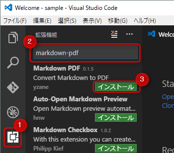
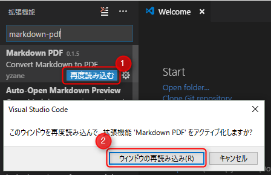
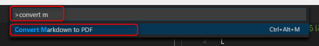
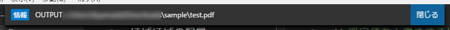
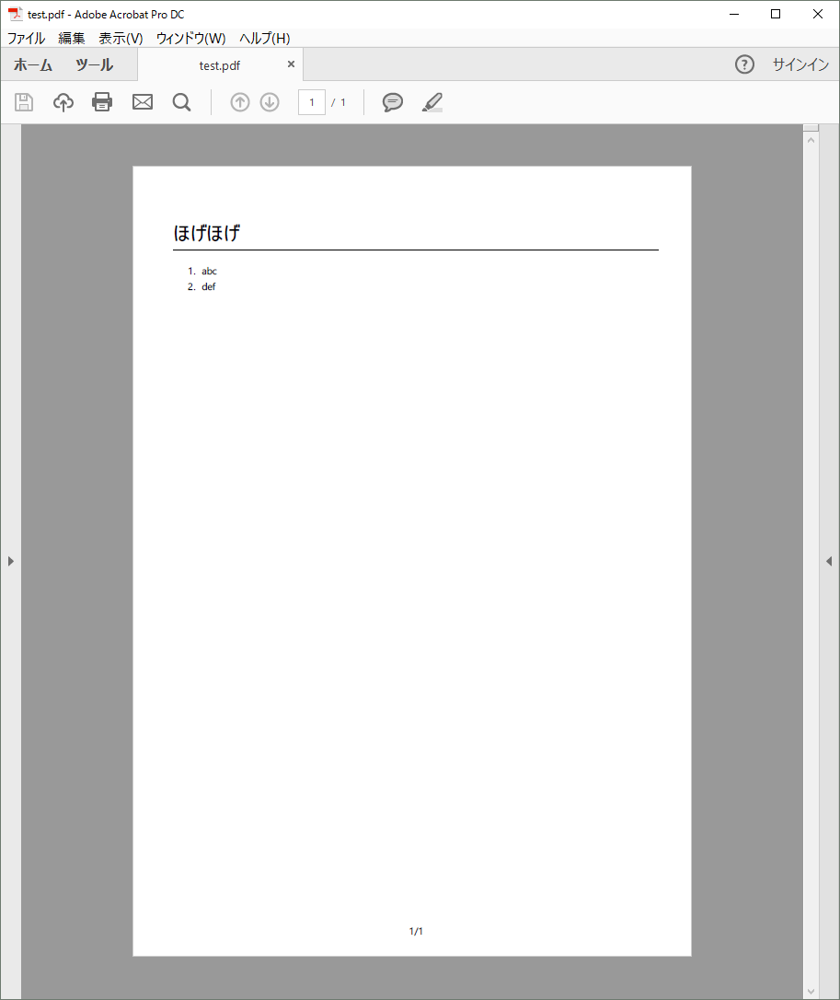
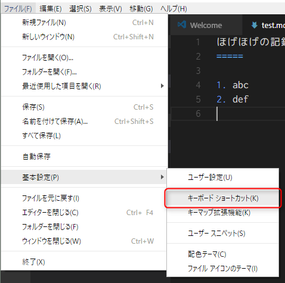
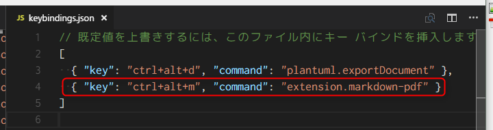

今回は **Visual Studio Code** (以下 VSCode) で **Markdown → PDF が一発で変換できるようになる拡張機能** をご紹介します。

>2018/5/18 追記
>本記事で紹介している markdown-pdf が v1 になってヘッダーやフッターの指定の仕方が変わっていますので、新しい記事と併せてご覧ください。
>
>- [VSCode markdown-pdf でヘッダーやフッターをいい感じに設定する](/vscode-markdown-pdf-v1-header-footer-settings/)

## 拡張機能 markdown-pdf

印刷ドキュメントに関する苦悩はまた別の記事に書こうと思いますが、その苦悩をやわらげてくれる、とても素敵な拡張機能を発見しました。

yzane さんが公開してくださっている vscode の拡張機能 **[Markdown PDF](https://marketplace.visualstudio.com/items?itemName=yzane.markdown-pdf)** です。

東京の方なので日本語のドキュメントも GitHub のリポジトリにあります。

* [vscode-markdown-pdf/README.ja.md at master · yzane/vscode-markdown-pdf](https://github.com/yzane/vscode-markdown-pdf/blob/master/README.ja.md)

## markdown-pdf のインストール

VSCode を開きます。



1. **アクティビティーバー**で**拡張機能**に切り替え
2. 検索部分に `markdown-pdf` を入力
3. **インストール**をクリック



1. **再度読み込む**をクリック
2. **ウィンドウの再読み込み**をクリック

これでインストールは完了です。

## PDF に変換してみる

適当なフォルダに `test.md` を作り、下記のような Markdown を書いて保存します。なんでもかまいません。

```
ほげほげ
=====

1. abc
2. def
```

`Ctrl+Shift+P` を押して**コマンドパレット**を開き、 `>convert m` ぐらいまで入力するとおそらく **Convert Markdown to PDF** が表示されるので、これを選択します。



変換が完了すると `OUTPUT: ファイルパス` のように表示されます。



これで同じフォルダに `test.pdf` が出力されているはずです。感動！！

しかもデフォルトのスタイルでも普通に使えるレベルです。さすが日本人。



## キーボードショートカットの割り当て

これだけですでに便利ですが、より手軽に変換できるようにするため、キーボードショートカットを設定します。

**ファイル → 基本設定 → キーボード ショートカット** からキーバインドの設定ファイル (`keybindings.json`) を開きます。



**左ペインにデフォルトのキー設定** (Default Keybindings)、**右ペインにユーザー設定** (`keybindings.json`) が開きます。



この `keybindings.json` の配列 (`[` ～ `]`) 内に下記の記述を追加します。すでに他の設定がある場合は図にあるように `,` をつけるなど、 JSON の配列表記になるようにしてください。

またここでは `Ctrl+Alt+M` に割り当てていますが、ショートカットを他のキーに割り当てたい場合は左側の Default Keybindings を参考にして、希望のキーを指定してください。

```json
{ "key": "ctrl+alt+m", "command": "extension.markdown-pdf" }
```

これで設定ファイルを保存し、 Markdown ファイルに戻ってショートカットキーを押せば、さきほどと同様に PDF が出力されるはずです。

超簡単ですね！！

## あとがき

すばらしい拡張機能を作ってくださった yzane さんに感謝いたします。

ちなみに保存と同時に PDF に変換できるオプションがあるのですが、有効にしてしまうとすべての `*.md` ファイルに対して機能してしまって少し面倒なので、私はオフのままにしています。

この拡張機能を使ったスタイルの変更などに関してはまた別の記事にまとめます。