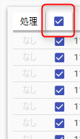
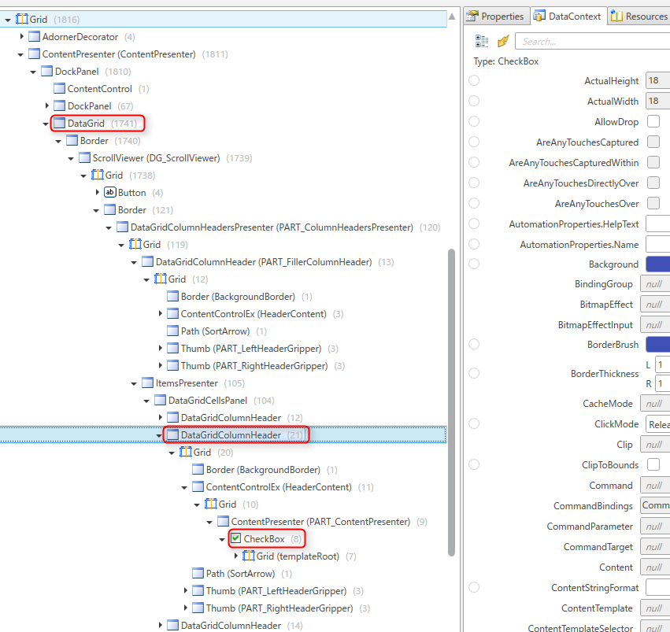

WPF の DataGrid はまぁそれなりの見栄えにはなるのですが、いかんせん標準で用意されている Column がショボすぎて結局全部 `DataGridTemplateColumn` で書き直さざるを得なくなるのが玉に瑕です。

## まずワンクリックで使えるチェックボックス列にする

標準で用意されているチェックボックス列は `DataGridCheckBoxColumn` です。このチェックボックス列なにがイケてないって、一番は **ワンクリックでチェック／解除ができない** ことでしょう。

一旦チェックボックスのセルをアクティブにして（セルを編集モードにして）からクリックして初めて状態が切り替わります。これは安易に変更されるのを防ぐことができる反面、やはりチェックボックスの直感的な操作とは相反しています。

ということでワンクリックでチェック／解除ができるようにする、というのは割と前から行われていて、先人たちのコードがいっぱい存在します。

* [SilverlightのDataGridのセルのチェックボックスをワンクリックで反転できるようにする - y_maeyamaの日記](http://d.hatena.ne.jp/y_maeyama/20101107/1289118361)

かくいう私自身も同じ内容で記事を書いたことがあります（すっかり忘れていて Google 先生に教えてもらいましたが・笑）。

* [WPF の DataGrid で直感的に使えるチェックボックス列を作る](https://mseeeen.msen.jp/usual-checkbox-column-on-wpf-datagrid/)

そのときのコードはこんな感じでした。

```xaml
<DataGridTemplateColumn IsReadOnly="True" Header="選択">
    <DataGridTemplateColumn.CellTemplate>
        <DataTemplate>
            <CheckBox IsChecked="{Binding IsSelected.Value, Mode=TwoWay, UpdateSourceTrigger=PropertyChanged}"
                      HorizontalAlignment="Center" VerticalAlignment="Center"/>
        </DataTemplate>
    </DataGridTemplateColumn.CellTemplate>
</DataGridTemplateColumn>
```

さて、本稿の主旨に戻ります。

## チェックボックスの一括制御

### ヘッダーにもこだわりたいあなたへ

さて、なんとかいい感じになったチェックボックス列ですが、まだイマイチですね。

レコード件数の多いアプリの場合、ユーザーにすべてのチェックボックスを操作させるなんてことは現実的ではありません。ユーザビリティの向上のためにも**「すべて選択」「すべて選択解除」**機能が望まれることが多いでしょう。

というわけで別にボタンを置いてもいいのですが、場所もとりますし、できたら下図のようにヘッダー部分のチェックボックスで一括制御ができるようにしたいと思うのです。

<a href="images/wpf-datagrid-checkbox-column-with-bulk-selector-1.png"></a>

当然、同様に考えた先人もいるわけでいくつかのページがヒットしますが、下記のページがわかりやすいです。

* [DataGridのSelectAll - DICOM Viewer 開発記](http://d.hatena.ne.jp/ebi_ryo/20121212/1355277559)

単純には `DataGridTemplateColumn.Header` に文字列で「選択」と渡していたところをチェックボックスに置き換えればいいので、下記のように記述します。

```xaml
<DataGridTemplateColumn.Header>
   <CheckBox IsChecked="{Binding Path=IsAllChecked.Value}"/>
</DataGridTemplateColumn.Header>
```

※Binding Path が `.Value` となっているのはプロパティに ReactiveProperty を使用しているからです（後述）。

さてこれはうまくいきません。なぜかというとこの **DataGrid のヘッダーに `DataContext` が引き継がれていない** からです。つまりこの **`CheckBox` の `DataContext` が空**なので、当然 `IsAllChecked` にもアクセスできず、下記のような `BindingExpression` が出力ウィンドウに表示されます。

```
System.Windows.Data Error: 40 : BindingExpression path error: 'IsAllChecked'
property not found on 'object' ''CheckBox' (Name='')'. 
BindingExpression:Path=IsAllChecked; DataItem='CheckBox' (Name=''); 
target element is 'CheckBox' (Name=''); target property is 'IsChecked' (type 'Nullable`1')
```

ではどうやって親コントロール (DataGrid) の `DataContext` を参照するのか、ということが鍵になります。

### 先人たちの知恵でもなかなかうまくいかない

これに対して下記のような解決法を示しているところが多いです。つまり先祖要素 (Ancestor) を遡って DataGrid の DataContext を取得しようということです。

```xaml
<DataGridTemplateColumn.Header> 
  <CheckBox Text="{Binding DataContext.IsAllChecked.Value, RelativeSource={RelativeSource AncestorType={x:Type DataGrid}}}" /> 
</DataGridTemplateColumn.Header> 
```

が、これは少なくとも私の環境では動きませんでした。

これについては原因が不明で、「DataGrid の Header が WPF の VisualTree 上に含まれないので取得できない」と書いてあるページがあるのですが、 VisualTree をのぞいてみたところ、VisualTree 的には DataGrid の子孫に DataGridColumnHeader と　CheckBox が含まれていました。

<a href="images/wpf-datagrid-checkbox-column-with-bulk-selector-2.png"></a>

しかし VisualTree 上で DataContext を追っていくと DataGridColumnHeader で DataContext が消失していました。このせいで取得できないようです。

`RelativeSource` でなく `ElementName` を使った方法も試しましたが、ダメでした。

### 解決した方法

で、結局たどりついたのはプロキシオブジェクト (↓の `FrameworkElement `) を配置する、という方法です。

```xaml
<DockPanel.Resources>
    <FrameworkElement x:Key="proxyElement" />
</DockPanel.Resources>
<ContentControl Visibility="Collapsed" Content="{StaticResource proxyElement}" />
<DataGrid>
    <DataGrid.Columns>
        <DataGridTemplateColumn>
            <DataGridTemplateColumn.Header>
                <CheckBox VerticalAlignment="Top" HorizontalAlignment="Center" IsThreeState="True"
                            DataContext="{Binding DataContext, Source={StaticResource proxyElement}}"
                            IsChecked="{Binding IsAllSelected.Value, UpdateSourceTrigger=PropertyChanged}"/>
            </DataGridTemplateColumn.Header>
        </DataGridTemplateColumn>
    </DataGrid.Columns>
</DataGrid>
```

「VisualTree にいないんなら、いるやつ作ればいいじゃん」という発明家的発想です。すごいですね。

DataGrid 以外になんか余計なものを配置しなくてはならないのは気持ち悪いのですが、やりたいことのために妥協します。

### 参考

* [\[WPF\] How to bind to data when the DataContext is not inherited » Thomas Levesque's .NET blog](http://www.thomaslevesque.com/2011/03/21/wpf-how-to-bind-to-data-when-the-datacontext-is-not-inherited/)
* [xaml - Binding Visibility for DataGridColumn in WPF - Stack Overflow](http://stackoverflow.com/questions/22073740/binding-visibility-for-datagridcolumn-in-wpf)
* [\[WPF\]DataGridColumnへのバインディング | OITA: Oika's Information Technological Activities](http://oita.oika.me/2014/05/31/binding-datagridcolumn/)

## 最終的な XAML コード

というわけで冒頭のセルテンプレートと合わせると下記のようになります。ややこしいですね...。

```xaml
<DockPanel.Resources>
    <FrameworkElement x:Key="proxyElement" />
</DockPanel.Resources>
<ContentControl Visibility="Collapsed" Content="{StaticResource proxyElement}" />
<DataGrid>
    <DataGrid.Columns>
        <DataGridTemplateColumn IsReadOnly="True">
            <DataGridTemplateColumn.Header>
                <CheckBox VerticalAlignment="Top" HorizontalAlignment="Center" IsThreeState="True"
                            DataContext="{Binding DataContext, Source={StaticResource proxyElement}}"
                            IsChecked="{Binding IsAllSelected.Value, UpdateSourceTrigger=PropertyChanged}"/>
            </DataGridTemplateColumn.Header>
            <DataGridTemplateColumn.CellTemplate>
                <DataTemplate>
                    <CheckBox IsChecked="{Binding IsSelected.Value, Mode=TwoWay, UpdateSourceTrigger=PropertyChanged}"
                              HorizontalAlignment="Center" VerticalAlignment="Center"/>
                </DataTemplate>
            </DataGridTemplateColumn.CellTemplate>
        </DataGridTemplateColumn>
    </DataGrid.Columns>
</DataGrid>
```

## ViewModel 側の実装

すべてがチェックされているかどうかを示す `IsAllSelected` プロパティを定義します。

```
/// <summary>
/// 全てのレコードが選択されているかどうか
/// </summary>
public ReactiveProperty<bool?> IsAllSelected { get; }
```

この `IsAllSelected` プロパティはコンストラクターで初期化します。

各レコードの `IsSelected` プロパティの変更を監視する `Observable` を受けて `bool?` (すべて選択されていれば `true` すべて選択されていなければ `false` それ以外なら `null`) を返すような `ReactiveProperty` を設定します。

```
// 選択列のヘッダーに表示する一括選択用チェックボックス向けのプロパティ
IsAllSelected = Records
	.ObserveElementObservableProperty(x => x.IsSelected)
	.Select(x =>
	{
		if (Records.All(y => y.IsSelected.Value)) return new bool?(true);
		else if (Records.All(y => !y.IsSelected.Value)) return new bool?(false);
		else return null;
	})
	.ToReactiveProperty();
```

なおかつ、`Subscribe` でこのプロパティが変更されたとき（チェックボックスがクリックされたとき）に各レコードの `IsSelected` を書き換えるように処理を書いておきます。

```
// 値が変更されたときは逆に全レコードを一括設定する
IsAllSelected.Subscribe(x =>
{
	if (x == true)
	{
		Records.ToList().ForEach(r => r.IsSelected.Value = true);
	}
	else if (x == false)
	{
		Records.ToList().ForEach(r => r.IsSelected.Value = false);
	}
}).AddTo(Disposable);
```

## あとがき

おおむね希望通りの動きにはなっているのですが、一括チェックボックスをチェック状態でクリックしたとき、すぐに未チェックにならず、一旦不確定状態 (indeterminate) を通ってしまうのが、イマイチです。

どなたか解決方法をご存知であれば教えてください。