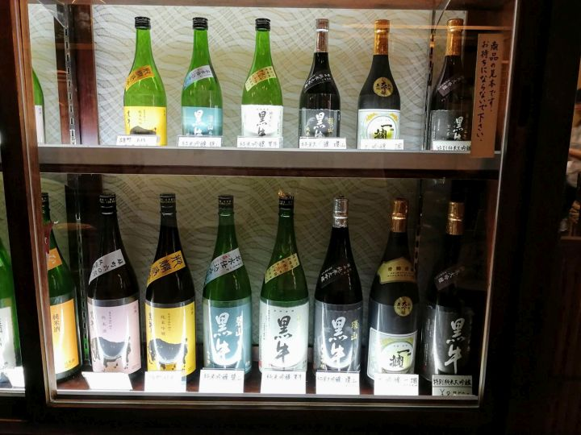
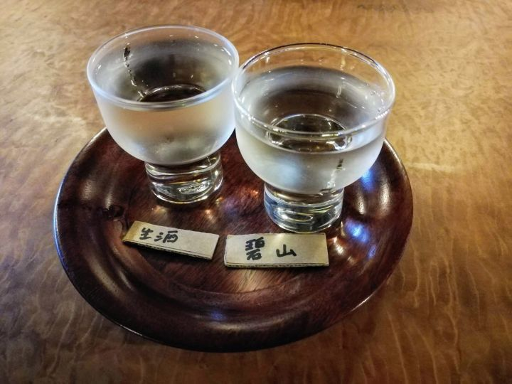
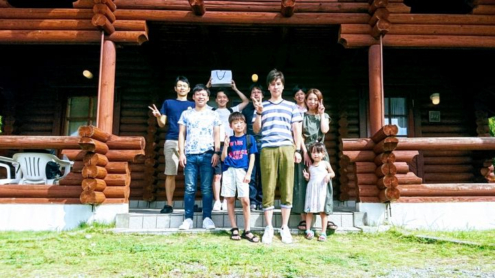
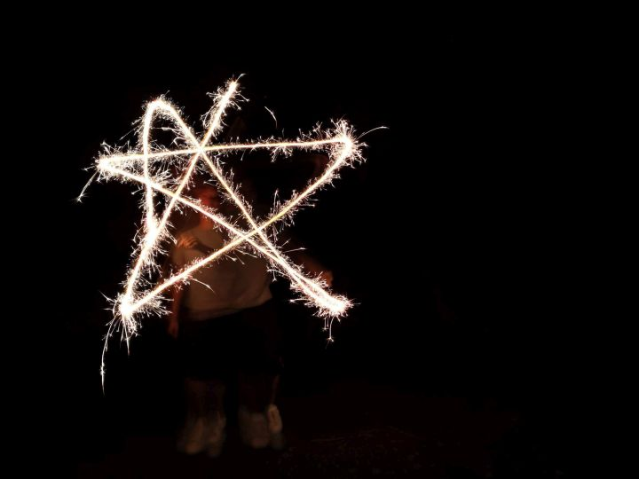
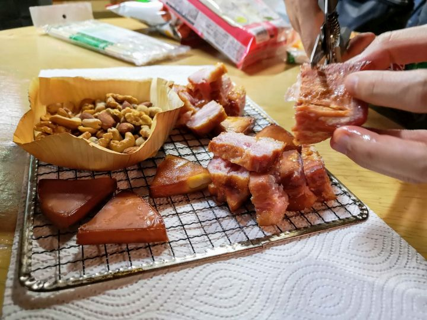
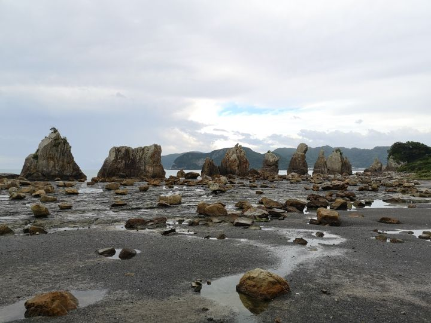
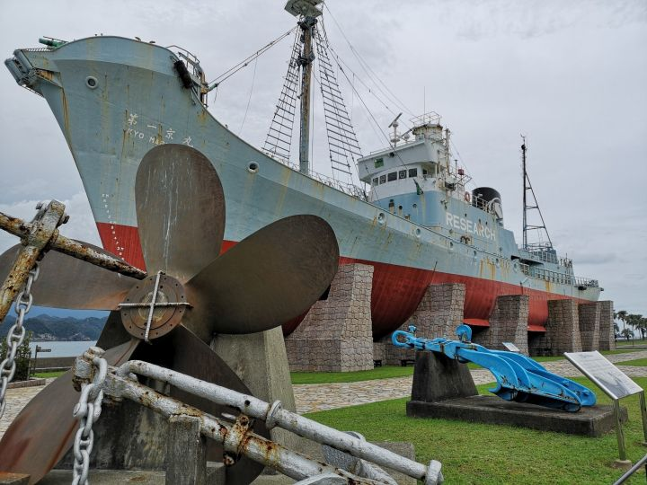
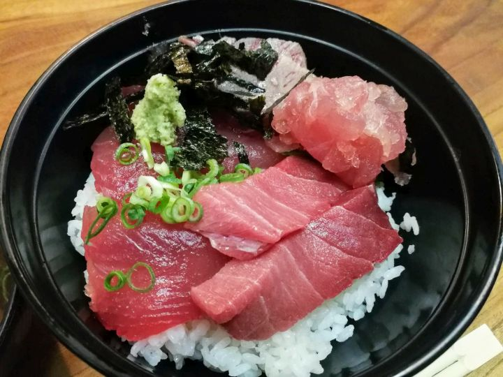
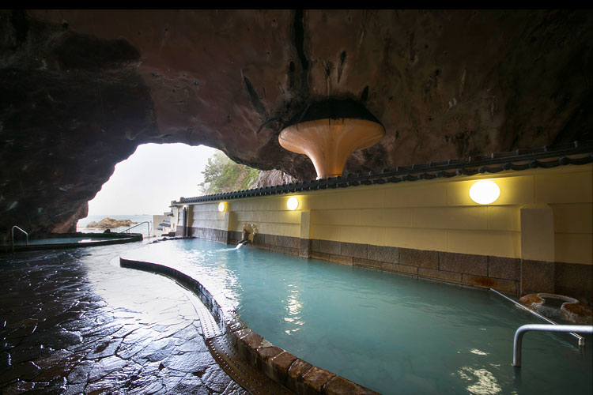

2018年9月1日～2日にかけて**和歌山へ社員旅行**にいってきました。

あいにくの天気ではありましたが、一部晴れ間もあり、ほぼ予定どおりの行程を楽しむことができました！！

## 1日目

大阪から約 1.5 時間、和歌山の銘酒 **「黒牛」で有名な [名手酒造店](http://www.kuroushi.com/)**（名手はナテと読みます）へお邪魔しました。

試飲もしつつ

併設された [酒造り資料館 温故伝承館](http://www.kuroushi.com/onko/) で酒造りの歴史を学びました。

昼食はとれとれ市場で...の予定でしたが、混雑していたので、向かい側の [海鮮寿司とれとれ市場](http://www.toretore-sushi.com/) へ。

回転寿司ではありますが、ネタはクオリティが高いです。
（食べるのに夢中で誰も写真を撮っていません・笑）

夜飲みのお酒などの買い出しをすませ、本日のお宿、**[串本ダイビングパーク](http://kushimoto.co.jp/diving/stay.php)** へ。

今回はダイビングはしませんが、写真のようなけっこうきれいなログハウスがあり、お子さん連れでも楽しめると思います。

ログハウスのテラスでバーベキューができないのが少し残念ですが、どのみちこの日は雨でバーベキューができなかったため、レストラン棟で焼き肉を楽しみました！

夜は**花火**を楽しんだり

自家製の**燻製**を満喫しました。

## 2日目

二日目は **[橋杭岩](https://www.travel.co.jp/guide/article/9430/)** を観光したあと、

太地町でかつての**捕鯨船**と記念撮影しつつ、

**那智勝浦でまぐろと温泉**を堪能しにいきました。まぐろは [桂城](https://tabelog.com/wakayama/A3005/A300502/30000173/) さんでいただきました。

おなかがいっぱいになったところで、送迎船に乗り **[ホテル浦島](http://www.hotelurashima.co.jp/hotspring/)** へ。

有名な洞窟温泉、**忘帰洞**にのぞみます。

※画面はイメージです。

台風の影響で一番外側には出られませんでしたが、やはり海をながめながらの温泉は気持ちよかったです。

企画してくれたみなさん、ありがとうございました！！！
