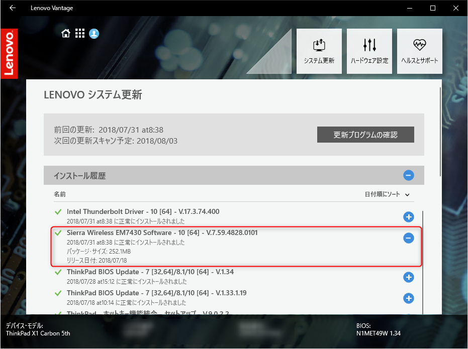
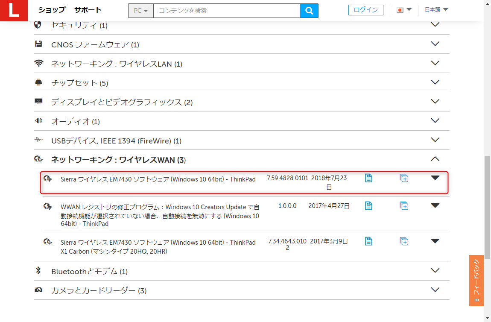
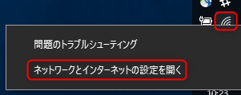
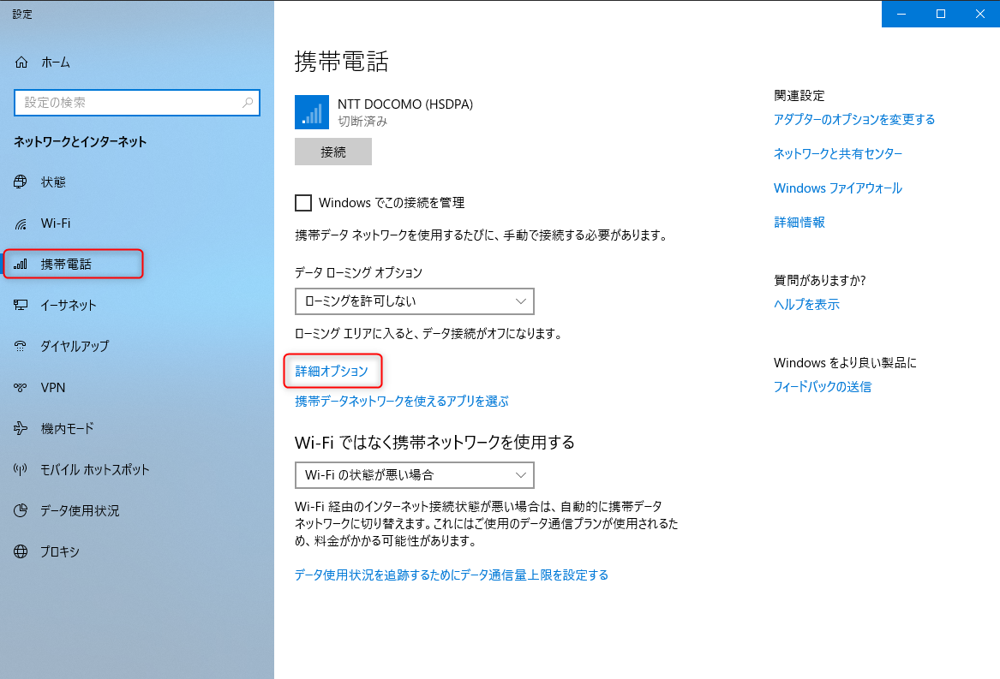
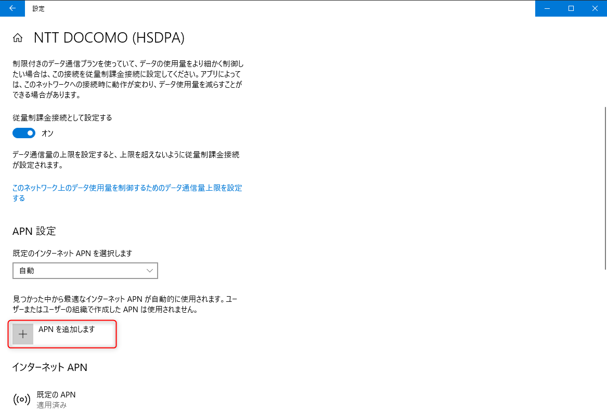
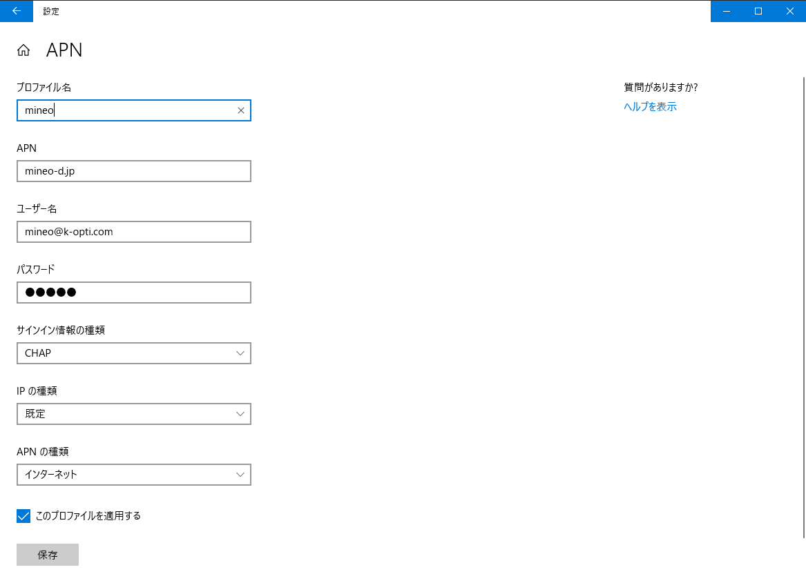
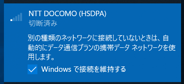
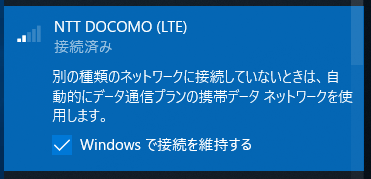

近年の **ThinkPad X1 にはワイヤレス WAN がついていて、テザリングなしに外出先でもインターネット接続ができる**ので大変便利です。

ただ、 **DoCoMo 以外の MVNO (格安 SIM)** で使おうと思うとなかなか面倒で、いつもセットアップ時に接続できなくてイラッとします。

今回も若干すっきりしない解決だったのですが、接続できるようにはなりましたので、同じような方々の助けになれば幸いです。

## 環境

本記事は以下の環境を元にしています。

- Lenovo ThinkPad X1 Carbon 5th Generation (**20HQ**)
- Windows 10 Pro (**1803**)
- mineo (D) Micro SIM

本体に Micro SIM を装着した状態とします。

### ワイヤレス WAN ドライバーの更新

X1 Carbon の **ワイヤレス WAN (WWAN)** のデバイスは **Sierra Wireless EM7430** というやつなのですが、標準で入っているドライバーでは SIM を挿しているにもかかわらず「SIM を挿入してください。」となって、接続できません。

というわけで、このドライバーを更新します。 2018/7/31 時点での最新版は V.7.59.4828.0101 でした。

**Lenovo Vantage** から自動更新するのが簡単ですが、表示されないときは Lenovo のドライバーリストからダウンロードするといいでしょう。

>[ThinkPad X1 Carbonのマシンタイプの識別 - jp](https://support.lenovo.com/jp/ja/solutions/x1-carbon-help)

世代を選べば、ダウンロード可能なドライバーの一覧が表示されます。

### 再起動すると設定が走る

再起動すると自動的に「モバイル ブロードバンド デバイスの設定」が画面の片隅で実行されます。終了するのを待ちます。

これが終了すると、ネットワークの一覧に WWAN が出現しますが、**キャリアが DOCOMO 以外の場合、 APN の設定をしないと接続できません**。

### APN の追加

タスクトレイのネットワークアイコンを右クリックし、「**ネットワークとインターネットの設定を開く**」をクリックします。

サイドメニューの「**携帯電話**」を開き、「**詳細オプション**」をクリックします。

APN 設定の部分で、 [**APN を追加します**] をクリックします。

使用するキャリアに合わせて、 APN 情報を入力します。 APN 情報は各キャリアのホームページのヘルプ等に記載されています。図は mineo (DoCoMo) の場合です。 (パスワードも mineo)

この状態で APN を保存し、接続しようとしましたが、うまく接続できませんでした。

少し調べると「APN の種類」を「インターネットと LTE」にする必要があるというような情報があったのですが、私の環境では「インターネットと LTE」が選択できませんでした。

<ins>※追記: 2020年10月現在の Windows 10 (1909) では LTE を有効にするには「**インターネットおよびアタッチ**」を選択する必要があります。</ins>

が、何度か APN 設定の画面を行き来している間に、もともと「NTT DOCOMO (**HSDPA**)」となっていたプロファイルが勝手に、「NTT DOCOMO (**LTE**)」に変わっていました。

この状態で APN を設定し直すと、無事接続されました。

LTE に変わるのがタイミングなのか、なんらかの操作なのかは不明ですが、ちょっといろいろ操作してみて、なんらか「**LTE**」が表示・選択されるようにするしかないようです。

理由をご存知の方がいらっしゃいましたら、教えていただけると助かります。

