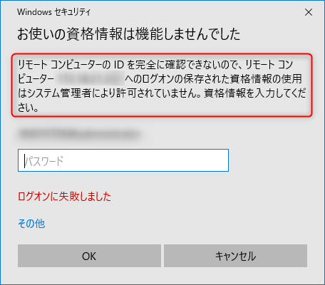
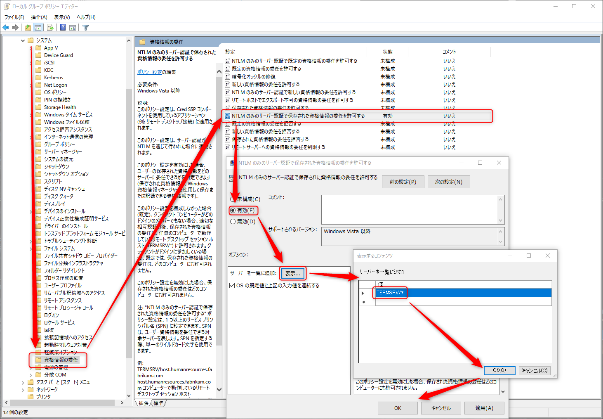
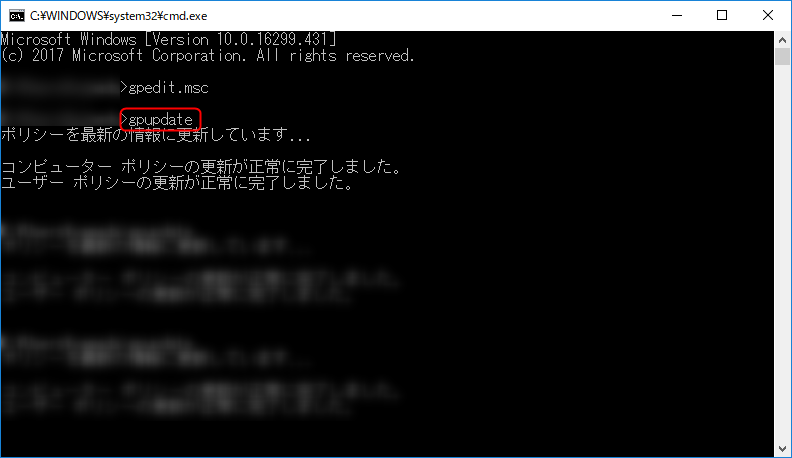

Windows 標準の**リモートデスクトップ**ソフト (mstsc.exe) で接続する際、**接続先によってはパスワードが保存できず、接続する度にパスワードの入力が求められて、けっこう不便**です。

>**お使いの資格情報は機能しませんでした**
>リモート コンピュータの ID を完全に確認できないので、リモート コンピュータ（ホスト名）へのログオンの保存された資格情報の使用はシステム管理者により許可されていません。資格情報を入力してください。

なんでやねん。

不便なのは御免なので、パスワードを保存して接続できるようにしましょう。

## グループポリシーエディターで設定変更

**[Windows] + [R]** キーを押して `cmd` と入力→OKを押すなどして**黒い画面 (コマンドプロンプト)** を起動します。

**`gpedit.msc`** と入力して [Enter] を押すと「**ローカル グループポリシー エディター**」が起動します。

左のメニューで **[ローカル コンピューター ポリシー]→[コンピューターの構成]→[管理用テンプレート]→[システム]→[資格情報の委任]** を開いた後、次の手順で設定します。

まず、**[NTLM のみのサーバー認証で保存された資格情報の委任を許可する]** をダブルクリックして開きます。

(※[NTLM のみのサーバー認証で**既定の**資格情報の委任を許可する] やら [NTLM のみのサーバー認証で**新しい**資格情報の委任を許可する] というややこしい設定もあるので注意してください。)

**[有効]** に切り替え、 **[サーバーを一覧に追加]** の **[表示]** をクリックして、でてきたウィンドウに **`TERMSRV/*`** (ターミナルサービスのすべて、ぐらいの意味合いですね) と入力して **[OK]** を押します。

設定ウィンドウも **[OK]** を押して設定を確定させます。

## グループポリシーの設定を反映

黒い画面 (コマンドプロンプト) に戻って、 **`gpupdate`** (group policy update) を実行します。

> **コンピューターポリシーの更新が正常に完了しました。**

と表示されれば OK です。

