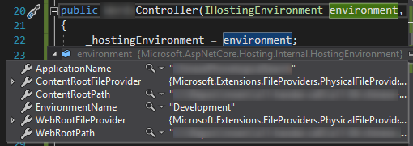

今回は **ASP.NET Core** で、たとえばファイルアップロードなど、コントローラー内で Web サーバーのパスを使う方法を紹介します。

## コンストラクターに IHostingEnvironment を渡せるようにする

まずコントローラーのコンストラクターに **`IHostingEnvironment`** のインスタンスを渡せるようにします。

```cs
// コントローラー
public class HogehogeController : ControllerBase
{
    private IHostingEnvironment _hostingEnvironment;

    // IHostingEnvironment を注入できるコンストラクター
    public HogehogeController(IHostingEnvironment environment)
    {
        _hostingEnvironment = environment;
    }

    // uploads ディレクトリーのパスを取得するプロパティ
    private string UploadDir => Path.Combine(_hostingEnvironment.WebRootPath, "uploads");
}
```

これにより、実行時は自動的に `HostingEnvironment` がインジェクションされます。



この `IHostingEnvironment.WebRootPath` や `IHostingEnvironment.ContentRootPath` を使うことでパスが取得できます。

- `WebRootPath` : wwwroot フォルダーのパス
- `ContentRootPath` : コンテンツルートのパス

### 注意: コンストラクターの多重定義を避ける

一つ注意しなければならないのは、**コントローラーのコンストラクターは一つしか定義できない**ということです。

もしコンストラクターのオーバーロードを複数定義してしまうと下記のようなエラーが発生します。

> Multiple constructors accepting all given argument types have been found in type 'HogehogeController'.
> **There should only be one applicable constructor.**

どうしてもいろいろ引数定義が必要な場合は、**デフォルト引数を使用してコンストラクター自体は一つに留めましょう**。

```cs
    public HogehogeController(IHostingEnvironment environment, string hogehoge = null)
    {
        _hostingEnvironment = environment;
        _hogehoge = hogehoge ?? "ほげほげ";
    }
```

## テスト時はモックで流し込む

`IHostingEnvironment` はコンストラクターで注入できるようになっているので、テスト時はモックオブジェクトを作って流し込んでやります。

**[Moq](https://www.nuget.org/packages/moq/)** を使う場合、下記のようになります。

```cs
// テストクラス
public class HogehogeControllerTest
{
    // モックオブジェクト
    private readonly Mock<IHostingEnvironment> MockEnvironment = new Mock<IHostingEnvironment>();

    // テストクラスのコンストラクター
    public HogehogeControllerTest()
    {
        var dir = Path.GetDirectoryName(System.Reflection.Assembly.GetExecutingAssembly().Location); // dll のディレクトリーパス
        Directory.CreateDirectory(dir); // ディレクトリーがなければ作る
        MockEnvironment.SetupGet(m => m.WebRootPath).Returns(dir); // WebRootPath として dll のディレクトリーパスを返す
    }

    // 各テストで使うコントローラーを生成するメソッド
    private HogehogeController CreateController() => new HogehogeController(MockEnvironment);
}
```

この例ではテストクラスの定義されたアセンブリのディレクトリー (通常はテストプロジェクトの `bin/Debug/netcoreapp2.1` など) が `WebRootPath` として返されるようになります。

## 参考

- [Getting the Web Root Path and the Content Root Path in ASP.NET Core | Marius Schulz](https://blog.mariusschulz.com/2016/05/22/getting-the-web-root-path-and-the-content-root-path-in-asp-net-core)