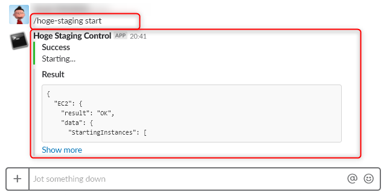
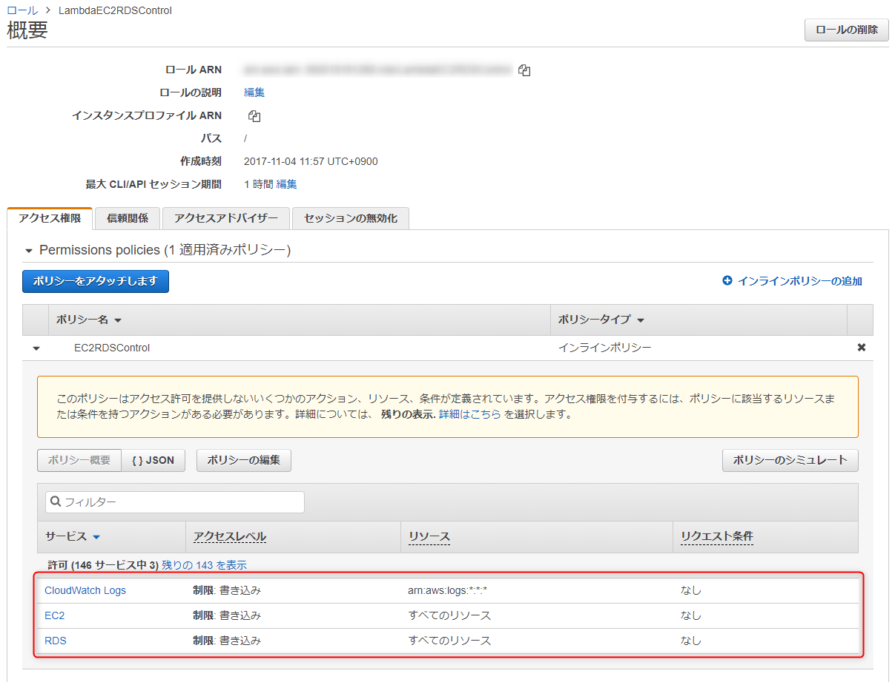

**AWS の EC2 (サーバー) や RDS (データベース) は基本的に時間課金制**です。

本番環境なら仕方ないのですが、ステージング環境で使っていない夜間や休日も課金されていくのでは夜も眠れません。

**不要なときは停止させ、必要なときに起動させたいわけですが、EC2 と RDS を AWS コンソールにログインして個別に起動・停止するのはかなり面倒です。**

この**起動や停止が面倒だと評価自体が後回しになったり、結局停止させなかったりして、意味がなくなってしまう**可能性があります。

これまでは社内の Jenkins から実行させていた ([過去記事](/start-ec2-instance-by-aws-lambda-through-api-gateway)) のですが、 Jenkins へのログインすら面倒になってきたので(笑)、 Slack からお手軽に起動・停止ができるよう設定してみました。

本記事は連載です。後の記事は下記のリンクから参照ください。

- (1) 導入 ← 本記事
- [(2) Lambda 関数と API の準備](/aws-ec2-rds-instance-control-via-slack-slash-command-2)
- [(3) Slash Command の作成とテスト](/aws-ec2-rds-instance-control-via-slack-slash-command-3)

## やりたいこと

**Slack 上で Slash Command を叩くだけで AWS にある EC2 と RDS のインスタンスを ON/OFF** したい。

私の願いは、ただそれだけです。

## Slash Command とは

> [Slash Commands | Slack](https://api.slack.com/slash-commands#app_command_handling)

Slack から外部の API などを実行する手段はいくつかありますが、 API 側を自由に作れるのであれば、 Slash Command が一番カンタンに設定できます。

**Slash Command (スラッシュコマンド) はSlack のメッセージ入力欄に `/` からはじまるコマンドを入力するだけで特定の API を叩く**ことができます。

余談ですが、この記事書きながら、英単語で書くと Slack と Slash がややこしいなと思いました。

Slash Command のバックエンドとして AWS の **Lambda Function** と **API Gateway** を使用します。制御対象が EC2 と RDS なのでこの組み合わせがおそらく一番素直で簡便でしょう。

## 前提

EC2 と RDS のインスタンスはそれぞれ作成済みとし、それぞれのリージョンとインスタンス ID は下記の想定とします。当然ながら、みなさまの環境にあった値を設定ください。

  | リージョン | インスタンス ID
-- | -- | --
EC2 (CentOS 7) | us-east-1 | i-0cf8df09567e2hoge
RDS (MySQL) | us-east-1 | hogehogedb

Slash Command のコマンド名は **`/hoge-staging`** にします。

**一つの Slash Command に紐付けられる API の URL は一つ**だけなので、 Lambda 関数は一つ、 API Gateway の URL も一つだけ登録します。

起動と停止の区別は **`/hoge-staging start`**, **`/hoge-staging stop`** のようにパラメーターで行います。

### API の認証について

**API Gateway** で API を公開するときは、不正呼び出しを防ぐため、 **API キーを作成し、 `x-api-key` ヘッダーにそのキーを渡して呼び出してやるのが望ましい**と考えられます。

ただ、 **Slash Command からの呼び出しでは リクエストヘッダーを設定できない**ため、今回は **Slash Command から渡された "Slash Command のトークン" を API では検証せずに Lambda 関数にパススルーし、 Lambda 関数内で検証**するようにしています。

### IAM ロールの準備

**Lambda 関数から EC2 と RDS を制御するために権限を付与した IAM ロール**が必要です。

今回使用するロール `LambdaEC2RDSControl` は下記のようなポリシーになっています。

IAM ロールの作成に関しては割愛しますが、下記の 3 権限があれば OK です。

- CloudWatch Logs / 書き込み / すべてのリソース
- EC2 / アクション : Start*, Stop* / リソース : すべてのリソース
- RDS / アクション : Start*, Stop* / リソース : すべてのリソース

なお、ロールは Lambda 関数の作成時に、作成画面を呼び出して作ることもできるので、それでもかまいません。

次は Slash Command から呼び出す Lambda 関数と API を準備していきます。

[次の記事: (2) Lambda 関数と API の準備 へ](/aws-ec2-rds-instance-control-via-slack-slash-command-2/)

## 関連記事

- [AWS API Gateway から Lambda 関数を使って EC2 インスタンスを起動・終了する](/start-ec2-instance-by-aws-lambda-through-api-gateway)
- [AWS Lambda 関数で EC2 インスタンスを起動・終了する (Python 3.6)](/start-ec2-instance-by-aws-lambda-with-python-36)