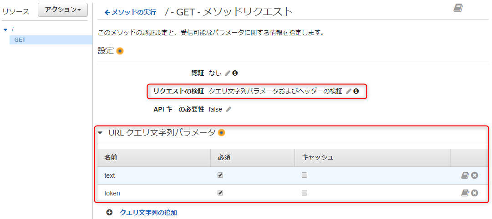
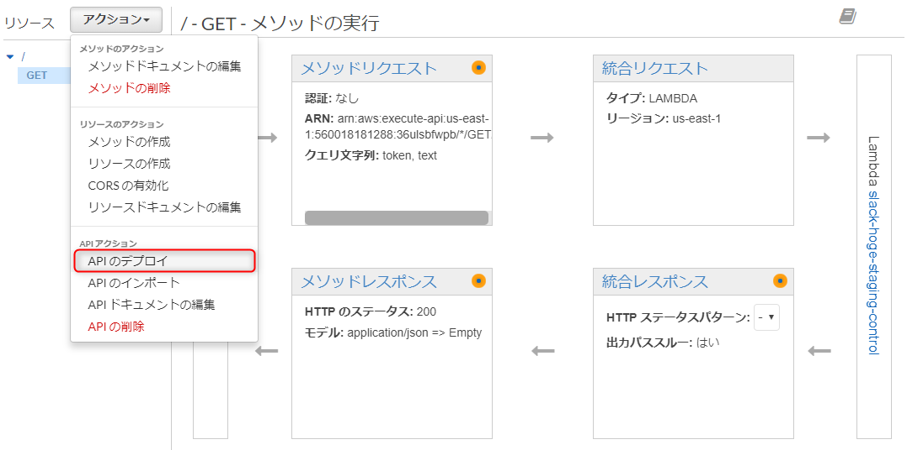

本記事は [Slack の Slash Command で AWS の EC2 と RDS の起動と停止を実現してみた (1) 導入](https://mseeeen.msen.jp/aws-ec2-rds-instance-control-via-slack-slash-command-1) の続きです。やりたいことや前提条件は前回の記事を参照してください。

- [(1) 導入](https://mseeeen.msen.jp/aws-ec2-rds-instance-control-via-slack-slash-command-1)
- (2) Lambda 関数と API の準備 ← 本記事
- [(3) Slash Command の作成とテスト](https://mseeeen.msen.jp/aws-ec2-rds-instance-control-via-slack-slash-command-3)

## Lambda 関数の準備

**EC2 と RDS を制御するスクリプトの実体を Lambda 関数で作成**します。

- Lambda 関数の名前 : **`slack-hoge-staging-control`**
- ランタイム (言語) : **Node.js 8.10** (おそらく今回のスクリプトは Node.js 6 系でも動作します)

希望のリージョンで **AWS Lambda** の関数ページを開き、 [関数の作成] ボタンを押します。

**[一から作成]** で必要事項を入力します。 IAM ロールには [前述](https://mseeeen.msen.jp/aws-ec2-rds-instance-control-via-slack-slash-command-1) のとおり EC2 と RDS の制御権限をもつロールを指定します。


入力できたら [関数の作成] を押し、関数が作成されたら、**インラインエディターに index.js の中身を貼り付け**ます。ソースコードは [こちらの gist](https://gist.github.com/kenzauros/965feb6f5a7fe9dd4ba2246a1628a8b3) に置いています。


次にインラインエディターの下にある **[環境変数]** に EC2, RDS のリージョンとインスタンス ID などを指定します。

キー| 値
-- | --
EC2_REGION | us-east-1
EC2_INSTANCE_ID | i-0cf8df09567e2hoge
DB_REGION | us-east-1
DB_INSTANCE_ID | hogehogedb
SLASH_COMMAND_TOKEN | Slash Command のトークン (後で設定)


今回の関数で実行するのは開始と停止の「指示」だけなので、応答は比較的すぐに返ってきますが、Lambda 関数がタイムアウトしてしまうのを防ぐため、基本設定で [タイムアウト] を 10 秒程度にしておきます。


ここまで終わったら、 [保存] を押して、 **Lambda 関数を一旦保存**しておきます。


## API の準備 (API Gateway)

### API キーについて

**API Gateway** で API を公開するときは、不正呼び出しを防ぐため、 **API キーを作成し、 `x-api-key` ヘッダーにそのキーを渡して呼び出してやるのが望ましい**と考えられます。

ただ、 **Slash Command からの呼び出しでは リクエストヘッダーを設定できない**ため、今回は **Slash Command から渡された "Slash Command のトークン" を API では検証せずに Lambda 関数にパススルーし、 Lambda 関数内で検証**するようにしています。

### API の作成

**API Gateway** のページを開き、 [APIの作成] ボタンから Lambda 関数と同名の API を作成します。


**リソース `/` の [アクション] から [メソッドの作成]** を選択します。


メソッドには "GET" を選択し、[チェックマーク (OK)] を押します。


※ちなみにここでは GET にしましたが、 Slash Command は POST がデフォルトですし、 URL にトークンが載ってくるので、 POST のほうがいいかもしれません。いずれにしても **API Gateway の設定と Slash Command の設定を合わせて**ください。

[GET のセットアップ] で下記のように設定して保存します。

- 統合タイプ : **Lambda 関数**
- Lambda プロキシ統合の使用 : **オフ**
- Lambda リージョン, 関数 : さきほど作成した Lambda 関数のリージョンと関数名


確認ダイアログが表示されるので、 [OK] を押します。


これで API `GET /` の枠組みが作成されました。

### URL パラメーターの設定

Slash Command からのパラメーターを受け取る **URL パラメーター** (`<APIのURL>/?text=hogehoge` この `?text=hogehoge` の部分) を設定します。

GET メソッドの設定で **[メソッドリクエスト]** をクリックします。


[リクエストの検証] で "クエリ文字列パラメータおよびヘッダーの検証" を選択し、 **[URL クエリ文字列パラメータ] に `text` と `token` を追加**して、両方とも必須に設定します。



`text` は Slash Command を実行したときに `/hoge-staging ほげ` と書いたときの "ほげ" 部分がやってくるパラメーターです。

`token` はその名の通り、Slash Command のトークンがやってきます。

### パラメーターのマッピング設定

**URL パラメーターで送信されてきた `text` と `token` を Lambda 関数のイベント引数に渡す**ため、**マッピングテンプレート**を追加します。

GET メソッドの設定に戻り、 **[統合リクエスト]** をクリックします。


マッピングテンプレートのところで「テンプレートが定義されていない場合 (推奨)」を選択し、 **[マッピングテンプレートの追加]** を押して、 **Content-Type に `application/json` を入力**して、チェックマーク (OK) を押します。


表示されたテンプレート部分に下記のコードを貼り付け、 [保存] を押します。この指定で、URL パラメーターの `text` と `token` がそれぞれ Lambda 関数のイベント引数 の`text` と `token` に渡されます。

```js
{
   "token": "$input.params('token')",
   "text": "$input.params('text')"
}
```


### API のデプロイ

URL を発行するため、 **API をデプロイ**します。

リソース `/` の [アクション] から [API のデプロイ] を選択します。



デプロイされるステージに「新しいステージ」を選択し、ステージ名を適当につけて [デプロイ] をクリックします。このステージ名が URL の一部になりますが、特にこだわりがなければ、なんでもかまいません。


**デプロイが完了すると API の URL が生成されます**。この URL をコピーしておきます。


これで API の準備は完了です。

いよいよ Slack 側で Slash Command を作成していきます。

[次の記事: (3) Slash Command の作成とテスト へ](https://mseeeen.msen.jp/aws-ec2-rds-instance-control-via-slack-slash-command-3/)

## 参考リンク

- [AWS Lambda 関数の API GatewayAPI を作成する - Amazon API Gateway](https://docs.aws.amazon.com/ja_jp/apigateway/latest/developerguide/integrating-api-with-aws-services-lambda.html#api-as-lambda-proxy-expose-get-method-with-query-strings-to-call-lambda-function)
  (Lambda 関数を呼び出してクエリパラメータを渡す GET メソッドを作成する)