本記事は [Slack の Slash Command で AWS の EC2 と RDS の起動と停止を実現してみた (2) Lambda 関数と API の準備](https://mseeeen.msen.jp/aws-ec2-rds-instance-control-via-slack-slash-command-2) の続きです。前提条件や API の準備までの手順は前回までの記事を参照してください。

- [(1) 導入](https://mseeeen.msen.jp/aws-ec2-rds-instance-control-via-slack-slash-command-1)
- [(2) Lambda 関数と API の準備](https://mseeeen.msen.jp/aws-ec2-rds-instance-control-via-slack-slash-command-2)
- (3) Slash Command の作成とテスト ← 本記事

## Slash Command の作成

いよいよ **Slack 側に Slash Command を作成**します。

Slack のワークスペース設定の [Manage] から [Custom Integrations] → [Slash Commands] を選択します。

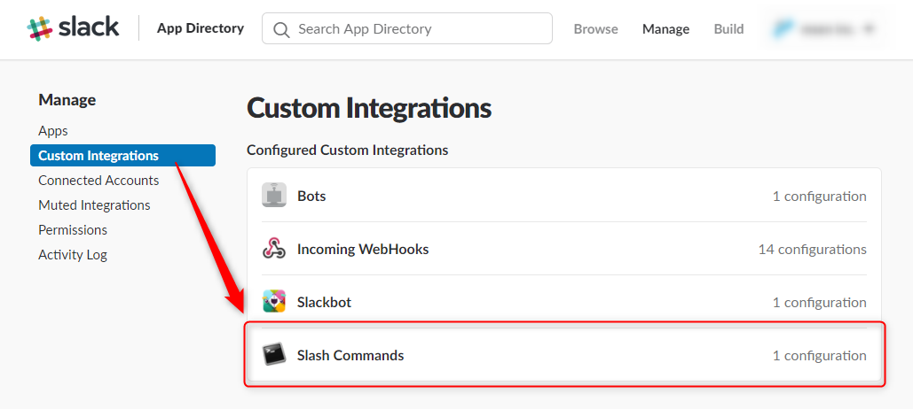

[Add Configuration] を押します。

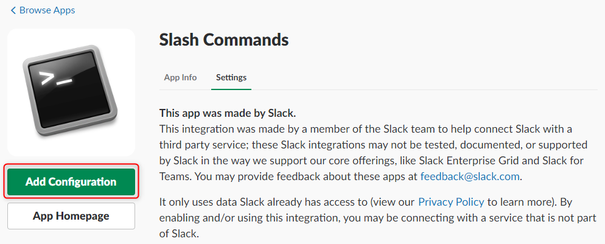

[Choose a Command] で希望のコマンド名 (今回は `/hoge-staging`) を入力し、 [Add Slash Command Integration] を押します。

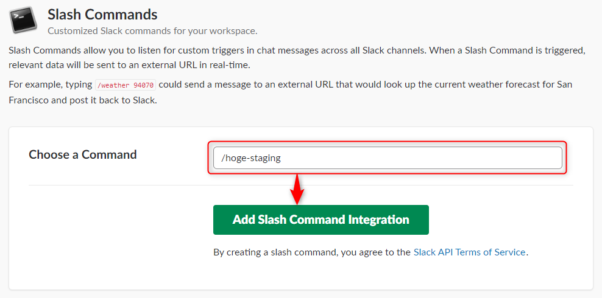

[Integration Settings] で Slash Command を設定します。

- URL : API の準備で発行された URL
- Method : GET (API の準備で設定したメソッド名)
- Token : この Slash Command のトークン
- Customize Name : この Slash Command がチャンネルに結果などを流す際の名前

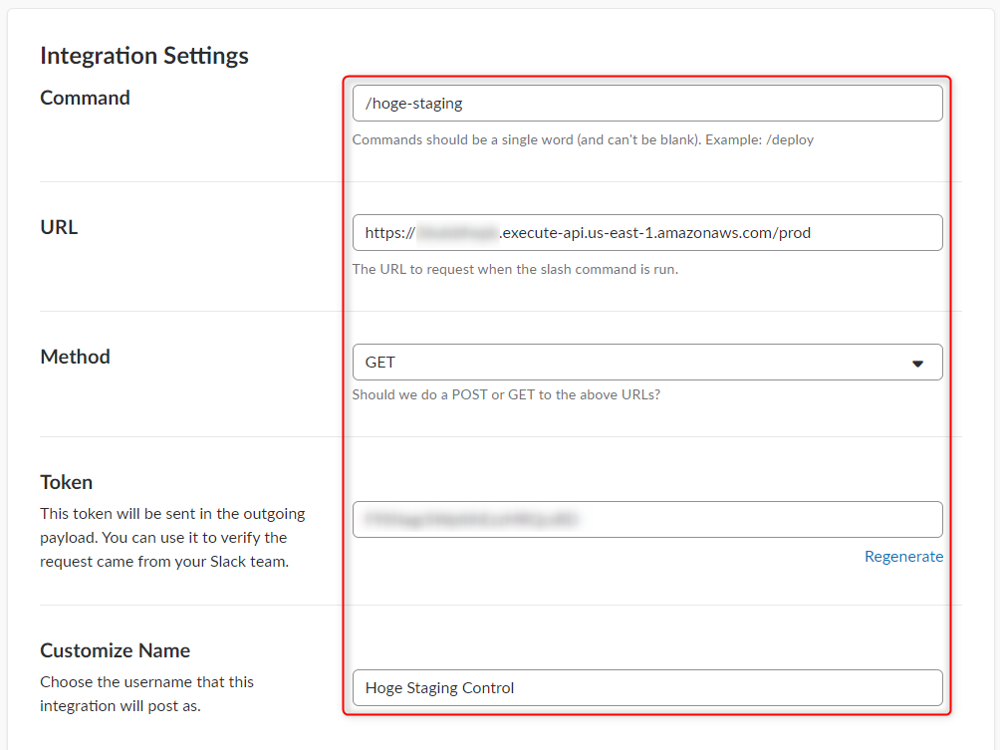

**Show this command in the autocomplete list のところを設定しておくと Slack の入力欄で `/` を入力した際にヘルプが表示される**ようになります。

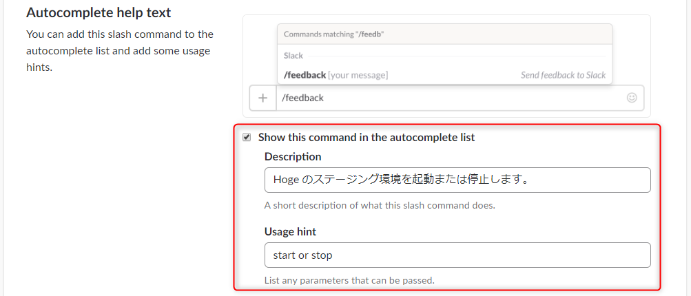

入力が終わったら画面下部の [Save Integration] を押して、コマンドを保存します。

一旦保存すると、 Slack 上ではすでに下記のように Slash Command が使えるかのように候補が表示されます。

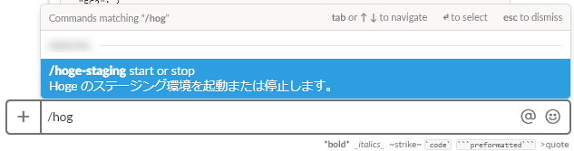


## Lambda 関数の発行

Lambda 関数の設定画面に戻り、空けてあった**環境変数 `SLASH_COMMAND_TOKEN` に今作ったスラッシュコマンドの Token を設定**し、 [保存] してから、 **[新しいバージョンを発行]** を押します。

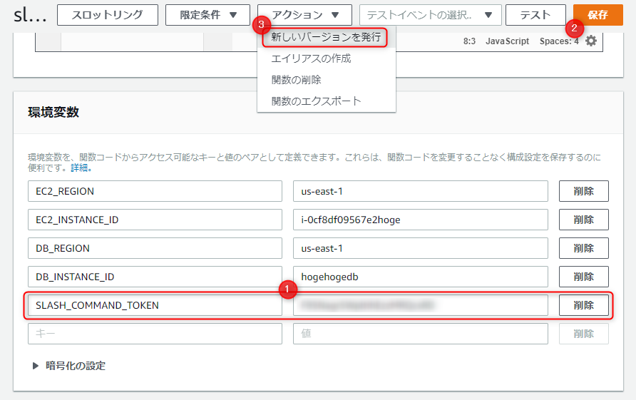

確認ダイアログで [発行] を押すと Lambda 関数が発行されます。これで API からこの Lambda 関数が呼び出せるようになりました。

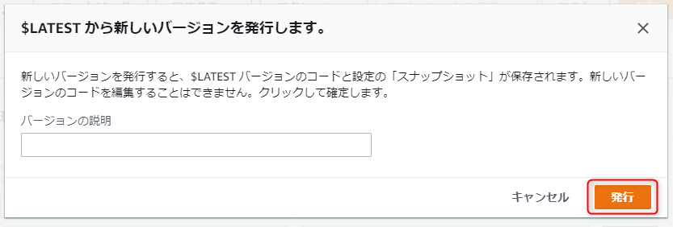


## API Gateway から動作テスト

Lambda で個別にテストもできますが、今回は **API Gateway から直接テスト**します。

API の GET メソッドの設定に戻り、 **[テスト]** をクリックします。

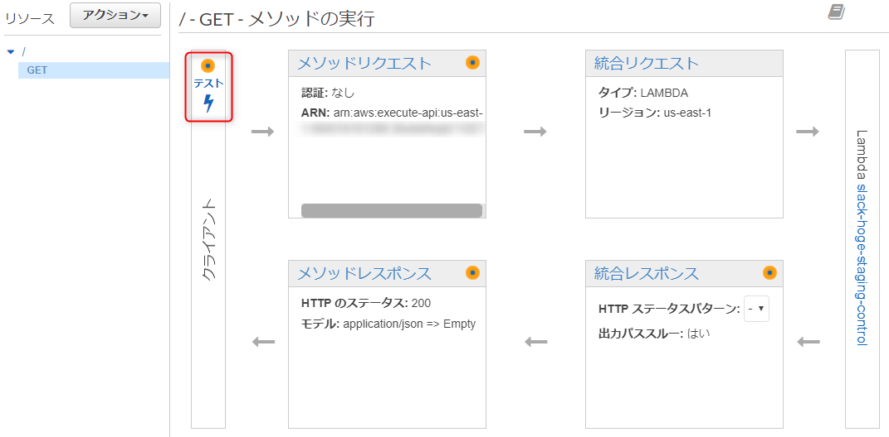

**[クエリ文字列] に Slash Command からのクエリを模した `text=start&token=<Slash Command のトークン>` を記入**し、 [テスト] ボタンを押します。

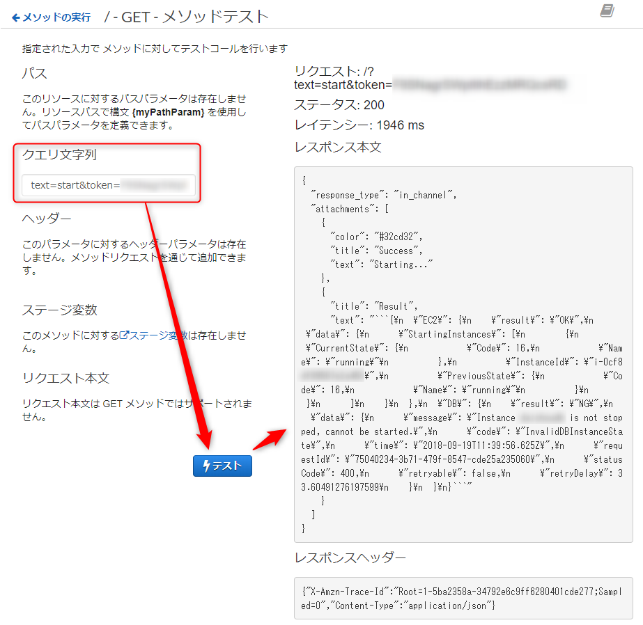

右半分に実行結果が表示され、 [レスポンス本文] に `"response_type": "in_channel",` などが記載されていれば API → Lambda まできちんと動作しています。

`text=start` の部分を `text=stop` にも変えてテストし、 **EC2 や RDS のコンソールで動作状態が切り替わることを確認**してください。


## Slack から実行

これですべての準備が完了しました。

さっそく Slack で自分宛ての DM ででも `/hoge-staging start` と叩いてみましょう。きっと実行されるはずです！

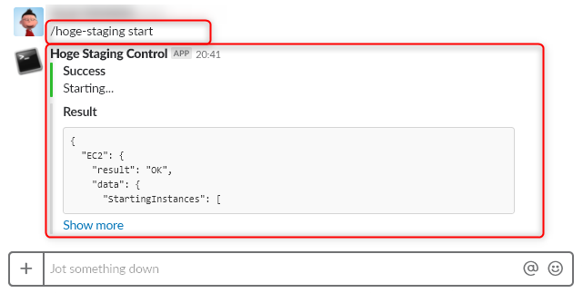

おつかれさまでした。


## 参考： Slack メッセージの書式化

Slack 上で下記のように**カラーバー付きの表示にできるように Lambda 関数の実行結果を、 Slack の仕様に合わせた JSON** で返しています。


Lambda 関数の実行成功時は、 AWS 制御関数の結果を返すため、下記のような JSON になっています。この場合は **`"response_type"` を `"in_channel"` にして、チャンネルに結果が表示し、動作したことを他のメンバーに知らせる**ようにしています。

```json
{
	"response_type": "in_channel",
	"attachments": [
		{
			"color": "#32cd32",
			"title": 'Success',
			"text": message,
		},
		{
			"title": 'Result',
			"text": '```' + JSON.stringify(result, null, 2) + '```',
		},
	],
}
```

Lambda 関数にくるイベント引数が不正な場合など、実行できなかった場合は `"response_type"` を `"ephemeral"` にして、 **Slash Command を叩いた本人にだけ見える**ようにして、赤いバー (`#ff0000`) で表示させています。

```json
{
	"response_type": "ephemeral",
	"attachments": [
		{
			"color": "#ff0000",
			"title": 'Error',
			"text": message,
		},
	],
}
```

より詳細な Slack メッセージ用 JSON のヘルプは下記を参照してください。

>[An introduction to messages | Slack](https://api.slack.com/docs/messages#composing_messages)

