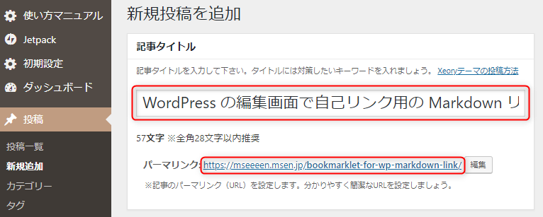

昔々、下記の記事を投稿しました。

- [Markdown 記法のリンクを取得するブックマークレット MDLink](https://mseeeen.msen.jp/bookmarklet-for-markdown-link/)

このブックマークレットは我ながら便利なツールとして使っているのですが、当然ながら公開されたページにしか使えません。

**WordPress を触っていると、未公開のページのリンクを取得したい**ことがあります。パーマリンク部分を右クリックして「リンクのアドレスをコピー」でもかまわないのですが、タイトルを個別にコピーしないといけないのが面倒です。



ということで、（WordPress の記事を Markdown で書いている人しか嬉しくなさそうですが）上図のように**編集画面で記事タイトルとパーマリンクを取得して `[タイトル](URL)` 形式にするブックマークレット**を作りましたので、紹介します。

なお、ちょっと編集すれば `<a>` タグ用にもできますので、 Markdown 嫌いな方はお試しください。

## ブックマークレットの登録方法

<span style="font-size:200%"><a href="javascript:var t=document.querySelector('input#title');var s=document.querySelector('#editable-post-name-full');var a=document.querySelector('#sample-permalink&gt;a');if(t||s||a)prompt('WPLink','['+t.value.toString()+']('+a.firstChild.textContent+s.textContent+')')">WPLink</a></span>

* 方法1. 上の WPLink というリンクをドラッグして、ブラウザのブックマークバー（お気に入りバー）にドロップする
* 方法2. とりあえずブックマーク（お気に入り）ボタンを押して適当なページをブックマークし、ブックマークの編集で URL 部分に下記のソースをコピペする。
  ```
  javascript:var t=document.querySelector('input#title');var s=document.querySelector('#editable-post-name-full');var a=document.querySelector('#sample-permalink>a');if(t||s||a)prompt('WPLink','['+t.value.toString()+']('+a.firstChild.textContent+s.textContent+')')
   ```

わからなければ "[ブックマークレット 登録方法](https://www.google.co.jp/search?q=ブックマークレット%20登録方法)" とかでググりましょう。

## 使い方

1. **リンクを作成したい記事の編集画面**を開き、ブックマークレットをクリックする
2. 表示された Markdown をコピーする
3. 自由に使う

## ソースコード

内容はごく簡単で、 `[タイトル](URL)` の形式を prompt で表示しているだけです。

```javascript
var t=document.querySelector('input#title');
var s=document.querySelector('#editable-post-name-full');
var a=document.querySelector('#sample-permalink>a');
if (t||s||a) prompt('WPLink','['+t.value.toString()+']('+a.firstChild.textContent+s.textContent+')');
```

WordPress の編集画面の仕様変更で使えなくなる可能性大ですが、せめてそれまでは幸せな Markdown ライフをお過ごしください。