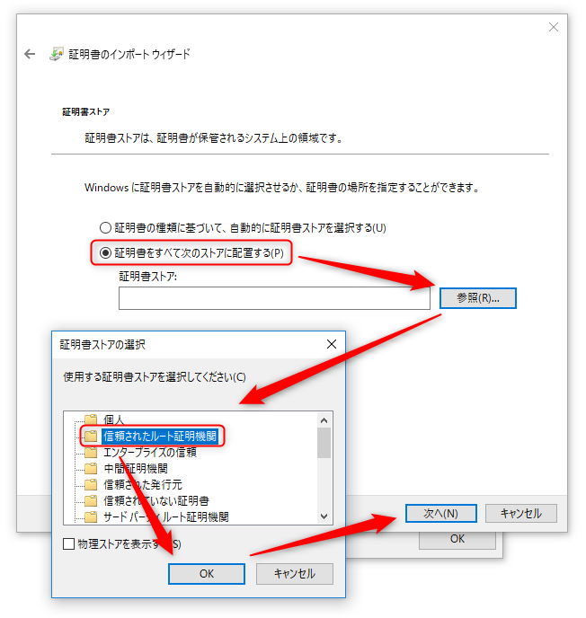

今回は昨今のアプリ開発者は避けて通れない **SmartScreen と .NET アプリのコード署名**のお話です。

## Microsoft SmartScreen

**Microsoft SmartScreen** とは Windows 8 や 10 をつかっていてアプリを実行しようとしたりすると表示されるアレです。


Windows 10 では 8 より厳しくなったため、この画面で [OK] を押すと起動しようとしたアプリは終了してしまい、図中の  [詳細情報] を押さないと [実行] ボタンが表示されないため、 PC に詳しくない人にアプリを使ってもらうのが難しくなってしまいました。

「疑わしきは排除」という感じで安全性に配慮しているのは理解できるのですが、社内や客先で使うアプリを開発したとき、**一般ユーザーにとってはかなり不安な文言なので、この確認を通過させるというのはなかなかハードルが高い**でしょう。

### Microsoft SmartScreen とコード署名用証明書

Microsoft SmartScreen とアプリの署名の話は、以下でも説明しますが、グローバルサインのページもわかりやすいです。

> [Microsoft SmartScreenとは｜GMOグローバルサイン【公式】](https://jp.globalsign.com/service/codesign/knowledge/smartscreen.html)

自作のアプリで Microsoft SmartScreen の警告を出さないようにするには **コード署名** を行う必要があります。

これに必要なのが **コード署名用（コードサイニング）証明書** です。

### 販売会社で価格が大きく異なる

SSL 証明書と同じく、コード署名用証明書でも、販売代理店や認証局で価格が大きく異なります。

長年の経験を元にまとめてくださっている下記のサイトが参考になります。

> [コードサイニング証明書を買う前に （山崎はるかのメモ）](https://www.nda.co.jp/memo/codesigning/index.html)

SSL 証明書でもそうですが、この価格差はある種のブランド価格のようなものなので、基本的に**ちゃんとした認証局のものであれば、どこの証明書でも効果は一緒**です。

あとは対応窓口の充実度などがあると思いますが、先のサイトによれば「初心者はコモドジャパンがおすすめ」だそうです。

### コード証明書と EV コード証明書

購入前に気をつける必要があるのですが、コード証明書には通常のコード署名のものと **EV (Extended Validation) コード署名**のものがあります。

SmartScreen における両者の違いは下記の通りです。

種類 | SmartScreen
-- | -- | --
コード署名なし | 警告あり。 [詳細情報] を押さないと [実行] ボタンが表れない。
通常のコード署名あり | 警告あり。 [実行] ボタンは表示されている。
EV コード署名あり | 警告なし。 **これが理想**

つまり、 **通常のコード署名用証明書で署名しただけでは SmartScreen の警告は回避できない** ということです。

よって EV コード証明書がほしくなるわけですが、名前だけでなく価格も Extended です。

たとえば比較的安価で知られるコモドの場合でも、下記のような価格設定となっており、 **EV コード証明書はおよそ 3 倍の価格** になることがわかります。

種類 | 1年価格 | 3年価格
-- | -- | --
[コード証明書 ](https://comodo.jp/products/codesign.html) | 21,000 円～ | 58,000 円～
[EV コード証明書](https://comodo.jp/products/evcodesign.html) | 65,000 円～ | 170,000 円～

結局のところ **SmartScreen から解き放たれるには EV コード証明書が必要** なことがわかりました。

ただ、年間 65,000 円なんて、個人の、特にフリーソフトの開発者にはなかなか維持できるものではありません。

なんだか証明書業界の利益のために制度化されている気がしないでもないですが、そのうち SSL みたいにほぼ無料の証明書もでてくるのかもしれません。

### そしてオレオレ

ということで、とりあえず署名してみたいとき、あるいは「認証局なんかに頼るか！うちの証明書が正義じゃ！」という場合はいわゆる **オレオレ証明書** を作ります。

オレオレ証明書というとオレオレ詐欺みたいで聞こえは悪いですが、要するに作った人が証明者になるので、ユーザーが作った人自身を信用してくれれば、特に問題はないわけです。

オレオレ証明書は某税務当局や某銀行も使っているので、オンラインサービスの利用時に証明書をインストールさせられるのはこのためでしょう。

## Windows SDK で証明書鍵ファイルを作成

### 証明書ファイルの概要

ということで **Windows 10 でコード署名のオレオレ証明書を作り、 Visual Studio で利用** してみます。

なお、 Visual Studio でも簡易に作成することができますが、有効期間が 1 年間になってしまい、延長するのが面倒なので、下記のコマンドで作成したほうがむしろ楽だと思います。

以下の手順では `.pvk` `.cer` `.pfx` ファイルの 3 ファイルが生成されます。

拡張子 | 取り扱い | 説明
-- | -- | --
`.pvk` | 公開厳禁 | 秘密鍵ファイル
`.cer` | 公開 | 公開鍵を含む証明書ファイル (ユーザーに配布)
`.pfx` | 公開注意 | `.pvk` と `.cer` から生成される署名用ファイル

pfx ファイルは Visual Studio で署名するときに使用します。ファイルの内容については下記の説明がわかりやすいです。

> PFXとは、Personal Information Exchangeの略で、 証明書とそれに関連した秘密鍵を共に格納できる形式を指します。 この形式は、証明書と秘密鍵をパスワードを基に暗号化しているため、 仮に第三者がPFX形式のファイルを入手しても、 パスワードが分からないことには証明書と秘密鍵が取り出されることはありません。
> [PFXのエクスポート](http://eternalwindows.jp/crypto/certmgr/certmgr13.html)

### 作成ツール

オレオレ証明書を作るために **`makecert.exe`** と **`pvk2pfx.exe`** を使用します。

これらは **Windows 10 SDK** というのに含まれていますが、 Visual Studio がインストールされていれば入っていることが多いでしょう。

`C:\Program Files (x86)\Windows Kits\10\bin\10.0.17134.0\x64` とかにあるはずですが、 `C:\Program Files (x86)\Windows Kits\10` あたりでファイル名検索して、なければ個別にインストールしましょう。

> [Windows 10 SDK - Windows app development](https://developer.microsoft.com/en-us/windows/downloads/windows-10-sdk)

### Visual Studio 開発者コマンドプロンプト

VS がインストールされている開発者の方であれば、スタートメニューから **Visual Studio 開発者コマンドプロンプト** を起動して使うとすでにパスが通っているので便利です。


下記ではわかりやすいように `c:\cert` フォルダでも作って作業することにします。

開発者コマンドプロンプトを起動して、 `c:\cert` に移動します。

```
cd c:\cert
```

### pvk + cer の生成

`makecert.exe` を実行します。

```
makecert -n "CN=MSEN,O=MSEN,C=JP" -b 01/01/2000 -e 01/01/2100 -r -sv msen.pvk msen.cer
```

各ファイルは好きな名前にしてください。

`-n` では署名 (`CN`: Cannonical Name, `O`: Organization, `C`: Country) を設定します。 `-r` は自己署名のルート証明書であることを示すフラグで、つまりオレオレ証明書になります。

証明書の期限が切れると当然ながら署名できなくなり、延長するか変更して再インストールする必要がでてきますので、特に期限を重視しないのであれば、 `-b` (開始日) と `-e` (終了日) オプションで期限を長めに設定しておいたほうが無難です。


鍵のパスワードを入力する画面が現れるので、なるべく複雑なものを設定します。
（ここでは以下、 `PASSWORD` とします）

パスワードは確認を含めて 3 回入力します。

### pfx の生成

次に `pvk2pfx.exe` で `.pvk` と `.cer` ファイルから **`.pfx` ファイルを生成**します。

```
pvk2pfx -pvk msen.pvk -spc msen.cer -pfx msen.pfx -f -pi "PASSWORD"
```

同じようなファイル名を何回も入れさせられますが、がんばります。
パスワードは先程設定したものを指定します。

成功すると特にメッセージもなく `.pfx` ファイルが生成されます。


以上で証明書ファイルの作成は完了です。


## オレオレ証明書を用いた .NET アプリの署名

### Visual Studio プロジェクトの署名設定

Visual Studio でプロジェクトのプロパティを開き、 [署名] タブから [アセンブリに署名する] にチェックを入れ、ドロップダウンで [参照...] を選びます。


先ほど作成した `.pfx` ファイルを指定します。パスワードを聞かれますので、作成時のパスワードを入力します。


完了するとプロジェクトのルートに `.pfx` ファイルが追加されます。

このまま **git でコミットしてしまうと全世界に公開されてしまうことになるので、 `.gitignore` に必ず `*.pfx` を追加**しておきましょう。

あとは普通にビルドすれば厳密名で署名した状態のアセンブリになります。

### 参照アセンブリの署名について

なお、参照しているアセンブリ (DLL など) が署名されていない場合、下記のような warning がでます。

```
>CSC : warning CS8002: 参照アセンブリ 'CommLibrary, Version=1.0.4933.7545, Culture=neutral, PublicKeyToken=null' には厳密な名前がありません。
```

また、署名されていない依存ライブラリがある状態で実行ファイル (exe) をビルドしようとすると下記のエラーが起こり、ビルドできません。

```
エラー: 不明なビルド エラー 'ファイルまたはアセンブリ 'HogeHoge, Version=1.2.0.0, Culture=neutral, PublicKeyToken=null'、またはその依存関係の 1 つが読み込めませんでした。厳密な名前付きのアセンブリが必要です。
```

まぁ当然といえば当然なのですが、参照アセンブリを含む全ての実行ファイルが厳密名で署名されている必要があります。

参照ライブラリが同ソリューションの場合は、そのプロジェクトで前述の署名設定を行います。その他、自社でソースコードがある場合は、同様の設定で署名を行えます。

ただ、依存しているライブラリが**外部ライブラリや NuGet で取得しているようなモジュールの場合、コード署名を付加することができませんので、当該モジュールを使用しないか、署名自体を諦めるしかない**ようです。

オープンソースでソースコードを取得できるのであれば、手元で署名をつけてビルドすればいけるはずです。

### 証明書の配布とインストール

署名つきでビルドできたのはいいですが、肝心の**ユーザー側クライアントに証明書がインストールされていなければ、（＝信用されていなければ）意味がありません**。

**`.cer` ファイルをクライアントに配布してインストール**することもできますし、**ドメイン環境であればグループポリシーで設定してクライアントに配布**するのがよいでしょう。グループポリシーでの配布は下記を参照してください。

> [グループ ポリシーを使用してクライアント コンピューターに証明書を配布します。 | Microsoft Docs](https://docs.microsoft.com/ja-jp/windows-server/identity/ad-fs/deployment/distribute-certificates-to-client-computers-by-using-group-policy)

クライアントに直接インストールする場合は、クライアントマシンで `.cer` ファイルをダブルクリックし、 **[証明書のインストール]** をクリックします。


[ローカルコンピューター] を選んで次へ進みます。



次に証明書ストア（証明書保管場所）を選びますが、今回は**「オレの作った証明書が正義じゃ！」というオレオレ証明書なので、信頼されたルート証明機関にルート証明書として登録します。**

[証明書をすべて次のストアに配置する] を選び、 [参照...] から証明書ストアに **[信頼されたルート証明機関]** を選びます。

[OK] や [次へ] 、[完了] を押していくと証明書のインポートが完了します。


## 参考

- [証明書を作成する | Do Design Space](https://sakapon.wordpress.com/2015/12/11/make-certificates/)