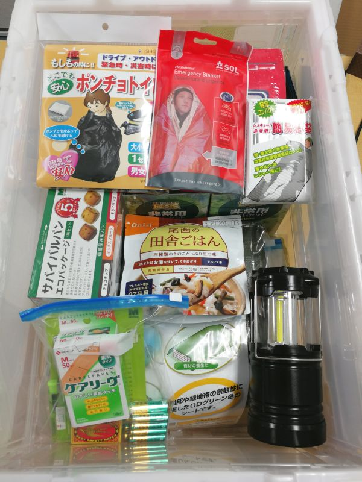
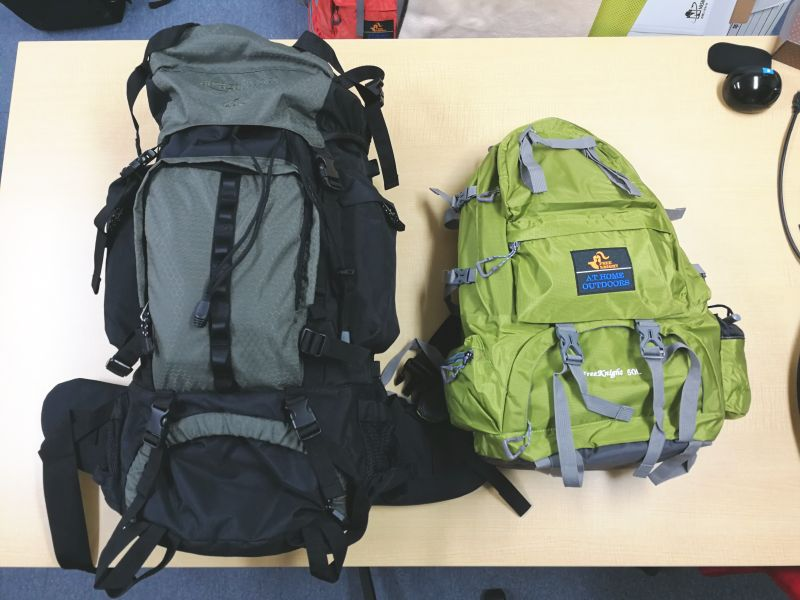

今年は大阪北部地震や大型台風で、いつもは呑気な大阪もかなりの被害があり、自然災害の怖さを再認識する年となりました。

そこで、いままで先延ばしにしていた**災害対策用品を整備**を行いました。

同様に小規模の会社で整備されることがあれば、多少なりとも参考になるのではないかと思います。

## 基本方針

弊社は**事務所以外に役員・社員含めていくつかの家を拠点と考え、それぞれに防災対策用品を配備**することにしました。

なかなか個人でまとまった整備は難しいため、会社として整備することで少し充実した用意ができると思います。

また、会社としても用品を分散できますので、初期費用はかかりますが、冗長性は高くなると思います。ただし食糧のローテーションについてはその分手間がかかりますので、そのあたりは時間的経済的コストの見合いとなります。

## 購入物品の選定

最近は「○○士が考えた災害用品セット」みたいなセット商品も多いのですが、意外と入っているものが少なかったり、割高であったりすることもあり、今回は**自社で物品を選定し、パッケージ化**しました。

物品については、ほとんどAmazonで調達しました。スーパーや百均のほうがコスパのいいものは、個別に買い出しにいって調達しています。

## 物品リスト

参考までに弊社で調達した物品のリストです。

一番右端の列は**2～3人家庭の拠点用**に準備した個数を書いています。

「入り数」と「個数」はわかりにくいかもしれませんが、たとえばカンパンなら販売単位が 10 箱 (入り数10) なのでそのうち 5 箱を 1 バックパックに配分するという意味です。

品名 | 購入物品 | 価格 | 入数 | 個数
-- | -- | -- | -- | --
カンパン | [ミドリ安全   サバイバルパン エコパッケージ ３味セット １０箱](https://www.amazon.co.jp/o/ASIN/B00UTD10UW/m1s-22/ref=nosim) | 8,280 | 10 | 5
コメ | [尾西食品   アルファ米12種類全部セット](https://www.amazon.co.jp/o/ASIN/B06XZM1RGH/m1s-22/ref=nosim) | 3,582 | 12 | 10
保存飲料水 | [[Amazonブランド]Happy Belly 長期保存水   500ml×24本](https://www.amazon.co.jp/o/ASIN/B077S3698L/m1s-22/ref=nosim) | 3,120 | 24 | 3
サバイバルシート | [SOL(ソル) アウトドア ヒートシート エマージェンシーブランケット   1人用](https://www.amazon.co.jp/o/ASIN/B001MVZRSQ/m1s-22/ref=nosim) | 632 | 1 | 3
防災たいさく手帖 | [防災たいさく手帖](https://www.amazon.co.jp/o/ASIN/B074M22Q9T/m1s-22/ref=nosim) | 270 | 1 | 1
レスキュー簡易寝袋 | [[5個セット]   レスキュー簡易寝袋](https://www.amazon.co.jp/o/ASIN/B007WJDPAY/m1s-22/ref=nosim) | 1,680 | 5 | 3
ブルーシート | [ユタカ #3000ODグリーンシート 1.8mx1.8m   OGS01](https://www.amazon.co.jp/o/ASIN/B00I4KQM3C/m1s-22/ref=nosim) | 306 | 1 | 1
非常用ローソク | [カメヤマ ローソク 長時間 24時間 ボーティブ カップ入り   6個セット](https://www.amazon.co.jp/o/ASIN/B004UO199S/m1s-22/ref=nosim) | 1,745 | 6 | 3
ティーライトキャンドル | [Hwagui ティーライトキャンドル 業務用 無香料 燃焼   8時間以上](https://www.amazon.co.jp/o/ASIN/B07D6GMWJL/m1s-22/ref=nosim) | 1,530 | 50 | 8
非常用給水バッグ | [アイリスオーヤマ ウォータータンク 10リットル    WAT-10L](https://www.amazon.co.jp/o/ASIN/B00TDKRUAG/m1s-22/ref=nosim) | 888 | 2 | 1
すべり止め付軍手 | [TRUSCO WARMすべり止め付裏起毛軍手 12双組   TGW-835](https://www.amazon.co.jp/o/ASIN/B00I4NRRO2/m1s-22/ref=nosim) | 1,109 | 12 | 4
抗菌消臭・簡易トイレ | [驚異の防臭袋 BOS (ボス) 非常用 トイレ セット   50個](https://www.amazon.co.jp/o/ASIN/B00OYO4TOG/m1s-22/ref=nosim) | 5,400 | 50 | 20
携帯用ミニトイレ | [アイワ 携帯トイレミニ   3個入](https://www.amazon.co.jp/o/ASIN/B002T3RO78/m1s-22/ref=nosim) | 367 | 3 | 6
ポンチョトイレ | [ポンチョトイレ １回分   ５個セット](https://www.amazon.co.jp/o/ASIN/B01ISHDG2A/m1s-22/ref=nosim) | 1,998 | 5 | 2
フェイスタオル | [Gizaniton 冷却タオル(3セット)   スポーツタオル](https://www.amazon.co.jp/o/ASIN/B07CZZ31FT/m1s-22/ref=nosim) | 995 | 3 | 2
防災用ウェットティッシュ | [除菌おでかけウェットティッシュ 大判 20枚入×10個セット](https://www.amazon.co.jp/o/ASIN/B00G9UEGL4/m1s-22/ref=nosim) | 1,597 | 10 | 3
絆創膏 | [ケアリーヴ Mサイズ 50枚 CL50M](https://www.amazon.co.jp/o/ASIN/B000FQU6H6/m1s-22/ref=nosim) | 496 | 1 | 0.4
加熱器 | [モーリアンヒートパック Lサイズ発熱剤×3個+加熱袋(L)1枚入り](https://www.amazon.co.jp/o/ASIN/B005C23QVG/m1s-22/ref=nosim) | 1,026 | 1 | 1
ダイナモ式ラジオ | [Natuoke 非常用ライト 手回し式充電器   AM/FMラジオライト](https://www.amazon.co.jp/o/ASIN/B07FP7XB6W/m1s-22/ref=nosim) | 2,400 | 1 | 0
懐中電灯/ランタン | [Raniaco LEDランタン](https://www.amazon.co.jp/o/ASIN/B074V4DZZZ/m1s-22/ref=nosim) | 1,889 | 2 | 0
防災頭巾 | [アイリスオーヤマ 防災グッズ 防災頭巾 シルバー 難燃加工   BZN-300](https://www.amazon.co.jp/o/ASIN/B002NEVVKO/m1s-22/ref=nosim) | 920 | 1 | 3
バッグ   大 | [Amazonベーシック インターナルフレームハイキングバックパック 65L   グリーン](https://www.amazon.co.jp/o/ASIN/B07B3STPYG/m1s-22/ref=nosim) | 4780 | 1 | 1
バッグ   小 | [REEDARK 登山バッグ 50L   防水防災](https://www.amazon.co.jp/o/ASIN/B07J2N66XC/m1s-22/ref=nosim) | 4599 | 1 | 0
非常用カイロ | スーパーで調達 |   |   | 5
トイレットペーパー | スーパーで調達 |   |   | 1
ポケットティッシュ | Seriaで調達 |   |   | 2
ホイッスル | Seriaで調達 |   |   | 1
ライター・マッチ | Seriaで調達 |   |   | 1
電池   単3・単4 | Seriaで調達 |   |   | 1
ゴミ袋 | Seriaで調達 |   |   | 1
キッチンバサミ | Seriaで調達 |   |   | 1
布テープ | Seriaで調達 |   |   | 1
ラップ | Seriaで調達 |   |   | 1
マスク | Seriaで調達 |   |   | 3

## 物品選定詳細

いくつかの物品について、メモです。

### バックパック

災害用には難燃素材の銀色のバックパックもありますが、小容量で高価なので、割り切って普通のバックパックを採用しました。

バッグは二～三人家庭用が 65L (写真左)、一人家庭用が 50L (写真右) にしました。

大きいほうのバックパックは最初 Amaazon のレビューで評価のよかった7000円ぐらいのよくわからないブランドの 80L を買いましたが、作りがイマイチなのと大きすぎたため、返品し、**[Amazonベーシックの65Lバックパック](https://www.amazon.co.jp/o/ASIN/B07B3STPYG/m1s-22/ref=nosim)** にしました。

5000 円程度にもかかわらず、ポケットも多く、デザインも登山用バックパックとしても遜色ない感じなので、これがベターと思います。

### 食糧

5日程度耐えることを想定しています。**パン系、コメ系と水**があればだいたい大丈夫でしょう。

いずれも**賞味期限が5年の長期保存可能**な商品です。Amazonで購入する場合、賞味期限の短いものが届く場合があるようですが、弊社で調達したものはいずれも5年以上ある、良品でした。

### トイレ

リストからもわかりますが、トイレ用品はかなり充実させています。

人間は1週間食べなくても大丈夫ですが、1週間排泄しなければ重篤になりますので、**トイレの確保はむしろ食糧より重要**です。

自宅で生活できるとしても、水の流れない環境では排泄物の処理が重要になりますので、処理剤に加え、匂いを閉じ込めて衛生的に廃棄できる袋が必要です。

ということで、子供向けの簡易トイレ・女性用のポンチョトイレに加え、定評のある [驚異の防臭袋 BOS (ボス) 非常用トイレセット](https://www.amazon.co.jp/o/ASIN/B00OYO4TOG/m1s-22/ref=nosim) を多めに用意しました。

## あとがき

**備えあれば憂いなし。**

かなり手間はかかりましたが、それなりに充実した災害対策セットができたと思います。

あとはこれらを使う機会がこないことを祈りつつ、すぐ使える場所に置いておくことを忘れないようにしたいと思います。
