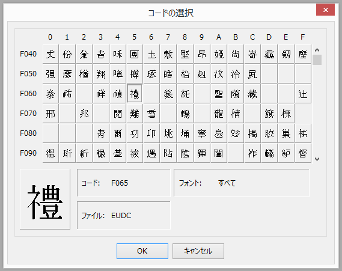
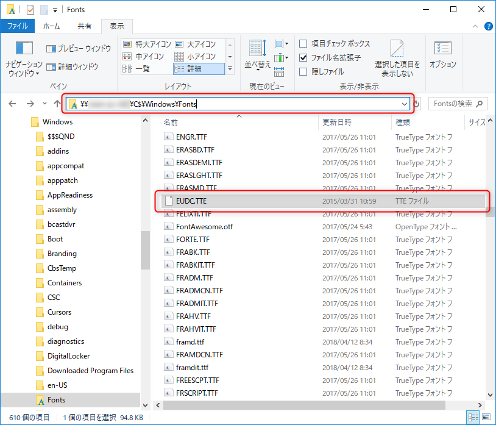

業務システムを作っていると「**外字**」とお友達にならないといけないときがあります。

「外字ってなんやねん？」「外国の字か？！」とか言いたい気持ちはさておき、これを WPF (C#) で扱う方法を紹介します。

## 外字とは

このページを見ている人には蛇足と思いますが、コンピューターで言う「**外字**」とは既定で定義された以**外**の**字** を言います。

標準のフォントに入っていない人名漢字などをシステムで使用しなければならない場合に定義することがあります。基本的には「ペイント」のようにドットの集まりで文字の形を表現したものですので、↓の図でもわかるように、表示上は現代のフォントのようにきれいには表示されません。



古い機能ですが、需要は変わらないので、現在の Windows でもスタートメニューから「**外字エディター**」と入力すれば作成画面を開くことができます。そういえば昔、父がもっていたカシオのワープロでいろいろ外字を作って遊んでたころがありました。

ちなみに英語では External (外部の) character, Extended (拡張) character などとも呼びます。また **End User Defined Character** (ユーザー定義文字) の頭文字をとって **EUDC** と呼ぶこともあります。

## 外字はどこにあるのか

外字を定義すると「**外字フォント**」が作成されます。

だいたいの場合 `C:\Windows\Fonts\EUDC.tte`, `EUDC.tte` にあるんですが、違う場合もあります。面倒ですね。

おまけに、 `Fonts` フォルダに入っていてもデフォルトの Windows の「フォント」一覧からは見ることができません。エクスプローラーのパス指定で `\\PC 名\C$\Windows\Fonts\` とでも入力して生のフォルダ構造を見てやると表示できます。



## 先人の知恵に与る

そもそも WPF で本格的に業務システムを作っている人が少ないので、さてどうするかと思案していたところ、なんとドンピシャな先人がおられました。

- [C#のWPFで外字を表示する その１ - Ararami Atudio](https://araramistudio.jimdo.com/2017/04/21/wpf%E3%81%A7%E5%A4%96%E5%AD%97%E3%82%92%E8%A1%A8%E7%A4%BA%E3%81%99%E3%82%8B-%E3%81%9D%E3%81%AE%EF%BC%91/)
- [C#のWPFで外字を表示する その２ - Ararami Atudio](https://araramistudio.jimdo.com/2017/04/21/wpf%E3%81%A7%E5%A4%96%E5%AD%97%E3%82%92%E8%A1%A8%E7%A4%BA%E3%81%99%E3%82%8B-%E3%81%9D%E3%81%AE%EF%BC%92/)

はい、もうほぼすべて書かれているので、私の拙い文章にあらためる必要もありません。

`Window` クラスの `FontFamily` プロパティーのデフォルト値を書き換えてしまうというクレバーな方法です。

少し手を入れたバージョンを Gist に上げていますので、 `App.xaml.cs` (`App.xaml` のコードビハインド) に追加するだけです。

- [WPF で外字フォントを表示する - gist](https://gist.github.com/kenzauros/a79d3eda53fda48be09e836bcad1658c)

```cs
public partial class App
{
    public App()
    {
        PrepareEUDCFont();
    }

    /// <summary>
    /// 外字フォントを Window のデフォルトフォントに追加します。
    /// </summary>
    /// <seealso cref="https://araramistudio.jimdo.com/2017/04/21/wpf%E3%81%A7%E5%A4%96%E5%AD%97%E3%82%92%E8%A1%A8%E7%A4%BA%E3%81%99%E3%82%8B-%E3%81%9D%E3%81%AE%EF%BC%92/"/>
    private void PrepareEUDCFont()
    {
        var ffDef = Window.FontFamilyProperty.DefaultMetadata.DefaultValue as System.Windows.Media.FontFamily;
        var ffName = ffDef.Source;

        string eudc = "C:\\Windows\\Fonts\\EUDC.tte";
        string eudcDef = null;
        string eudcCur = null;
        using (var key = Registry.CurrentUser.OpenSubKey("EUDC\\932"))
        {
            foreach (var nm in key.GetValueNames())
            {
                if (0 == nm.CompareTo("SystemDefaultEUDCFont"))
                    eudcDef = key.GetValue(nm) as string;

                if (0 == nm.CompareTo(ffName))
                    eudcCur = key.GetValue(nm) as string;
            }
            if (eudcDef != null) eudc = eudcDef;
            if (eudcCur != null) eudc = eudcCur;
        }

        var path = Path.IsPathRooted(eudc)
            ? eudc
            : Path.Combine(Environment.GetFolderPath(Environment.SpecialFolder.Fonts), eudc);
        ffName = ffName + ", " + new Uri(path).AbsoluteUri + "#EUDC";
        var font = new System.Windows.Media.FontFamily(ffName);

        var style = new Style(typeof(Window));
        style.Setters.Add(new Setter(Window.FontFamilyProperty, font));

        FrameworkElement.StyleProperty.OverrideMetadata(typeof(Window), new FrameworkPropertyMetadata(style));
    }
}
```

手を入れたのは最後のほうだけです。

フォントパスの指定のあたりは、掲載されているパス指定ではレジストリーに書かれたパスが相対パスの場合にうまくいきませんでした。そのためルート (`C://` など) が含まれるかどうかでパスの表現を変えることにしました。

また `file:///` から始まる URI に変換する際、 `Uri` クラスの `AbsoluteUri` メソッドを使うようにしました。

このソースコードでは Shift-JIS のみ対応していますので、日本語以外ではコードページ (レジストリーキーの `932` 部分 = Shift-JIS) を変えなければ機能しないと思います。

それでは「外字」と楽しい午後をお過ごしください。
