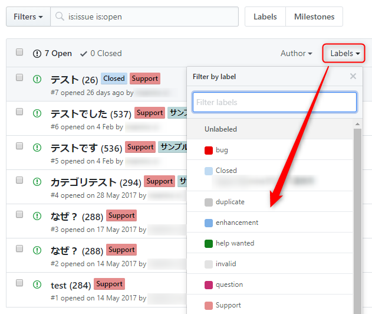
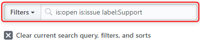
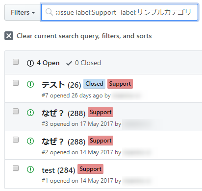

**GitHub** も **Issue** が増えてくると必要なものを確認するのが面倒になってきます。

**GitHub で「タグ」的に使える「ラベル (label)」**。様々な識別や自動化にも利用しています。

今回はこのラベルを使った小技を一つご紹介します。

## 特定のラベルを含む Issue の検索

「特定のラベルの Issue」は標準の GUI から下記のようにフィルタリングすることができます。



これで Filter には `is:open is:issue label:Support` という具合にラベル条件が指定されます。



では、「特定のラベルを**含まない** Issue」 を表示したい場合はどうすればいいでしょうか。

## 特定のラベルを含まない Issue の検索

この場合 GUI では指定できない (と思う) ので、 **Filter ボックスに `-label:ラベル名` の形式で直接指定**します。

たとえば先ほどの検索条件に加えて「『サンプルカテゴリ』というラベルを含まない Issue」を抽出する場合、下記のように指定します。

```
is:open is:issue label:Support -label:サンプルカテゴリ 
```

このとおり、サンプルカテゴリの Issue が除外されます。



端的に言えば、**条件に `-` つけるだけ**ですね。

では、すてきな GitHub ライフをお過ごしください。
