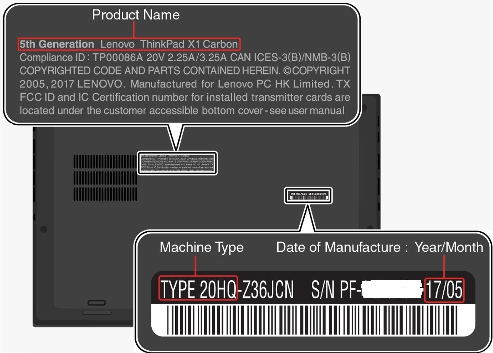
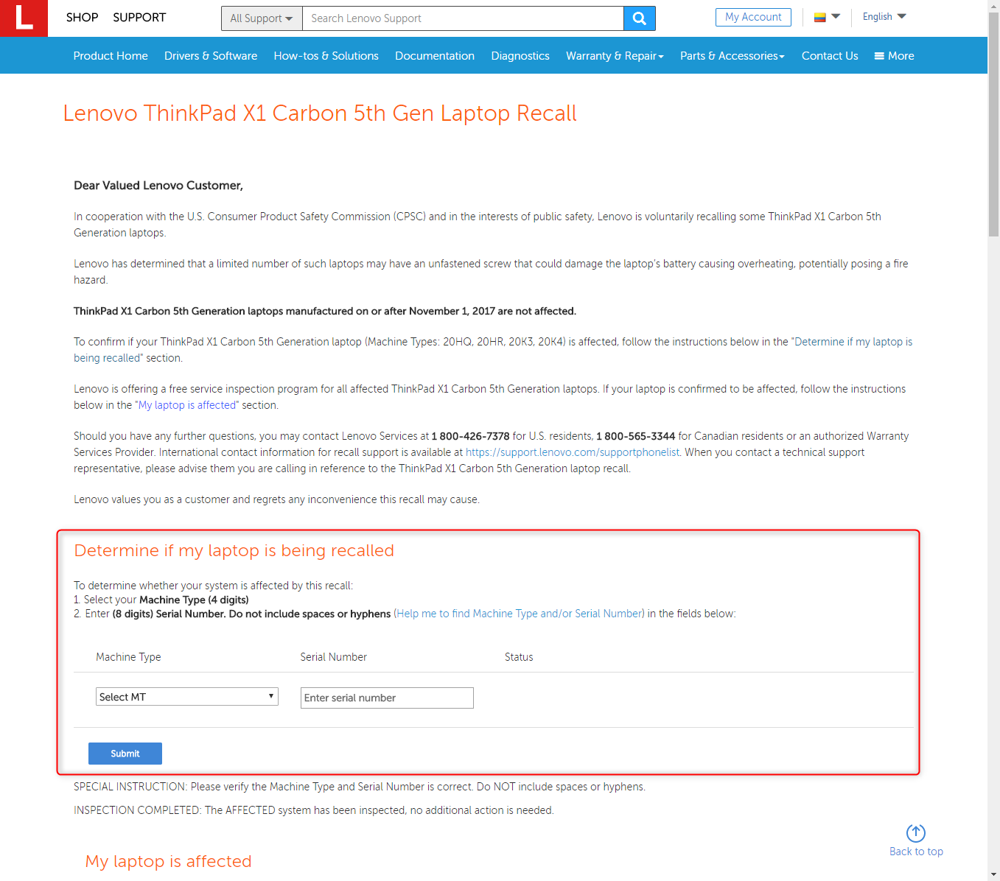
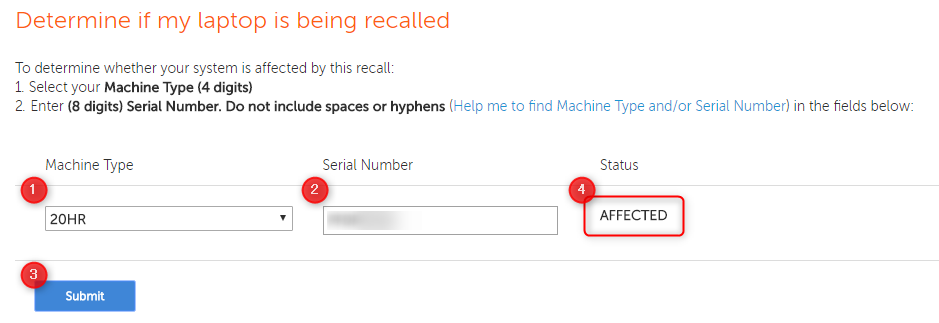

こんにちは、kenzauros です。

私の愛用する Lenovo の **ThinkPad X1 Carbon** がリコールの対象かも...ということで早速チェックしました。

リコールに関する記事はこちら。

>対象となるのは、**2016年12月から2017年10月までに生産されたもの**です。日本外で購入されたものも対象です。Lenovoが用意したこちらのウェブサイトに「マシンタイプ」と「シリアルナンバー（S/N）」を入力すると対象端末かどうかチェックできますよ（対応窓口の情報もこちら）。ちなみに、**対象製品には無償点検と無償修理**が提供されるそうです。
>
> [Lenovoの「ThinkPad X1Carbon」にリコール 異常加熱で発火の可能性 - ライブドアニュース](http://news.livedoor.com/article/detail/14268898/)

**2017年11月1日以降に生産されたもの** は大丈夫なようです。ちなみに私は **2017年5月** ですので、思いっきり期間内でした！

## 公式ページで調査

まず、マシンタイプとシリアル番号を確認します。本体裏面のラベルに記載されている、 **TYPE** と **S/N** がそれにあたります。

公式のリコール情報ページにアクセスします。

>[Lenovo ThinkPad X1 Carbon 5th Gen Laptop Recall](https://support.lenovo.com/co/en/solutions/ht504453)

**Determine if my laptop is being recalled** のところに下記の手順で入力します。

1. 4 桁の **マシンタイプ Machine Type** を選択します。
2. 8 桁の **シリアル番号 Serial Number** を入力します。（ハイフンやスペースは不要です）
3. **Submit** (送信) ボタンを押します。

図のように 4 のところに **AFFECTED** と出れば、おめでとうございます！あなたはリコール対象です！

...

......

orz

**幸い、まだ我が家は燃えていません。**

## レノボへの連絡

なんと **日本はホットラインの電話番号だけでメールや Web からの問い合わせはできません。**

> [Contact for the Asia Pacific Country - please contact Lenovo by hotline/email to arrange the service according to your location. For the customer in Hong Kong and Macau, also can submit inspection request by fill into the Online Form](https://support.lenovo.com/co/en/solutions/ht506106)

素直に **0120-988-819** に電話しましょう。
