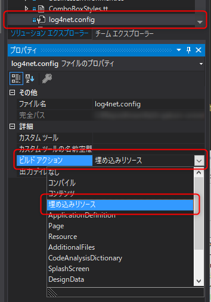

こんにちは、kenzauros です。

C# のロギングといえば、今日日は **[NLog](http://nlog-project.org/)** のほうが盛んかもしれませんが、私は未だ **[log4net](https://logging.apache.org/log4net/)** を使用しています。

- [log4net](https://logging.apache.org/log4net/)
- [NLog](http://nlog-project.org/)

log4net の config ファイル (`log4net.config` とか `Log4net.Config.xml` とか) はアプリケーションと同じフォルダに配置して読み込むのが多いと思うんですが、大人の事情により、「exe と dll 以外配信できない」という面倒な状況になりました。

これは困った、ということで、 config を実行ファイルに埋め込んだ上で、初期化時に**埋め込みリソース (Embedded Resource) から設定ファイルを読み込む方法**を紹介します。

## 設定ファイルを埋め込みリソースに変更



なにはともあれ `log4net.config` のビルドアクションを **埋め込みリソース** に設定します。

## App コンストラクタで設定

ロガーを使う前ならどこでもいいわけですが、とりあえず App のコンストラクタで設定ファイルを読み込ませます。

```cs
public partial class App : Application
{
    // log4net ロガー
    public static readonly log4net.ILog Logger = log4net.LogManager.GetLogger(MethodBase.GetCurrentMethod().DeclaringType);

    public App()
    {
        // 埋め込みリソースからロガーの設定を取得する
        var assembly = Assembly.GetExecutingAssembly();
        var resourceName = assembly.GetManifes‌​tResourceNames()
            .FirstOrDefault(x => x.EndsWith("log4net.config"));
        if (resourceName != null)
        {
            using (var stream = assembly.GetManifestResourceStream(resourceName))
            {
                log4net.Config.XmlConfigurator.Configure(stream);
            }
        }
    }
}
```

おおまかな流れは下記の通りです。

1. `Assembly.GetExecutingAssembly` で実行ファイルの情報を取得
2. `assembly.GetManifes‌​tResourceNames` で実行ファイルに含まれるリソース名の一覧を取得
3. 設定ファイルのファイル名 (`log4net.config`) で終わるリソース名を抽出
4. そのリソース名のリソースを `assembly.GetManifestResourceStream` で開く
5. `log4net.Config.XmlConfigurator.Configure(stream);` でロガーに設定を反映

2 で得られるリソース名は、名前空間名がくっついて長ったらしいので、 `.FirstOrDefault(x => x.EndsWith("log4net.config"))` で後方一致検索させています。

当然ながら log4net の設定ファイル限らず、**埋め込みリソースから名前で検索してファイルを使用する場合**には同様の方法が使えます。

ちなみに含まれるリソースのリソース名一覧は下記のようにでもすれば列挙できます。

```cs
var assembly = Assembly.GetExecutingAssembly();
assembly.GetManifes‌​tResourceNames().ToList().ForEach(Console.WriteLine);
```

なにかの助けになれば幸いです。
