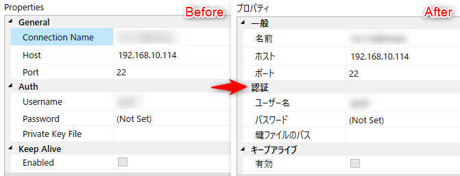

Xceed Software 社の **[Extended WPF Toolkit](https://github.com/xceedsoftware/wpftoolkit)** に含まれる **[PropertyGrid](https://github.com/xceedsoftware/wpftoolkit/wiki/PropertyGrid)** は自作アプリなどでプロパティーを設定する UI を提供するために非常に有用です。

Extended WPF Toolkit はライセンス的にも **[Microsoft Public License (MS-PL)](https://opensource.org/licenses/MS-PL)** で提供されるため、使いやすいです。

ただし、この PropertyGrid 、公式 Wiki もそこそこ充実しているのですが、やはり凝った使い方をするにはオンラインの断片的な情報をつなぎ合わせるしかありません。

その中でも一筋縄で行かなかったのが、**表示名やカテゴリー名のローカライズ、つまり国際化対応**です。

## 概要

### やりたいこと



左のように英語表記だったものを右のような日本語表記に変えたいのです。

### WPF の国際化対応について

**WPF アプリケーションのローカライズ**に関しては、この記事では割愛しますので、 MS か先達の記事を参照ください。

- [WPF のグローバリゼーションおよびローカリゼーションの概要 | Microsoft Docs](https://docs.microsoft.com/ja-jp/dotnet/framework/wpf/advanced/wpf-globalization-and-localization-overview)
- [WPFアプリケーションの国際化対応 - かずきのBlog@hatena](https://blog.okazuki.jp/entry/20110309/1299683215)
- [WPF での文字列リソースの利用と国際化 | プログラマーズ雑記帳](http://yohshiy.blog.fc2.com/blog-entry-232.html)

プロジェクトに `Resources.resx` `Resources.ja-JP.resx` が配置済み、ソースコードから `Resources.リソース名` で文字列が取得できるようになっているものとします。

## PropertyGrid の表示制御とローカライズ

### PropertyGrid の表示制御に必要な属性

**PropertyGrid で要素の表示を制御するために必要な属性**は主に下記の通りです。

属性 | 指定対象 | 用途 | 国際化の要否
-- | -- | -- | --
**`CategoryAttribute`** | プロパティー | カテゴリー名の設定 | 要
**`DisplayNameAttribute`** | プロパティー | プロパティーの表示名 | 要
**`DescriptionAttribute`** | プロパティー | プロパティーの説明 | 要
`PropertyOrderAttribute` | プロパティー | プロパティーの並び順指定 | 不要
`BrowsableAttribute` | プロパティー | プロパティーの非表示指定 | 不要
**`CategoryOrderAttribute`** | クラス | カテゴリーの並び順指定 | 要

※ `CategoryOrderAttribute` のみ Xceed.Wpf.Toolkit PropertyGrid の独自属性です。

通常、それぞれの属性の指定は下記のようになります。

```cs
[CategoryOrder("General", 1)]
internal class AwesomeClass {

    [Category("General"), PropertyOrder(1)]
    [DisplayName("Your Name")]
    [Description("Input your name in English")]
    public string Name { get; set; }

    [Category("General"), PropertyOrder(2)]
    [DisplayName("Your Age")]
    [Description("Input your age")]
    public int Age { get; set; }

}
```

`Browsable` や `PropertyOrder` はその性質上、多言語化を考慮する必要はありません。
`CategoryOrder` はカテゴリー名自体が多言語化されるため、並び順指定に使うカテゴリー名も国際化に合わせて変えてやる必要があります。

ということで、前述の表で "要" となっている 4 つのクラスについて多言語化を行います。

以下、詳細を説明しますが、ソースコードは Gist にも置いていますので、参照ください。

> [Extended WPF Toolkit PropertyGrid ローカライズ (国際化/多言語対応) - Gist](https://gist.github.com/kenzauros/0d61bb42fb3410a238f896234a8cad19)

### Resources のラッパークラス作成

Visual Studio が生成する `Resources` クラスは `Resources.MyText` のような感じで静的にリソース名を指定するしかできません。
`Resources.Get("MyText")` のようにキーを指定してリソースを取得できないのです。

そのため、まず **`Resources` クラスからキー指定で文字列を取得する静的なラッパークラス**を作成します。本来ならパーシャルクラスで定義したいところですが、クラスに `partial` がついていないため、しかたなく別クラスにしています。

名前はなんでもいいのですが、ここでは **`LocalizedResources`** としました。

```cs
internal static class LocalizedResources
{
    readonly static ResourceManager _ResourceManager = new ResourceManager(typeof(Resources));

    public static string GetString(string resourceKey)
    {
        return _ResourceManager.GetString(resourceKey) ?? resourceKey;
    }
}
```

中身は `ResourceManager.GetString()` をプロキシしているだけの単純なユーティリティークラスです。

この **`LocalizedResources.GetString()` でリソースからローカライズされた文字列が取得できる**ので、各属性クラスを継承したクラスからこれを利用します。

### ローカライズに対応した属性クラスの作成

`LocalizedResources` ができてしまえば、継承クラスの実装は極めてシンプルです。

```cs
internal class LocalizedCategoryAttribute : CategoryAttribute
{
    public LocalizedCategoryAttribute(string resourceKey)
        : base(LocalizedResources.GetString(resourceKey)) { }
}

internal class LocalizedDisplayNameAttribute : DisplayNameAttribute
{
    public LocalizedDisplayNameAttribute(string resourceKey)
        : base(LocalizedResources.GetString(resourceKey)) { }
}

internal class LocalizedDescriptionAttribute : DescriptionAttribute
{
    public LocalizedDescriptionAttribute(string resourceKey)
        : base(LocalizedResources.GetString(resourceKey)) { }
}

internal class LocalizedCategoryOrderAttribute : CategoryOrderAttribute
{
    public LocalizedCategoryOrderAttribute(string resourceKey, int order)
        : base(LocalizedResources.GetString(resourceKey), order) { }
}
```

つまり**継承クラスのコンストラクターで国際化済みの文字列を取得し、もともとの属性クラスのコンストラクターに渡して初期化**しているだけです。

### ローカライズ済み属性の適用

新しい属性クラスができたら、**既存の属性指定を `Localized` なんたらに置き換え**ます。当然ながら、**引数には `Resources.resx` で定義したリソース名を指定**してください。

```cs
[LocalizedCategoryOrder("Category_General", 1)]
internal class AwesomeClass {

    [LocalizedCategory("Category_General"), PropertyOrder(1)]
    [LocalizedDisplayName("Property_Name_DisplayName")]
    [LocalizedDescription("Property_Name_Description")]
    public string Name { get; set; }

    [LocalizedCategory("Category_General"), PropertyOrder(2)]
    [LocalizedDisplayName("Property_Age_DisplayName")]
    [LocalizedDescription("Property_Age_Description")]
    public int Age { get; set; }

}
```

これで `Resources.ja-JP.resx` にも `Category_General` などを定義すれば、無事 PropertyGrid で日本語化ができているはずです。

またこの `Localized` なんたらなクラスを応用すれば、多言語化だけでなく、もっと柔軟に `Category` や `Description` を変化させることもできるでしょう。

## 関連情報

### 先人たちの取り組み

このローカライズのためのアプローチは、 10 年以上前からさまざまな人が取り組んでいます。

- [Localization of Property Grid - PropertyGrid - UI for WPF Forum](https://www.telerik.com/forums/localization-of-property-grid)
- [c# - Localization of DisplayNameAttribute - Stack Overflow](https://stackoverflow.com/questions/356464/localization-of-displaynameattribute)
- [Localize Properties for the PropertyGrid](https://social.msdn.microsoft.com/Forums/vstudio/en-US/6a7a2088-81b3-4ce5-a9f5-3e461406bc4f/localize-properties-for-the-propertygrid?forum=netfxbcl)

最も役にたったのは下記の Brian Lagunas 氏の 2015 年の記事でした。

- [Localize Property Names, Descriptions, and Categories for the XamPropertyGrid | Infragistics Blog](https://www.infragistics.com/community/blogs/b/blagunas/posts/localize-property-names-descriptions-and-categories-for-the-xampropertygrid)

継承クラスで `ResourceManager` からリソースを取得してくるというアイディアがグッドです。国際化の例が日本語なのも好印象です(笑)

余談ですが、彼は Infragistics 社の Senior Product Owner みたいです。 Infragistics 社にとって日本も重要なマーケットであることがうかがい知れます。

彼は各クラスのメンバーをオーバーライドして実装していたのですが、それぞれオーバーライドするメンバーが異なるので、少々煩雑なイメージがありました。

そこで `ResourceManager` の部分を別クラスに切り出し、各継承クラスはコンストラクターのみオーバーライドするだけで実現できるようにしたのが、今回の記事です。

しかし今あらためて見返すと他の参照記事に似たようなアイディアがありましたね...
自分で実装してみないとわからないものです😭


### DisplayAttribute というのもある

ちなみに表示名だけでよければ、リソースを使用できる **`DisplayAttribute`** という属性クラスもあります。

`DisplayAttribute` は下記のように利用します。

```cs
[Display(ResourceType = typeof(Resources), Name = "Property_Name_DisplayName")]
```

これでもたしかに表示名が国際化できました。

あと、実はこの `DisplayAttribute` には `Description` プロパティーや `GroupName` プロパティーなどもあります。

```cs
[Display(ResourceType = typeof(Resources), Name = "Property_Name_DisplayName", Description = "Property_Name_Description", GroupName = "Category_General")]
```

こんな感じで指定すれば、全部リソースからイイ感じにとってきてくれる...ことが期待されます。が、残念ながら私の環境では `GroupName` などを指定すると PropertyGrid の表示が途中で止まってしまい、動作しませんでした。

WPF Toolkit の PropertyGrid が対応していないだけなのかもしれませんが、ソースを追う気力はなかったので、諦めました。残念です。

まぁ、今回の記事のソースコードは非常にシンプルですので、現状ではベターな解決法だと思います。
