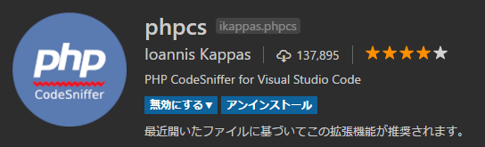
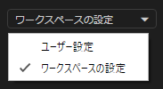

プログラミングにおいて開発チーム内でコーディング規約を定めて、書式を統一しておくことは非常に重要です。

言語、IDE (統合開発環境) によって、それぞれコーディングスタイルを強制するような仕組みがあります。

PHP の場合は [PHP_CodeSniffer](https://github.com/squizlabs/PHP_CodeSniffer) (phpcs) を使います。

## インストール

### Composer でインストール

これが一番簡単でしょう。

```
composer global require "squizlabs/php_codesniffer=*"
```

### pear でインストール

pear コマンドが使える状態では、 pear でもインストールできます。

```
pear install PHP_CodeSniffer
```

他にも github からソースコードをダウンロードしてインストールする方法もありますが、ここでは割愛します。

### 開発環境（エディタ）側の設定

ご使用の開発環境で PHP_CodeSniffer が有効になるように設定する必要があります。

VSCode の場合、 **phpcs** という拡張機能をインストールする必要があります。



## 使い方

### 詳細は Wiki を参照（ただし英語）

基本的な使い方は Wiki にいっぱい書いてありますが、英語しかありません。

- [squizlabs/PHP_CodeSniffer Wiki](https://github.com/squizlabs/PHP_CodeSniffer/wiki)

### コーディング標準について

PHP_CodeSniffer にソースコード評価にどういった規則を適用するかを指定してやる必要があります。

これを **コーディング標準 (Coding Standard)** と呼びます。

既定のコーディング標準として用意されているものは `phpcs -i` コマンドで知ることができます。

- PEAR
- PHPCS
- PSR1
- PSR2
- Squiz
- Zend

VSCode の場合、**設定の "phpcs.standard" オプション**に、この名前を指定することでそのコーディング標準に則って評価されます。

### コーディング標準ファイルの作成

PHP_CodeSniffer のコーディング標準は前述の既定のものを使用することもできますが、通常はチームに応じてカスタムの設定が必要なはずですので、**ルールを定義した xml ファイル**を作成します。

ここでは**プロジェクトのルートフォルダに `phpcs.xml`** を配置することにします。

まず、 **VSCode の設定 (`Ctrl+,`)** を開き、設定画面の右上のドロップダウンで「**ワークスペースの設定**」を選んで、 



JSON に下記の設定を追加します。

```
"phpcs.standard": "phpcs.xml",
```

余談ですが、この**「ワークスペースの設定」はプロジェクトの `.vscode/settings.json` に保存**されます。

プロジェクトごとに設定を切り替えるときは「ユーザー設定」でなく、こちらを利用します。

通常は**コーディング標準を決めたファイルを他の開発者とも共有するため、リポジトリ（プロジェクト）に保存される「ワークスペースの設定」**を選んだほうがいいでしょう。当然ながら `.vscode/settings.json` をソースコード管理の対象にしておきます。

### コーディング標準の定義

設定に従って、プロジェクトルートに `phpcs.xml` を作成し、その中にカスタムのルールを書いていきます。コーディング標準ファイルは下記のような構成の XML です。

```xml
<?xml version="1.0"?>
<ruleset name="Custom Standard">
  <rule ref="PSR2">
    <!-- "PSR2" の中で除外するルール -->
    <exclude name="Generic.Files.LineLength"/>
    <exclude name="PSR1.Classes.ClassDeclaration"/>
  </rule>
  <!-- 追加するルール -->
  <rule ref="PEAR.WhiteSpace.ObjectOperatorIndent"/>
  <!-- 除外するファイル・ディレクトリ -->
  <exclude-pattern>node_modules/</exclude-pattern>
  <exclude-pattern>storage/</exclude-pattern>
  <exclude-pattern>vendor/</exclude-pattern>
</ruleset>
```

#### ベースルールの指定

全部一から定義するのは辛いので、おおまかな部分は `<rule ref="PSR2">` のようにして、既定のコーディング標準を流用します。

この場合は PSR2 のルールをとりあえずベースにしています。

ちなみに PSR2 の定義書は和訳してくださっている方がいらっしゃるので、そちらの記事を参考にしてください。

- [PSR-2 コーディングガイド（日本語）｜北海道札幌市のシステム開発会社インフィニットループ](http://www.infiniteloop.co.jp/docs/psr/psr-2-coding-style-guide.html)

本当にありがとうございます。

#### 個別ルールの指定

ベースルールに含まれないルールを個別に追加する場合も `rule` タグで `<rule ref="PEAR.WhiteSpace.ObjectOperatorIndent"/>` のように指定します。

#### ベースルールから特定のルールを除外する

ベースルールの中で不要なルールがある場合は `<exclude name="Generic.Files.LineLength"/>` のようにして、除外します。

#### 除外ファイルとディレクトリの指定

`.blade.php` のように PHP ファイルでも評価する必要のないファイルや、 `node_modules/` のような大量のファイルが含まれるフォルダは除外設定しておきます。

※私の環境では除外しておかないと、評価が走るたびにディスクアクセスで CPU 負荷が上がっていました。

### ルールの一覧

ここまでルールと呼んできたものは正確には **Sniff** と呼びますが、わかりにくいので今後も「ルール」と呼びます。

ルールは下記のページに載っていますが、なぜか全部は載っていません。

- [Customisable Sniff Properties · squizlabs/PHP_CodeSniffer Wiki](https://github.com/squizlabs/PHP_CodeSniffer/wiki/Customisable-Sniff-Properties)

たとえば、上述した ruleset で除外設定している `PSR1.Classes.ClassDeclaration` はここには掲載されていません。

このあたりは非常に泥臭いのですが、キーワードで検索して「っぽい」設定を探しあてて記述するしかないようです。（いい方法があれば教えてください）

### ルールの一例

使用しているルールの一例を紹介しておきます。

#### オブジェクト演算子 (アロー) にインデントを強制する
```
<!-- オブジェクト演算子 (アロー) にインデントを強制する -->
<rule ref="PEAR.WhiteSpace.ObjectOperatorIndent"/>
```

#### 関数の引数でイコールが使われる場合にイコール前後にスペースを強制する

```
<!-- 関数の引数でイコールが使われる場合にイコール前後にスペースを強制する -->
<rule ref="Squiz.Functions.FunctionDeclarationArgumentSpacing">
  <properties>
    <property name="equalsSpacing" value="1" />
  </properties>
</rule>
```

#### 演算子の前後にスペースを確保する

```
<!-- 演算子の前後にスペースを確保すること -->
<rule ref="Squiz.WhiteSpace.OperatorSpacing">
  <properties>
    <property name="ignoreNewlines" value="true" />
  </properties>
</rule>
```

`a=b` のような記述でなく `a = b` という記述を強制するルールです。

#### 余分なスペースの検出

```
<!-- 余分なスペースがないこと -->
<rule ref="Squiz.WhiteSpace.SuperfluousWhitespace">
  <properties>
    <property name="ignoreBlankLines" value="true" />
  </properties>
</rule>
```

行末に余分なスペースがある場合に検知・削除されます。

`ignoreBlankLines` を `true` にしておくと空行の場合は、評価されません。
