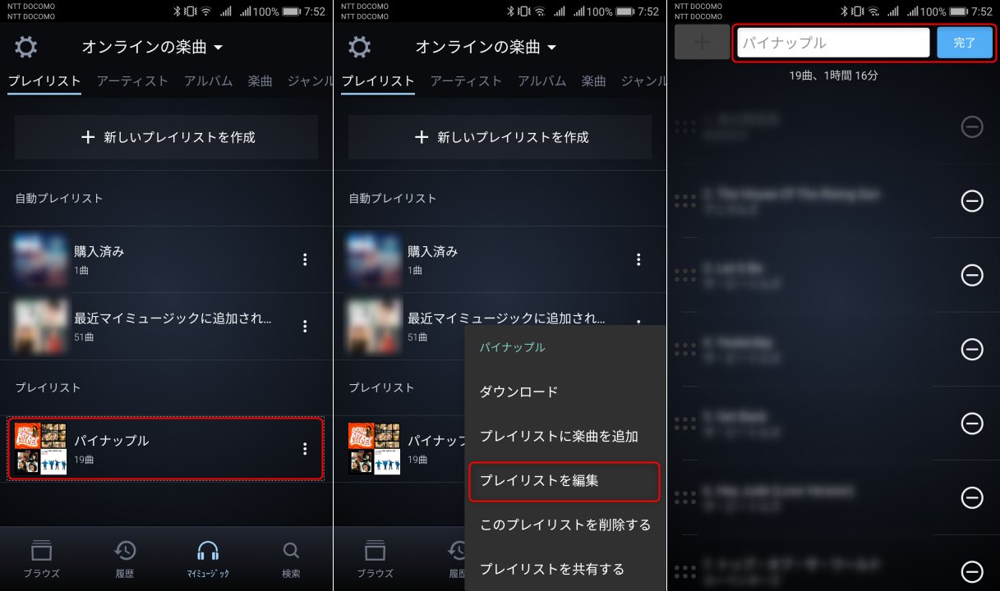
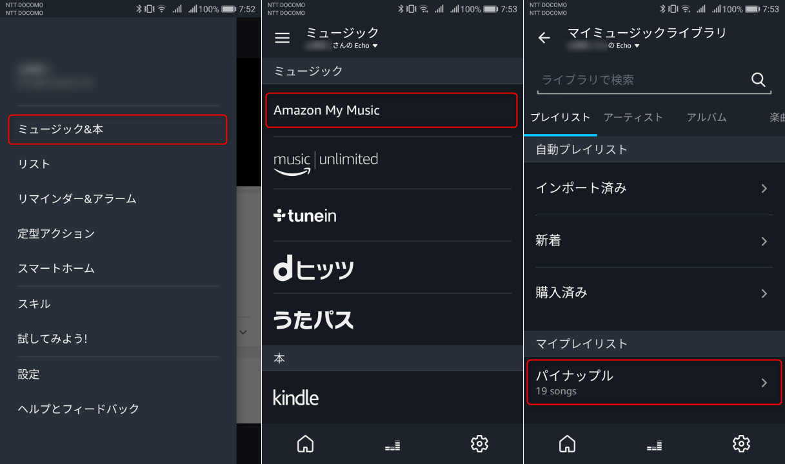

今年に入ってから、我が家ではテレビがついていないときは **Amazon Echo** が音楽を奏でてくれています。

- [Amazon | Echo - スマートスピーカー](http://www.amazon.co.jp/o/ASIN/B071ZF5KCM/m1s-22/ref=nosim)

今回は Echo の中の **Alexa さんに、お気に入りのプレイリストをかけてもらう**ために苦心したので、その記録です。

噂によると[最近は突如笑い出す](http://japanese.engadget.com/2018/03/07/echo/)そうですが、うちの Alexa はまだ大丈夫です。

## Alexa と Amazon Music

Alexa では **Amazon Music** の楽曲を聞くことができるので、特に**洋楽**や**ジャズ**なんかは快適です。

Amazon Music は Amazon のサービスなのでスキルを起動する必要がありません。再生するときの面倒が少ないのがメリットです。

Echo で気軽に音楽を聞こうと思うと Amazon Prime か Unlimited に入っていないと不便でしょう。うまいエコシステムですね。

標準のプレイリストやステーション（ラジオ）でもいいものは多いのですが、やはり使い出すとお気に入りの曲を登録して聞きたくなってきます。

## Amazon Music のプレイリスト作成

Echo では **Amazon Music のマイミュージックやマイプレイリストに保存した楽曲を再生する**ことができます。

Alexa アプリ側ではマイミュージックの編集ができないため、プレイリストの編集はスマホの Amazon Music アプリか PC から行います。

> [Amazon ミュージックライブラリ](https://music.amazon.co.jp/playlists/)

というわけで一番聞く時間の長い母が好きな曲を集めて、プレイリスト**「あきこ」(仮名)** を作りました。

## Alexa にプレイリストをかけていただくのは難しい

Alexa でたとえば「ほげほげ」というプレイリストを再生したいときは

> 「プレイリスト**の**『ほげほげ』かけて」

とお願いします。「の」が大事です。「の」がないと高確率で拒否られます。

余談ですが、標準で用意されているプレイリストも名前の長いものが多く、「2017 上半期洋楽ランキング Top 100 Prime Music編」とか、言うだけでも大変なのに、ちょっと「噛む」と誤認識されることが多いので、イラッとします。

### プレイリスト「あきこ」をかけていただく

早速、母用に作ったプレイリスト「あきこ」をリクエストしてみます。

> 私：「プレイリストの『**あきこ**』かけて」
> アレクサ: 「すみません、私にはわかりません。」 
> 私：「・・・」
> 私：「プレイリストの『**あ・き・こ**』かけて」
> アレクサ: 「すみません、私にはわかりません。」 
> 私：「・・・」
> 私：「プレイリストの『**あきこ**』をかけて」
> アレクサ: 「○？×！▲□の『**タマシイノウタ**』を再生します。」
> Echo: ♪！♪！♪！
> 私：「・・・アレクサ、ありがとう」
> アレクサ: 「いつでもどうぞ」

といった感じで、あまつさえ謎の「**魂の歌**」を聞かされる始末。

どう言い直そうとも、聞き入れてはいただけませんでした。

### プレイリスト名を変えてみる

認識しやすいかと気をつかって、ひらがなにしたのがダメなのかと、プレイリスト名をカタカナに変えてみました。

> 私：「プレイリストの『**アキコ**』かけて」
> アレクサ: 「すみません、私にはわかりません。」 
> 私：「・・・」
> 私：「プレイリストの『**アキコ**』かけて」
> アレクサ: 「『**シュウシ**』というプレイリストが見つかりません。」 
> 私：「シュウシ？！？！」

全然無理でした。もはや、会話になっていません。漢字にも変えてみましたが、これもダメ、ローマ字もダメでした。

### 「はひふへほ」は惜しい

もはや、「あきこ」にこだわるのはやめようと思い、思いつかなかったので、適当に「**はひふへほ**」にしてみました。

> 私：「プレイリストの『**はひふへほ**』かけて」（超言いにくい）
> アレクサ: 「プレイリスト『**わ・ひふへほ**』を再生します。」
> Echo: ♪♪♪♪♪♪ 
> 私：「！！！！！」

アレクサの声は「は」を助詞として認識しているらしく「わ・ひふへほ」と発音していますが、なにはともあれプレイリストがかかりました！

と思ったのも束の間。

同じ「はひふへほ」でも母の声には全く反応してくれませんでした。

### 「パイナップル」に落ち着く

そんなこんなで、試行錯誤してあきらめかけたとき、ふと入力した「**パイナップル**」が大ヒットしました。

ほぼ 100％ の認識率です。

**おそるべし「パイナップル」。**

> 私：「プレイリストの**『パイナップル』**かけて」（言いやすい）
> アレクサ: 「プレイリスト**『パイナップル』**を再生します。」
> Echo: ♪！♪！♪！

これですよ、これ。すばらしい！！！

**なにが入っているプレイリストなのか、さっぱりわからないことを除いてはね。**

そういえばパイナップルの写真をすごい遠目で見ると Echo Plus に見えなくも。。。

## 結論：Alexa に好みのプレイリストをかけてもらうには

今回試行錯誤してみた結果、 Alexa にかけてもらいやすいプレイリスト名の条件はズバリ

**「既存のプレイリストや曲名とかぶらない一般名詞」** でしょう。

人名や固有名詞は苦しいみたいです。あとは漢字系も Alexa の脳内誤変換が多発するようなので、難しそうです。

### プレイリスト名の変更と Alexa への反映

**プレイリスト名は Amazon Music アプリから変更**します。
繰り返しますが、今のところ **Alexa アプリからは編集できません。**

Amazon Music アプリを起動して、
**プレイリストを長押し → プレイリストを編集 → 画面上部の名前欄を編集して「完了」**を押します。

ちなみに、**編集しただけでは Alexa に反映されないことがありますので、そんなときはスマホの Alexa アプリを強制終了させて、再起動すれば OK** です。

そのプレイリストが再生中のときは一旦止めてやらないと、曲の内容も反映されない感じです。

### 最悪、Alexa アプリから再生できる

言葉で伝えても言うことを聞かないときは、実力行使です。

スマホの Alexa アプリからなら、下図のように
**メニュー → ミュージック＆本 → Amazon My Music → プレイリスト → マイプレイリスト** (遠い!)
から、プレイリストを選択することで再生させることができます。

ただ、**ペアリングしたスマホの所有者が家にいないといけない**という致命的な欠点があります。

しかもよく考えれば、**これだとただの Bluetooth スピーカーなので、 Echo である必要がまったくない**ですね。

## Alexa が聞き取った内容を間違える理由を推測してみた

ところで、

> 私：「プレイリストの『アキコ』かけて」
> アレクサ: 「『シュウシ』というプレイリストが見つかりません。」 
> 私：「？！？！」

という、さきほどのやりとりですが、このとき Alexa アプリを確認すると **Alexa が聞き取った内容**が下記のように表示されていました。

> プレイリストの **秋子** かけて

秋子って誰やねん、というのは置いておいて、このことから Alexa の中の思考回路は

1. アキコ って聞こえたわね
2. アキコ → 秋子 って書くのかしら
3. 秋子 → シュウシ って読むのかしら
4. シュウシ なんてプレイリストはないですわね
5. 知らね

のようになっていると推測できます。

**明らかに 2 と 3 のステップが不要**な気はしますが、これ以外の解釈が思いつきません。

といったところで終わるとエンジニアっぽくないので、少し技術的に考えてみます。

### Alexa の内部処理が原因？

**Alexa の音声認識・発話システムは [AVS (Alexa Voice Service)](https://developer.amazon.com/ja/alexa-voice-service)** と呼ばれるサービスが軸になっています。

大きな処理の流れは下記の3つです。

1. 音声認識・文字列への変換 (**ASR: Automatic Speech Recognition**)
1. 自然言語解析 (**NLU: Natural Language Understanding**)
1. 文字列から音声へ変換して発話 (**TTS: Text To Speech**)

上の「アキコ」の例で考えてみると下記のようになっていることが想像できます。

1. ASR: 音声「アキコ」→ 文字列「アキコ」
1. NLU: 文字列「アキコ」→ 自然言語「秋子」
1. TTS: 自然言語「秋子」→ 発話文字列「シュウシ」

おそらくプレイリスト名と照合されるのは 2 が終わったときでしょうから、全体の流れとしては下記のような感じでしょうか。

1. ASR: 「アキコ」を聞き取る
1. NLU: 「アキコ」を「秋子」に変換
1. Amazon Music: 「秋子」でプレイリストを検索するが、当然ながらそんな名前のプレイリストはない
1. TTS: 発話文字列「『秋子』というプレイリストが見つかりません。」を生成
1. TTS: 「『シュウシ』というプレイリストが見つかりません。」

現状、**プレイリストがかからないのは NLU が原因で、応答がおかしいのは TTS が原因**だと考えられるため、複合的ですね。

すぐに改善されてくると思うのですが、スキルを作るときはこのあたりも気を使っていかないといけないですね。

※本記事における「アキコ」「シュウシ」は固有名詞のサンプルです。