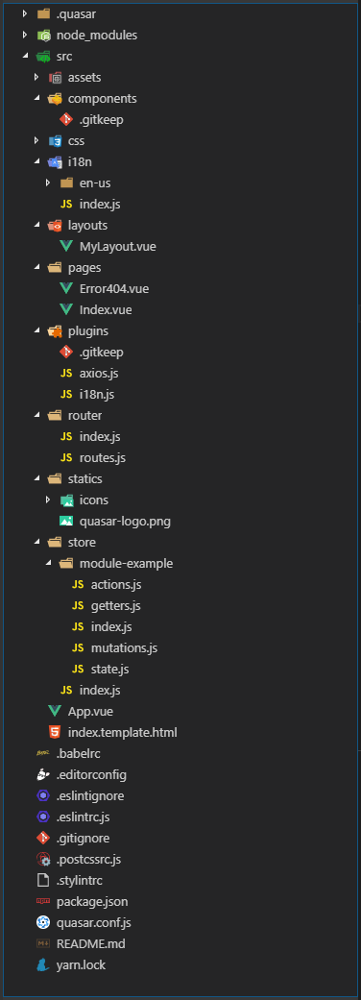
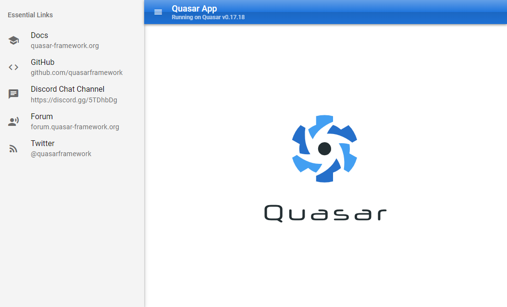
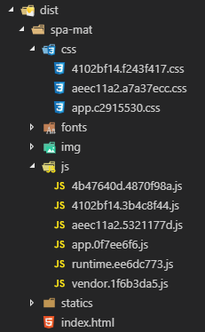

こんにちは、kenzauros です。

**Vue.js** のフレームワークでこれまで **[Vuetify](https://vuetifyjs.com/ja/)** を利用していましたが、 **[Quasar Framework](https://quasar-framework.org/)** に浮気してみました。

今回はインストール、開発環境起動、ビルドまでの流れを紹介します。

この記事における Quasar のバージョンは v0.17.x で、開発環境は Windows 10 Pro + VSCode + git bash です。

## デモ サイト

どんな感じかはデモサイト (Showcase) を見てみるのがいいでしょう。コンポーネントが多いので楽しいです。

- [Google Material Design テーマ](http://quasar-framework.org/quasar-play/android/index.html#/showcase)
- [Apple iOS テーマ](http://quasar-framework.org/quasar-play/apple/index.html#/showcase)
- [Google Play Store テーマ](https://play.google.com/store/apps/details?id=com.quasarframework.quasarplay) (古いので非推奨になっています)

いろいろ遊んでみて、作るアプリケーションに必要なコンポーネントや動きが備わっているかどうかを確認してみるといいでしょう。

## インストール

### Vue CLI と Quasar CLI のインストール

開発には **Quasar CLI** を使うのが一番イイ感じらしいので、これを使ってプロジェクトを初期化します。

動作には **Vue CLI** が必要なので一緒にインストールしておきます。
(`yarn global add` を使っていますが `npm install -g` でも問題ありません)

```bash
$ yarn global add vue-cli
$ yarn global add quasar-cli
```

インストールできたらバージョン番号でも確認しておきます。

```bash
$ quasar --version
0.17.22
```

なお、 *quasar* は "クェイサー" みたいに読むそうですが、恥ずかしながら quas**e**r とタイポしてコマンドが not found になっていたので、みなさまもご注意ください。

### プロジェクトの初期化

**`quasar init <フォルダー名>`** でプロジェクトを初期化できます。

カレントディレクトリーでよければ `quasar init .` で OK ですが、 `.gitignore` や `package.json` が存在する場合でも有無を言わさず上書きされるので注意してください。

```bash
$ quasar init .
 Running command: vue init 'quasarframework/quasar-starter-kit' .

? Generate project in current directory? Yes
? Project name (internal usage for dev) hogehoge
? Project product name (official name) Hogehoge
? Project description A Quasar Framework app
? Author Hogehoge <hogehoge@users.noreply.github.com>
? Check the features needed for your project: ESLint, Vuex, Axios, Vue-i18n, IE11 support
? Pick an ESLint preset Airbnb
? Cordova id (disregard if not building mobile apps) org.cordova.quasar.app
? Should we run `npm install` for you after the project has been created? (recommended) yarn

   vue-cli · Generated "hogehoge".


 [*] Installing project dependencies ...

yarn install v1.10.1
info No lockfile found.
[1/5] Validating package.json...
[2/5] Resolving packages...
warning eslint > file-entry-cache > flat-cache > circular-json@0.3.3: CircularJSON is in maintenance only, flatted is its successor.
warning quasar-cli > @babel/preset-stage-2@7.0.0-beta.54: 👋 We've deprecated any official stage presets in favor of users explicitly opt-ing into the proposals they want to use versus any perceived
 convenience. You can also check https://github.com/babel/babel/issues/7770 for more information.
warning quasar-cli > @babel/preset-stage-2 > @babel/preset-stage-3@7.0.0-beta.54: 👋 We've deprecated any official stage presets in favor of users explicitly opt-ing into the proposals they want to
use versus any perceived convenience. You can also check https://github.com/babel/babel/issues/7770 for more information.
[3/5] Fetching packages...
info fsevents@1.2.4: The platform "win32" is incompatible with this module.
info "fsevents@1.2.4" is an optional dependency and failed compatibility check. Excluding it from installation.
[4/5] Linking dependencies...
warning " > eslint-loader@2.1.1" has unmet peer dependency "webpack@>=2.0.0 <5.0.0".
[5/5] Building fresh packages...
success Saved lockfile.
Done in 60.63s.


 [*] Running eslint --fix to comply with chosen preset rules...


yarn run v1.10.1
$ eslint --ext .js,.vue src --fix
Done in 4.13s.

 [*] Quasar Project initialization finished!

To get started:

  quasar dev

Documentation can be found at: https://quasar-framework.org

Quasar is relying on donations to evolve. We'd be very grateful if you can
take a look at: https://www.patreon.com/quasarframework
Any amount is very welcomed.
If invoices are required, please first contact razvan.stoenescu@gmail.com

Please give us a star on Github if you appreciate our work:
https://github.com/quasarframework/quasar

Enjoy! - Quasar Team
```

なんだか warning はちらほらでてますが、大きな問題はなさそうです。

ファイル群はこんな感じになります。 Vuex とかも含めて全部外形だけ作ってくれるので楽でいいですね。



## 開発環境の起動

**`quasar dev`** でローカルの開発環境が起動します。
おそらくデフォルトで **`localhost:8080`** で起動し、自動的にブラウザーに開くと思います。

```bash
$ quasar dev

 Dev mode.......... spa
 Quasar theme...... mat
 Quasar CLI........ v0.17.22
 Quasar Framework.. v0.17.18
 Debugging......... enabled
```

デフォルトでこんな感じになります。デフォルトで Material Design (mat) が有効になっているはずなのですが、なぜかちょっと哀愁を感じるヘッダーバーです。



## ビルド

**`quasar build`** をたたくと `dist` ディレクトリーにビルドしたファイルが生成されます。非常に簡単です。

```bash
$ quasar build

 Build mode........ spa
 Quasar theme...... mat
 Quasar CLI........ v0.17.22
 Quasar Framework.. v0.17.18
 Debugging......... no

 app:quasar-conf Reading quasar.conf.js +0ms
 app:webpack Extending SPA Webpack config +4s
 app:artifacts Cleaned build artifact: "C:\Repos\hogehoge\dist\spa-mat" +6ms
 app:generator Generating Webpack entry point +36ms
 app:build Building... +13ms

  SPA █████████████████████████ [100%] in ~28s

 app:artifacts Added build artifact "C:\Repos\hogehoge\dist\spa-mat" +29s


Version: webpack 4.25.1
Time: 28164ms
Built at: 2018-11-21 11:23:42
                                                  Asset       Size    Chunks             Chunk Names
                              css/4102bf14.f243f417.css    0 bytes  4102bf14  [emitted]
                              css/aeec11a2.a7a37ecc.css    0 bytes  aeec11a2  [emitted]
                                   css/app.c2915530.css    166 KiB       app  [emitted]  app
            fonts/KFOkCnqEu92Fr1MmgVxIIzQ.e9dbbe8a.woff   19.5 KiB            [emitted]
           fonts/KFOlCnqEu92Fr1MmEU9fBBc-.de8b7431.woff   19.5 KiB            [emitted]
           fonts/KFOlCnqEu92Fr1MmSU5fBBc-.a1471d1d.woff   19.4 KiB            [emitted]
           fonts/KFOlCnqEu92Fr1MmWUlfBBc-.cf6613d1.woff   19.4 KiB            [emitted]
           fonts/KFOlCnqEu92Fr1MmYUtfBBc-.8c2ade50.woff   19.5 KiB            [emitted]
               fonts/KFOmCnqEu92Fr1Mu4mxM.bafb105b.woff   19.4 KiB            [emitted]
       fonts/flUhRq6tzZclQEJ-Vdg-IuiaDsNa.c38ebd3c.woff   70.6 KiB            [emitted]
fonts/flUhRq6tzZclQEJ-Vdg-IuiaDsNcIhQ8tQ.8a9a261c.woff2   53.8 KiB            [emitted]
                      img/quasar-logo-full.c3e88651.svg   12.6 KiB            [emitted]
                                             index.html   1.27 KiB            [emitted]
                                js/4102bf14.3b4c8f44.js   2.58 KiB  4102bf14  [emitted]
                                js/4b47640d.4870f98a.js   12.1 KiB  4b47640d  [emitted]
                                js/aeec11a2.5321177d.js  618 bytes  aeec11a2  [emitted]
                                     js/app.0f7ee6f6.js   2.44 KiB       app  [emitted]  app
                                 js/runtime.ee6dc773.js   3.09 KiB   runtime  [emitted]  runtime
                                  js/vendor.1f6b3da5.js    249 KiB    vendor  [emitted]  vendor
                   statics/icons/apple-icon-152x152.png   12.8 KiB            [emitted]
                        statics/icons/favicon-16x16.png   1.32 KiB            [emitted]
                        statics/icons/favicon-32x32.png   2.54 KiB            [emitted]
                         statics/icons/icon-128x128.png   7.03 KiB            [emitted]
                         statics/icons/icon-192x192.png   10.3 KiB            [emitted]
                         statics/icons/icon-256x256.png   14.7 KiB            [emitted]
                         statics/icons/icon-384x384.png   22.7 KiB            [emitted]
                         statics/icons/icon-512x512.png     29 KiB            [emitted]
                      statics/icons/ms-icon-144x144.png     12 KiB            [emitted]
                                statics/quasar-logo.png   7.03 KiB            [emitted]
Entrypoint app = js/runtime.ee6dc773.js js/vendor.1f6b3da5.js css/app.c2915530.css js/app.0f7ee6f6.js


 Build succeeded

 Build mode........ spa
 Quasar theme...... mat
 Quasar CLI........ v0.17.22
 Quasar Framework.. v0.17.18
 Debugging......... no
 ==================
 Output folder..... C:\Repos\hogehoge\dist\spa-mat

 Tip: Built files are meant to be served over an HTTP server
      Opening index.html over file:// won't work

 Tip: You can use "$ quasar serve" command to create a web server,
      both for testing or production. Type "$ quasar serve -h" for
      parameters. Also, an npm script (usually named "start") can
      be added for deployment environments.
      If you're using Vue Router "history" mode, don't forget to
      specify the "--history" parameter: "$ quasar serve --history"
```



生成後のファイルを確認すると html + js + css で 436KB でした。まだあまりコンポーネントを使っていないからかもしれませんが、初期状態では特別重いというファイルサイズではありませんでした。

ちなみに **`quasar build --theme=ios` とすると iOS テーマでビルド**されます。

## サーバー起動

ビルドしたファイルは **`quasar serve`** でホストすることができます。ビルド後のディレクトリーを指定しましょう。

```bash
$ quasar serve dist/spa-mat/

 Quasar CLI.......... v0.17.22
 Listening at........ http://HOGE-PC:4000
 Web server root..... C:\Repos\hogehoge\dist\spa-mat\
 Gzip................ enabled
 Cache (max-age)..... 86400
 Micro-cache......... 1s

GET / [10.0.75.1] Wed Nov 21 2018 11:39:23 GMT+0900 (GMT+09:00)
GET /css/app.1336c3d4.css [10.0.75.1] Wed Nov 21 2018 11:39:23 GMT+0900 (GMT+09:00)
GET /js/app.42a7b4a4.js [10.0.75.1] Wed Nov 21 2018 11:39:23 GMT+0900 (GMT+09:00)
GET /js/runtime.e9922e09.js [10.0.75.1] Wed Nov 21 2018 11:39:23 GMT+0900 (GMT+09:00)
GET /js/vendor.70c96f2e.js [10.0.75.1] Wed Nov 21 2018 11:39:23 GMT+0900 (GMT+09:00)
GET /css/4102bf14.f243f417.css [10.0.75.1] Wed Nov 21 2018 11:39:23 GMT+0900 (GMT+09:00)
GET /css/aeec11a2.a7a37ecc.css [10.0.75.1] Wed Nov 21 2018 11:39:23 GMT+0900 (GMT+09:00)
GET /js/4102bf14.3b4c8f44.js [10.0.75.1] Wed Nov 21 2018 11:39:23 GMT+0900 (GMT+09:00)
GET /js/4b47640d.4870f98a.js [10.0.75.1] Wed Nov 21 2018 11:39:23 GMT+0900 (GMT+09:00)
GET /js/aeec11a2.5321177d.js [10.0.75.1] Wed Nov 21 2018 11:39:23 GMT+0900 (GMT+09:00)
GET /fonts/flUhRq6tzZclQEJ-Vdg-IuiaDsNcIhQ8tQ.8a9a261c.woff2 [10.0.75.1] Wed Nov 21 2018 11:39:23 GMT+0900 (GMT+09:00)
GET /img/quasar-logo-full.c3e88651.svg [10.0.75.1] Wed Nov 21 2018 11:39:23 GMT+0900 (GMT+09:00)
GET /statics/icons/favicon-32x32.png [10.0.75.1] Wed Nov 21 2018 11:39:24 GMT+0900 (GMT+09:00)
GET /statics/icons/favicon-16x16.png [10.0.75.1] Wed Nov 21 2018 11:39:24 GMT+0900 (GMT+09:00)
GET /statics/quasar-logo.png [10.0.75.1] Wed Nov 21 2018 11:39:24 GMT+0900 (GMT+09:00)
```

なぜかよくわからないですが、ホスト名で起動しますので、 `localhost:4000` ではアクセスできません。

## まとめ

今回は **Quasar Framework のビルドまでの流れ**をご紹介しました。

フレームワーク固有の CLI はバージョンアップに伴う、仕様変更等で使えなくなったりするリスクも多いですが、それにしても簡単に環境が構築できました。

例によってリファレンスが英語しかないのでとっつきにくい感はありますが、使いこなせば多様なアプリが構築できるのではないかと思います。
