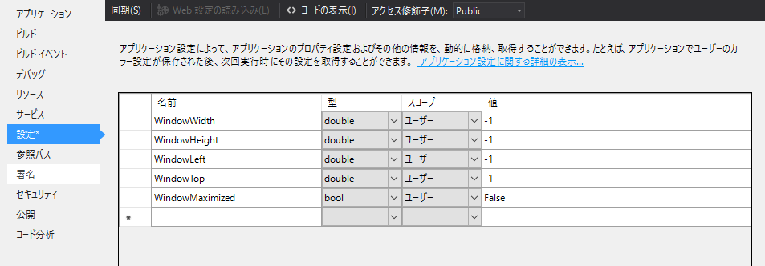

今回は **WPF でウィンドウの位置やサイズを保存しておいて復元する方法**を紹介します。「よくある」要求なのに意外と WinForms のころの話が多くて、直球な答えがありません。

毎回アプリをつくるたびに実装しているので自分のスニペットを兼ねて、ご紹介します。

## 前提

今回は前提として、ウィンドウ位置・サイズをユーザー設定ファイル (App.config) に保存することとします。

ちなみにユーザー設定ファイルは[ソリューションエクスプローラー]で[プロジェクト]を右クリックして[プロパティ]→[設定]から追加できます。

<a href="images/recover-window-bounds-with-wpf-1.png"></a>

上図のように 5 つの設定を使用します。

* `WindowWidth` : ウィンドウ幅
* `WindowHeight` : ウィンドウ高さ
* `WindowLeft` : ウィンドウの X 座標
* `WindowTop` : ウィンドウの Y 座標
* `WindowMaximized` : ウィンドウが最大化されていたか

## なにはともあれソースコード

全体像です。ビューのみの機能ですので MainWindow のコードビハインドに書くことを想定しています。

```cs
public MainWindow()
{
	// ウィンドウのサイズを復元
	RecoverWindowBounds();
}

protected override void OnClosing(CancelEventArgs e)
{
	// ウィンドウのサイズを保存
	SaveWindowBounds();
	base.OnClosing(e);
}

/// <summary>
/// ウィンドウの位置・サイズを保存します。
/// </summary>
void SaveWindowBounds()
{
	var settings = Settings.Default;
	settings.WindowMaximized = WindowState == WindowState.Maximized;
	WindowState = WindowState.Normal; // 最大化解除
	settings.WindowLeft = Left;
	settings.WindowTop = Top;
	settings.WindowWidth = Width;
	settings.WindowHeight = Height;
	settings.Save();
}

/// <summary>
/// ウィンドウの位置・サイズを復元します。
/// </summary>
void RecoverWindowBounds()
{
	var settings = Settings.Default;
	// 左
	if (settings.WindowLeft >= 0 &&
		(settings.WindowLeft + settings.WindowWidth) < SystemParameters.VirtualScreenWidth)
	{ Left = settings.WindowLeft; }
	// 上
	if (settings.WindowTop >= 0 &&
		(settings.WindowTop + settings.WindowHeight) < SystemParameters.VirtualScreenHeight)
	{ Top = settings.WindowTop; }
	// 幅
	if (settings.WindowWidth > 0 &&
		settings.WindowWidth <= SystemParameters.WorkArea.Width)
	{ Width = settings.WindowWidth; }
	// 高さ
	if (settings.WindowHeight > 0 &&
		settings.WindowHeight <= SystemParameters.WorkArea.Height)
	{ Height = settings.WindowHeight; }
	// 最大化
	if (settings.WindowMaximized)
	{
		// ロード後に最大化
		Loaded += (o, e) => WindowState = WindowState.Maximized;
	}
}
```

コンストラクターで `RecoverWindowBounds` を、OnClosing で `SaveWindowBounds` を呼び出すようにします。

## ウィンドウの位置とサイズを保存する

保存側から見ていきます。基本的にはユーザー設定 (`Settings.Default`) のプロパティに MainWindow の情報を保存します。

```cs
void SaveWindowBounds()
{
	var settings = Settings.Default;
	settings.WindowMaximized = WindowState == WindowState.Maximized;
	WindowState = WindowState.Normal; // 最大化解除
	settings.WindowLeft = Left;
	settings.WindowTop = Top;
	settings.WindowWidth = Width;
	settings.WindowHeight = Height;
	settings.Save();
}
```

この部分ですね。

最初に最大化されているかを保存しておき、標準状態のウィンドウサイズを取得するために最大化を解除します。
このとき一瞬とはいえ、ウィンドウが標準状態に戻る描画が走るのが玉にキズです。

標準状態に戻ったウィンドウの座標・幅・高さをそれぞれ設定に書き込み、保存すれば終了です。

## ウィンドウの位置とサイズを復元する

復元側を見ていきます。基本的には逆向きの操作をするだけですね。
それぞれの値を戻したあと、最大化されていた状態だったら最大化し直してやります。

```cs
/// <summary>
/// ウィンドウの位置・サイズを復元します。
/// </summary>
void RecoverWindowBounds()
{
	var settings = Settings.Default;
	// 左
	if (settings.WindowLeft >= 0 &&
		(settings.WindowLeft + settings.WindowWidth) < SystemParameters.VirtualScreenWidth)
	{ Left = settings.WindowLeft; }
	// 上
	if (settings.WindowTop >= 0 &&
		(settings.WindowTop + settings.WindowHeight) < SystemParameters.VirtualScreenHeight)
	{ Top = settings.WindowTop; }
	// 幅
	if (settings.WindowWidth > 0 &&
		settings.WindowWidth <= SystemParameters.WorkArea.Width)
	{ Width = settings.WindowWidth; }
	// 高さ
	if (settings.WindowHeight > 0 &&
		settings.WindowHeight <= SystemParameters.WorkArea.Height)
	{ Height = settings.WindowHeight; }
	// 最大化
	if (settings.WindowMaximized)
	{
		// ロード後に最大化
		Loaded += (o, e) => WindowState = WindowState.Maximized;
	}
}
```

ただ、復元するときは少し注意が必要です。

というのも、たとえば、解像度の高いモニターで終了した後、解像度の低いモニターで起動すると画面サイズを超えるウィンドウサイズになってしまい、縮小することも閉じることもできないというナンセンスな自体になりかねないからです。

そのため、それぞれの値を戻す前に範囲内かどうかをチェックしています。

まず位置 (座標) の場合、 `SystemParameters.VirtualScreenWidth` 等で取得できる「全画面サイズ」を超えないように設定してやります。

サイズの場合はプライマリーモニターのサイズ (`SystemParameters.WorkArea`) を超えないようにしています。本当はアプリの起動されたモニターに合わせて調節できればいいのですが、残念ながら WPF ではアプリの起動しているモニターを取得できないため、プライマリーモニターで我慢します。

このあたりの話　(`SystemParameters` 系のプロパティ等) については下記の過去記事をご参照ください。

- [WPF でマルチモニターの領域サイズやプライマリモニターの解像度を取得する](https://mseeeen.msen.jp/get-screen-bounds-with-multiple-monitors-in-wpf/)