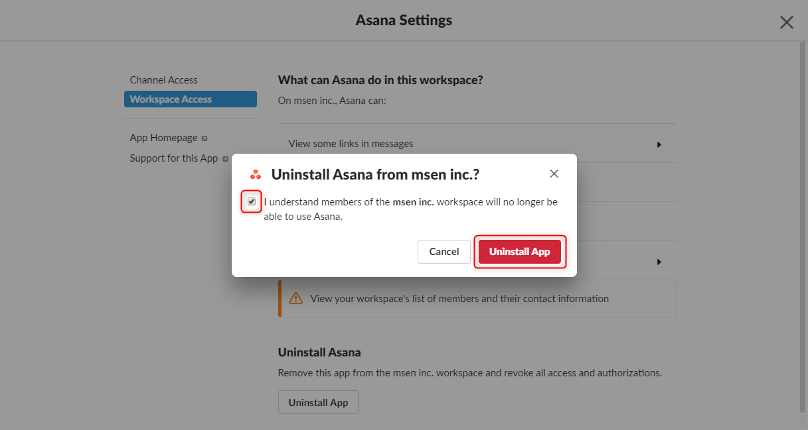

**Slack** はさまざまな別のサービスと連携できるのが利点の一つです。

すでにインストールした連携の一覧や管理は **[Apps and Integrations](https://my.slack.com/apps/manage)** から行うことができます。

ただ一部のアプリで削除できないものがあったので、備忘録として削除方法をメモしておきます。

## Asana アプリの削除方法

タスク管理サービスとして有名な **Asana** ですが、うちの運用にはフィットしなかったため、インストールしたアプリを削除することにしました。

多くのアプリの場合、詳細を開くと下記のように **Remove App** ボタンが表示されているのですが... 

Asana アプリには存在しませんでした。 (下図)

ということで削除するためにまず、 **Settings** ボタンを押して、設定画面を開きます。

設定画面で **Workspace Access** を開き、 **Uninstall App** をクリックします。

確認のチェックを入れ、 **Uninstall App** をクリックします。

これでうまく削除できました。

## Asana (Legacy) アプリの削除

すでにサポートが終わっているのですが、昔々にインストールされた **Asana (Legacy) アプリ**もありました。ただ、こちらは Remove App ボタンも Settings もないので、削除方法がわかりませんでした。

どうやら**前に在籍していたメンバーが設定した設定が残っているため、削除できない**ようです。

Slack のサポートに問い合わせたところ、下記の回答を得ました。

>設定したユーザーのみが変更/削除が可能となっており、バックエンドからも残念ながら設定変更ができません。
>
>設定したユーザーでログインする方法が唯一の回避策となってしまいます。
>そのため、御社の IT ポリシーが許す場合、解除されたアカウントのメールアカウントへアクセスし、パスワード>リセット後にログインする方法が考えられます。

上記の方法で試しにログインしてみましたが、**シングルチャンネルゲスト (Single Channel Guest) ではそもそも Apps の管理ができない**ため、どうすることもできませんでした(笑)

正規メンバーに昇格すればいいのですが、 Apps を消すだけのために費用を払うのももったいないので、とりあえず保留することにしました。

というわけで、 **Slack を利用していたメンバーが辞める場合は、無効化する前にすべての Apps でその人の設定したものが残ってないかをチェック**しましょう。

（でも大量に設定してくれた人が辞めるときは連携をやり直さなければならないような...）

ちなみに **Slack のサポートはいつのまにか日本語で問い合わせができるようになっていました**。アプリの管理とかの GUI は日本語化されていないのでちょっと違和感はありますが、アメリカから日本語でサポートしてもらえるのは便利ですね。