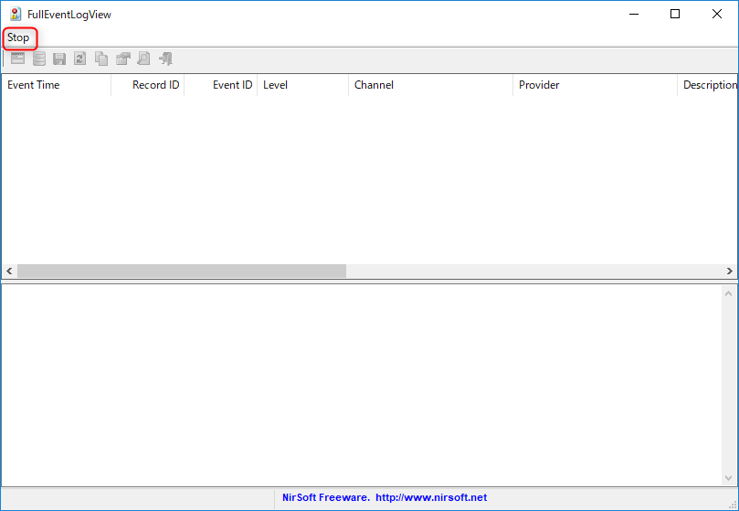
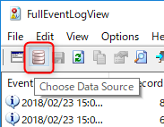
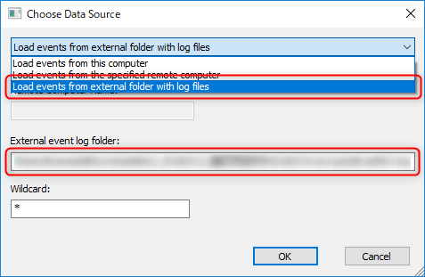
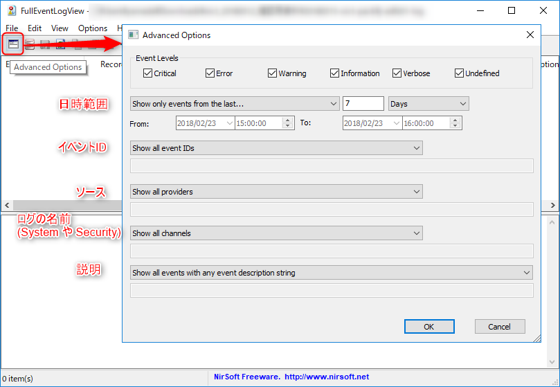
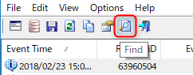

**Windows のイベントログ**といえば、<del>見にくいので有名ですが、</del>サーバーのログなどはすごい勢いで溜まっていくため、すぐにCドライブがパンパンになってしまいます。

ある程度の期間でアーカイブして別ドライブ等に移す方法が考えられますが、たとえば1日ごとのイベントログファイルに分けると今度は検索のときがかなり面倒になります。

というわけで、今回は**アーカイブされたイベントログファイル (*.evtx) をまとめて検索する**方法を紹介します。

## FullEventLogView を使う

NirSoft の **FullEventLogView** を使わせていただきます。このツールを使うとフォルダーにある *.evtx ファイルをまとめて検索できます。

下記のページからダウンロードして解凍しましょう。

> [FullEventLogView - Event Log Viewer for Windows 10/8/7/Vista](http://www.nirsoft.net/utils/full_event_log_view.html)

ちなみに [NirSoft](https://www.nirsoft.net/) さんには下記の記事でもお世話になっております。

> - [スリープで強制シャットダウンされる Kernel Power 41 闘病記 (Windows 10)](/how-to-fix-kernel-power-41-in-windows-10/)
> - [BlueScreenView](https://www.nirsoft.net/utils/blue_screen_view.html) 

## 使用方法

### 起動

解凍した中にある FullEventLogView.exe を起動します。

起動すると自動的にそのコンピューターのイベントログが検索され、けっこうな時間がかかるので、メニュー部分の [Stop] を押して検索を中止します。

### イベントログが保存されたフォルダを選択

**Choose Data Source** をクリックします。

**Load events from external folder with log files** を選択し、イベントログが保存されたフォルダーパスを **External event log folder** にコピペします。

[OK] を押すとメイン画面に戻ります。この状態で近いタイムスタンプのイベントログがあれば、検索がはじまりますので、不要なら起動時と同様に [Stop] で中止します。

### 抽出条件を指定

**Advanced Options** をクリックするとフィルター条件がでてきます。デフォルトでは直近7日間が条件として設定されています。

必要な条件を入力して [OK] を押すと合致するレコードが検索されますが、件数が多い場合はかなり時間がかかりますので、注意してください。

抽出されたログの詳細情報からさらに検索したい場合は [Find] ボタンで条件を入力してください。

ではイベントログと幸せな時間をお過ごしください。