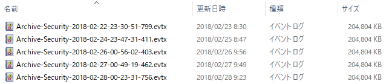
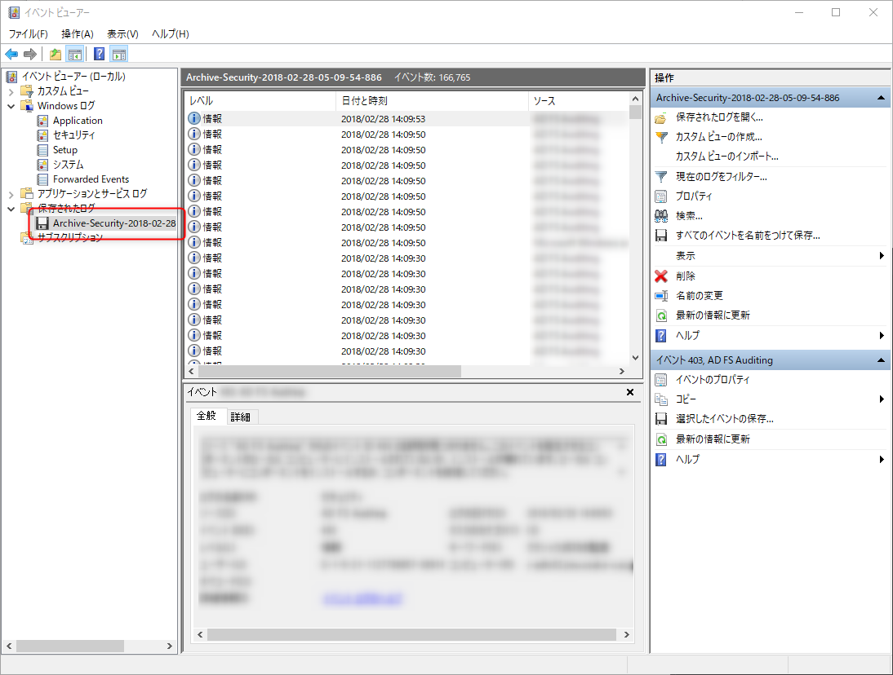
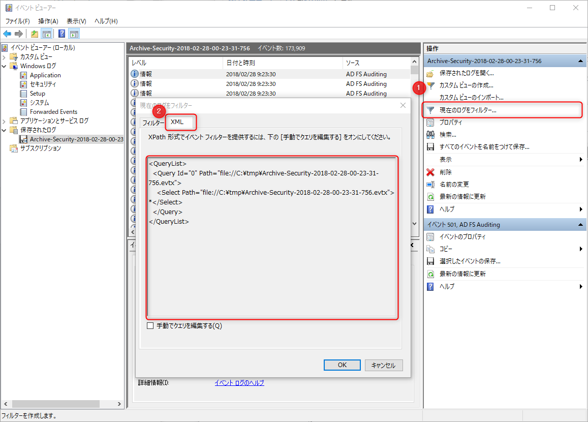
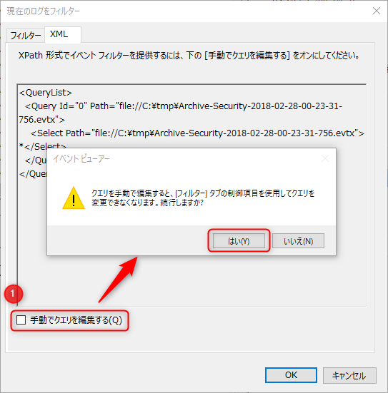
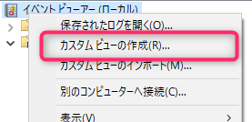
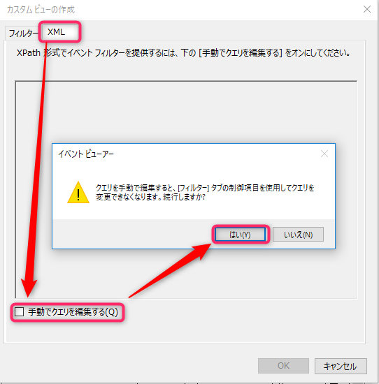
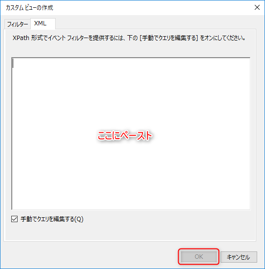
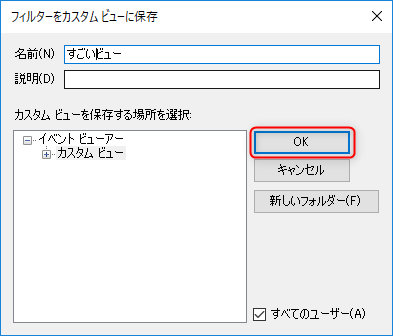
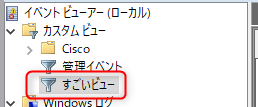

最近はイベントログと戯れています。

今回は下記のようにアーカイブされたり抽出したりして**複数に分かれたイベントログファイル (evtx) をまとめて一つの条件で検索する方法**を紹介します。



## カスタム検索の仕組み

単純に一つの evtx ファイルを検索するのであれば、 **evtx をダブルクリックするだけで Windows 標準のイベントビューアーが開きます**ので、これで内容を確認できます。



この状態で (1) **[現在のログをフィルター...]** をクリックし、(2) **[XML] タブ**を開くと単一の evtx ファイルの検索用クエリが XML で表示されますので、どんな構造か確認することができます。



これを見ると基本構造は下記のようになっていることがわかります。

```xml
<QueryList>
  <Query Id="0" Path="file://ファイルフルパス">
    <Select Path="file://ファイルフルパス">XPath クエリ</Select>
  </Query>
</QueryList>
```

実際の検索条件は `<Select>` タグ内に **XPath クエリ** で指定します。

ちなみにこの `<Query>` タグ側の `Path` はなくても動くため、**実質的には `<Select>` タグ内の `Path` だけにフルパスを記載すれば問題ありません**。



試しに **[手動でクエリを編集する]** をチェックしてクエリを編集してみます (警告メッセージが表示されますが、 [はい] を押してかまいません)。

`<Query>` タグ側の `Path` 属性を削除し、XPathクエリ (`*` のみが書かれている部分) に `*[System[(EventID=4624)]]` とでも書いて OK を押します。

開いたログが「セキュリティ」ログであればログオンイベント (4624) だけが抽出されるはずです。

これで単一ファイルに対する検索クエリをどのように書けばいいのかがわかりました。

## カスタムビューの作成

カスタムの検索条件で抽出するときは**カスタムビュー**を作ったほうがわかりやすいので、ここで手順を紹介します。

右クリックメニューから **[カスタムビューの作成]** を選びます。



**[XML] タブ**を開き、 **[手動でクエリを編集する]** をチェックします。警告メッセージが表示されますが、 [はい] を押します。



**作成した `<QueryList>` XML をペースト**します。この中でも編集できますが、かなり不便なので別のテキストエディターで編集して貼り付けることをおすすめします。



[OK] を押し、適当な名前をつけて [OK] を押すとカスタムビューが作成されます。既に存在する名前を指定して、上書きすることもできます。



これでカスタムビューが作成されました。



## 複数のイベントログファイルを検索するには

単一ファイルに対する検索クエリを眺めていると **`<QueryList>` タグはその名の通り「リスト」なので複数の `<Query>` を内包できそう**であることが想像できます。

ということで `<Query>` をコピーして、その `Query/Select` タグの `Path` に別のイベントログ・ファイルを指定してみます。

```sql
<QueryList>
  <Query Id="0">
    <Select Path="file://C:\tmp\Archive-Security-2018-02-28-00-23-31-756.evtx">*[System[(EventID=4624)]]</Select>
  </Query>
  <Query Id="1">
    <Select Path="file://C:\tmp\Archive-Security-2018-02-27-00-49-19-462.evtx">*[System[(EventID=4624)]]</Select>
  </Query>
</QueryList>
```

これでカスタムビューを作成すると 2 ファイルからイベント ID = 4624 のイベントが抽出されます。

さらに眺めているとなんとなく `<Query>` 自体まとめてしまってもよさそうな気がします。ということでまとめてみます。

```sql
<QueryList>
  <Query Id="0">
    <Select Path="file://C:\tmp\Archive-Security-2018-02-28-00-23-31-756.evtx">*[System[(EventID=4624)]]</Select>
    <Select Path="file://C:\tmp\Archive-Security-2018-02-27-00-49-19-462.evtx">*[System[(EventID=4624)]]</Select>
  </Query>
</QueryList>
```

これでもうまくいきました。これが一番シンプルな形かもしれません。

というわけで、**イベントビューアーで複数の evtx ファイルを検索する場合はこの `<Select>` タグを増やせばよい**、ということがわかりました。

## 検索クエリ XML を作るメソッドを一気に作る

形式はわかったものの、数十個を超えるファイルパスを XML に記述するのは面倒なので、 **Python でまとめて XML を作るスクリプト**を作成しました。

Gist に置いていますので、参考にしてください。

- [複数の Windows イベントログファイル (evtx) をまとめて検索する XML 作成スクリプト - gist](https://gist.github.com/kenzauros/27a532942d9150c0910376acc03cec1d)

```python
#!/usr/bin/env python
# -*- coding: utf-8 -*-

import codecs
import glob
import re
import os

# 上限ファイル数 (適宜変更)
limit = 3
# 対象にする EventID のリスト (適宜変更)
event_id_list = [4624, 4634, 4625, 4648]
# EventData/Data の検索値のリスト (適宜変更)
data_value_list = ['hogehoge', 'fugafuga', 'momimomi']

# ----------------------------------------------------------------------

# 抽出条件式に変換
event_id = " or ".join(["(EventID=" + str(i) + ")" for i in event_id_list])
event_data = " or ".join(["(Data='" + v + "')" for v in data_value_list])
condition = "*[System[" + event_id + "] and EventData[" + event_data + "]]"
# ファイル番号
n = 0
# 出力ファイル
output_file = codecs.open("query_list.xml", "w", "utf-8")
output_file.write("<QueryList>\n")
output_file.write("  <Query Id=\"0\">\n")
for filename in glob.glob("*.evtx"):
  print(filename)
  path = os.path.abspath(filename)
  output_file.write("    <Select Path=\"file://" + path + "\">" + condition + "</Select>\n")
  n += 1
  if n >= limit: break
output_file.write("  </Query>\n")
output_file.write("</QueryList>\n")
output_file.close
```

このスクリプトは、同じフォルダーに存在する evtx ファイル分の `<Select>` タグを生成するようになっています。

**イベント ID** と **EventData/Data の値**で検索するようなクエリで作成するようにしており、対象の検索値は `event_id_list`, `data_value_list` 等で指定できます。

`limit` は `<Select>` タグを生成するファイルの上限数です。あまり大量のファイルに対して検索すると時間がかかるので、クエリの動作確認時は小さな値にしておくことをおすすめします。「全部」にする場合は `10000` など大きな値を指定してください。

## 検索用 XPath クエリ覚え書き

いつも使う検索条件の XPath クエリをメモしておきます。参考にどうぞ。

### イベント ID で絞り込み

#### 単一のイベント ID の場合

```
*[System[(EventID=4624)]]
```

#### 複数のイベント ID の場合

複数の値は `or` でつなぎましょう。

```
*[System[(EventID=4624) or (EventID=4634)]]
```

### イベント ID + EventData/Data タグの値での絞り込み

#### 単一のイベント ID + EventData/Data タグの値

複数条件は `and` でつなぎましょう。

```
*[System[(EventID=4624)] and EventData[(Data='hogehoge')]]
```

さらに「Name 属性が `IpAddress` の EventData/Data の値が `-` 以外のレコード」の場合はこちら。 <ins datetime="2018-06-26T13:48:00+09:00">(2018/6/26 追記)</ins>

```
*[System[(EventID=4624)] and EventData[Data[(@Name='IpAddress')] != '-']]
```


#### 複数 EventData/Data タグ版

がんばって `and` と `or` を駆使しましょう。

```
*[System[(EventID=4624) or (EventID=4634)] and EventData[(Data='hogehoge') or (Data='fugafuga')]]
```

#### EventData/Data タグの名前指定版

```
<EventData>
  <Data Name="SubjectUserSid">S-1-5-18</Data> 
  <Data Name="SubjectUserName">hogehoge</Data> 
```

こんな感じのイベントログで `<Data Name="SubjectUserName">` この中身だけを検索したい場合です。

```
*[System[(EventID=4624)] and EventData[(Data[(@Name='SubjectUserName')]='hogehoge')]]
```

条件が増えてくると `[]` の数がわからなくなってきて、合っていないとエラーになりますのでご注意ください。
