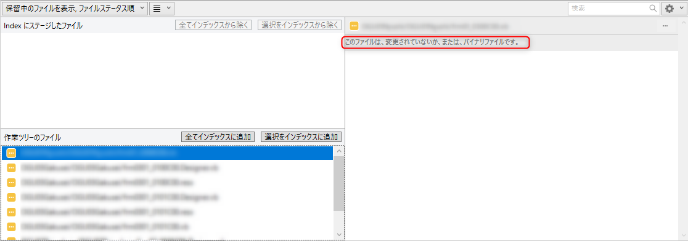
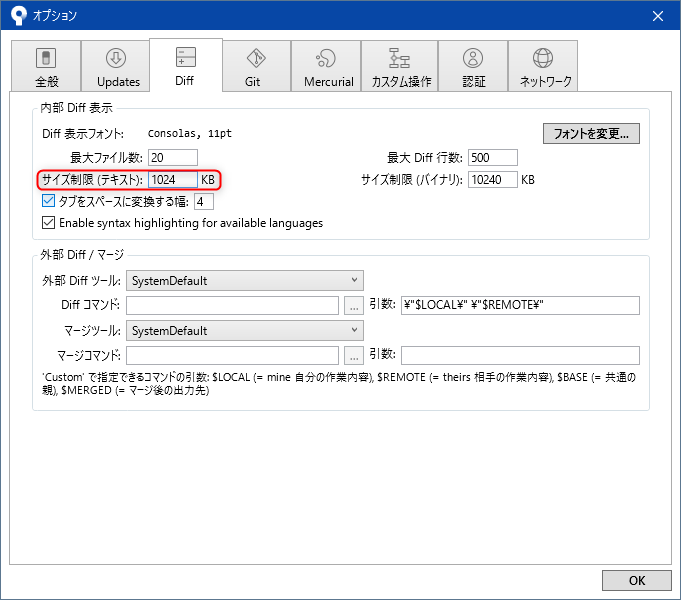

**SourceTree** を使っていて、一部のソースコードの diff が確認できなくて困ったのでメモです。

## 現象

SourceTree 画面下部の変更差分表示で、行数が多い (ファイルサイズの大きい) ファイルの場合「**このファイルは、変更されていないか、または、バイナリファイルです。**」と表示されます。

ファイルの拡張子的にも中身もソースファイルには間違いありませんし、変更されたことは検出されているので、設定の問題のようです。

## 解決策

この部分の表示には **SourceTree 内蔵の Diff** が使われています。高速化のためか、**標準設定では 1 MB 以上のファイルの差分は表示しない**ようになっています。

**[ツール]→[オプション]→[Diff]タブ→[内部 Diff 表示]→[サイズ制限 (テキスト)]** で任意のサイズに変更します。あまり大きくしすぎると巨大なログファイル等を開いたときに死にそうですので、とりあえず標準の倍の **2048 KB (2 MB)** にしておきました。

これで設定したサイズ未満のファイルは差分が表示されるようになります。

正直 1 ファイルで数 MB のソースコードとかやめてほしいですが。。。