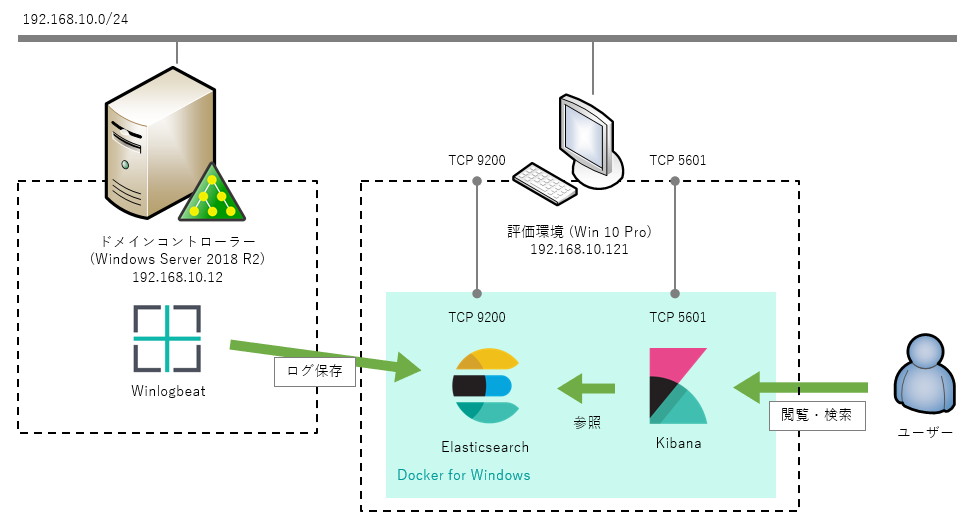
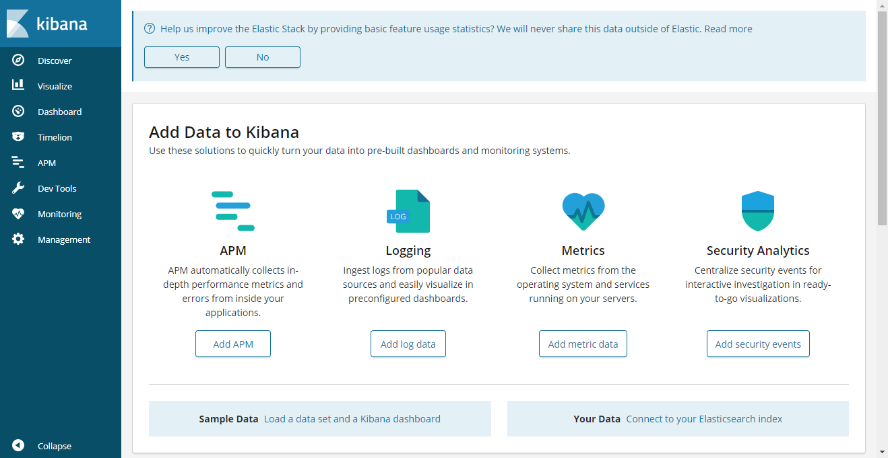
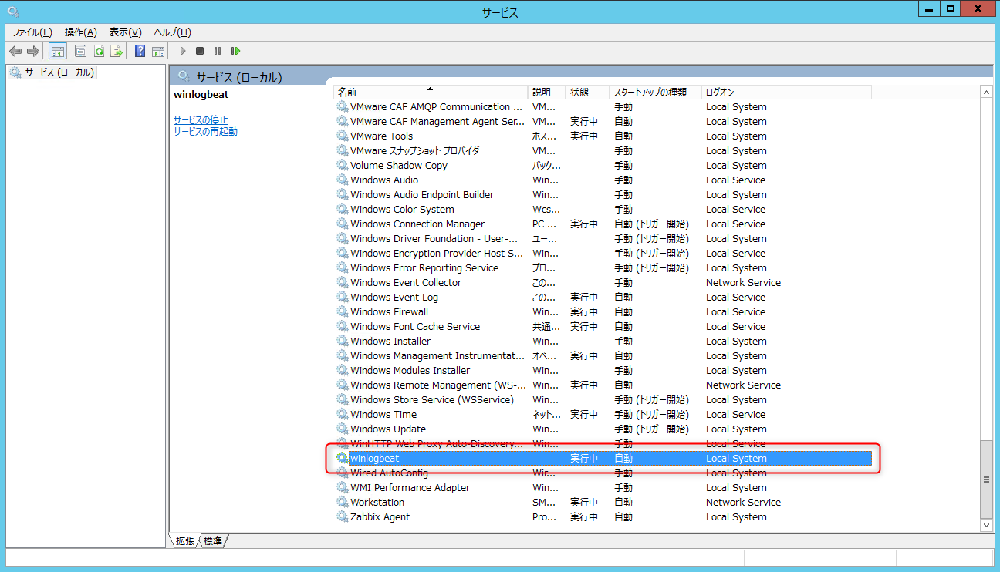
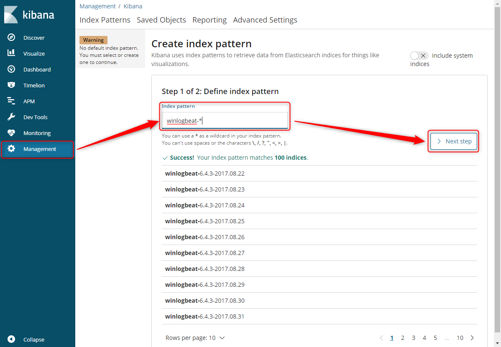
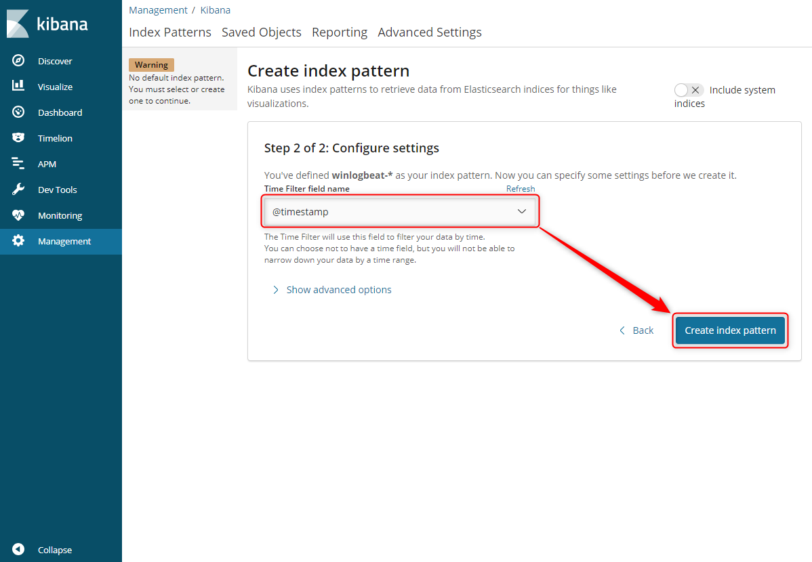
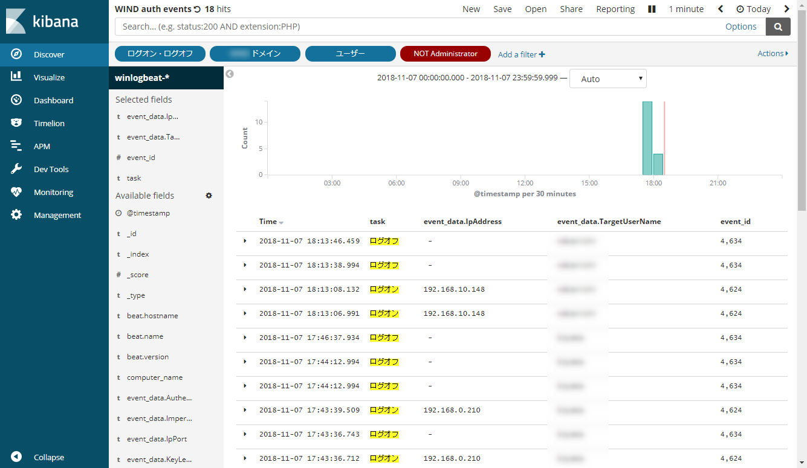
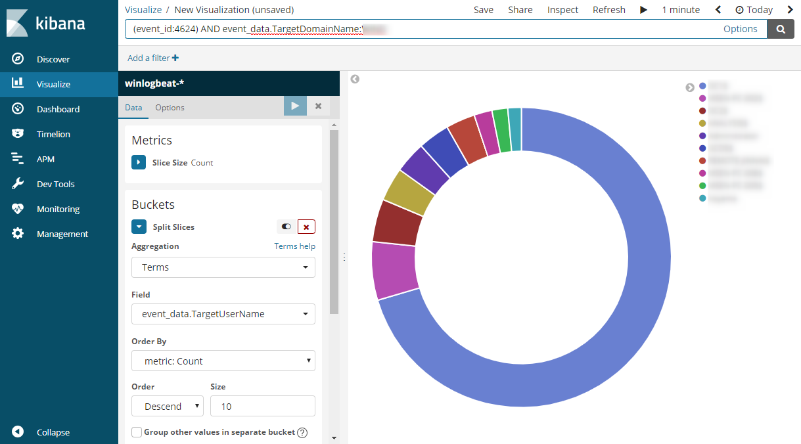

こんにちは、kenzauros です。

**Windows のイベントログにあるセキュリティログ**、特にログインとログオフのイベントを **Kibana で検索・可視化**できるようにしてみます。

## 構成



- イベントログの収集: [Winlogbeat](https://www.elastic.co/jp/products/beats/winlogbeat) 6.4.3
- データストア・検索: [Elasticsearch](https://www.elastic.co/jp/products/elasticsearch) 6.4.3
- 可視化 (GUI): [Kibana](https://www.elastic.co/jp/products/kibana) 6.4.3

**Winlogbeat** はドメインコントローラー (Windows Server 2012 R2, 192.168.10.12) で直接動作させます。

**Elasticsearch** と **Kibana** は評価環境 (Windows 10 Pro, 192.168.10.121) 上の Docker for Windows CE で動作させます。

Docker for Windows はインストール済みの想定です。

## Elasticsearch と Kibana の起動

説明は端折りますが、適当なフォルダ (今回は `C:\evtlogs`) を作り、下記のような `docker-compose.yml` を配置します。

```ruby
version: '2'
services:
  elasticsearch:
    image: docker.elastic.co/elasticsearch/elasticsearch:6.4.3
    container_name: elasticsearch
    ports:
      - "9200:9200"
      - "9300:9300"
    volumes:
      - esdata:/usr/share/elasticsearch/data
  kibana:
    image: docker.elastic.co/kibana/kibana:6.4.3
    container_name: kibana
    links:
      - elasticsearch:elasticsearch
    ports:
      - "5601:5601"

volumes:
  esdata:
```

データ永続化のためボリュームを作成しておきます。

```
PS C:\evtlogs> docker volume create esdata
PS C:\evtlogs> docker volume ls
```

あとは docker-compose で起動すれば完了です。

```
PS C:\evtlogs> docker-compose up -d
```

イイ感じで起動したか確認しておきましょう。

```
PS C:\evtlogs> docker ps
CONTAINER ID        IMAGE                                                 COMMAND                  CREATED             STATUS PORTS                                            NAMES
06f7780b364d        docker.elastic.co/kibana/kibana:6.4.3                 "/usr/local/bin/kiba…"   32 seconds ago      Up 30 seconds  0.0.0.0:5601->5601/tcp                           kibana
3f94b07548bd        docker.elastic.co/elasticsearch/elasticsearch:6.4.3   "/usr/local/bin/dock…"   45 seconds ago      Up 43 seconds  0.0.0.0:9200->9200/tcp, 0.0.0.0:9300->9300/tcp   elasticsearch
```

Elasticsearch は **`http://localhost:9200/`** にアクセスして下記のように表示されれば OK です。

```js
{
  "name" : "AZH4spw",
  "cluster_name" : "docker-cluster",
  "cluster_uuid" : "3CyyoB_mSC2ME5KY9ZqGaQ",
  "version" : {
    "number" : "6.4.3",
    "build_flavor" : "default",
    "build_type" : "tar",
    "build_hash" : "fe40335",
    "build_date" : "2018-10-30T23:17:19.084789Z",
    "build_snapshot" : false,
    "lucene_version" : "7.4.0",
    "minimum_wire_compatibility_version" : "5.6.0",
    "minimum_index_compatibility_version" : "5.0.0"
  },
  "tagline" : "You Know, for Search"
}
```

Kibana は **`http://localhost:5601`** にアクセスすれば GUI が表示されるはずです。




## Winlogbeat のインストール

### ダウンロード

公式ページから Winlogbeat をダウンロードします。Winlogbeat.exe が含まれた zip ファイルになっています。

> [Download Winlogbeat • Ship Windows Event Logs | Elastic](https://www.elastic.co/jp/downloads/beats/winlogbeat)

ダウンロードしたら、解凍して `c:\winlogbeat` にでも移動させます。

### 設定

解凍したフォルダーにある `winlogbeat.yml` を編集します。

```ruby
winlogbeat.event_logs:
  - name: Security
```

今回は「セキュリティー」ログだけでよいので `- name: Application` 等の行は削除しています。

次に下記の部分で Elasticsearch が動作しているサーバーを指定します。

```ruby
output.elasticsearch:
  hosts: ["192.168.10.121:9200"]
```

### とりあえず起動

サービスとしてインストールする前にとりあえず起動してみます。

PowerShell を管理者モードで起動し、 Winlogbeat のフォルダに移動して、 exe を起動します。

```
PS C:\Hogehoge> cd C:\winlogbeat
PS C:\winlogbeat> .\winlogbeat.exe -c winlogbeat.yml -e
```

`-e` は[デバッグモード](https://www.elastic.co/guide/en/beats/winlogbeat/master/enable-winlogbeat-debugging.html)です。 Elasticsearch にログが publish されていくのが確認できます。

`successfully published` が出力されていなければ Elasticsearch が動作していること、ファイアウォール等が適切に設定されていることを確認しましょう。

```
2018-11-07T15:00:58.450+0900    INFO    instance/beat.go:565    Home path: [C:\winlogbeat] Config path: [C:\winlogbeat]
Data path: [C:\winlogbeat\data] Logs path: [C:\winlogbeat\logs]
2018-11-07T15:00:58.464+0900    INFO    instance/beat.go:572    Beat UUID: fcc268fb-3541-4558-8a0f-e3c7619775ce
2018-11-07T15:00:58.464+0900    INFO    [beat]  instance/beat.go:789    Beat info       {"system_info": {"beat": {"path": {"config": "C:\\winlogbeat", "data": "C:\\winlogbeat\\data", "home": "C:\\winlogbeat", "logs": "C:\\winlogbeat\\logs"}, "type": "winlogbeat", "uuid": "fcc268fb-3541-4558-8a0f-e3c7619775ce"}}}
2018-11-07T15:00:58.464+0900    INFO    [beat]  instance/beat.go:798    Build info      {"system_info": {"build": {"commit": "a8afce82a3cbaffe30a9c23b5321a3183ae9dc1a", "libbeat": "6.4.3", "time": "2018-10-30T22:32:17.000Z", "version": "6.4.3"}}}
2018-11-07T15:00:58.465+0900    INFO    [beat]  instance/beat.go:801    Go runtime info {"system_info": {"go": {"os":"windows","arch":"amd64","max_procs":4,"version":"go1.10.3"}}}
2018-11-07T15:00:58.468+0900    INFO    [beat]  instance/beat.go:805    Host info       {"system_info": {"host": {"architecture":"x86_64","boot_time":"2018-10-11T05:16:18.27+09:00","hostname":"dc1","ips":["192.168.10.12/24","::1/128","127.0.0.1/8"],"kernel_version":"6.3.9600.19153 (winblue_ltsb.180908-0600)","mac_addresses":["00:50:56:a3:3f:be","00:00:00:00:00:00:00:e0"],"os":{"family":"windows","platform":"windows","name":"Windows Server 2012 R2 Standard","version":"6.3","major":3,"minor":0,"patch":0,"build":"9600.19155"},"timezone":"JST","timezone_offset_sec":32400,"id":"4a76fa1e-d3a3-4da8-8c43-560da178410a"}}}
2018-11-07T15:00:58.469+0900    INFO    instance/beat.go:286    Setup Beat: winlogbeat; Version: 6.4.3
2018-11-07T15:00:58.469+0900    INFO    elasticsearch/client.go:163     Elasticsearch url: http://192.168.10.121:9200
2018-11-07T15:00:58.469+0900    INFO    pipeline/module.go:98   Beat name: dc1
2018-11-07T15:00:58.470+0900    INFO    beater/winlogbeat.go:68 State will be read from and persisted to C:\winlogbeat\data\.winlogbeat.yml
2018-11-07T15:00:58.470+0900    INFO    instance/beat.go:383    winlogbeat start running.
2018-11-07T15:00:58.470+0900    INFO    [monitoring]    log/log.go:114  Starting metrics logging every 30s
2018-11-07T15:00:59.524+0900    INFO    pipeline/output.go:95   Connecting to backoff(elasticsearch(http://192.168.10.121:9200))
2018-11-07T15:00:59.533+0900    INFO    elasticsearch/client.go:712     Connected to Elasticsearch version 6.4.3
2018-11-07T15:00:59.536+0900    INFO    template/load.go:129    Template already exists and will not be overwritten.
2018-11-07T15:00:59.536+0900    INFO    pipeline/output.go:105  Connection to backoff(elasticsearch(http://192.168.10.121:9200)) established
2018-11-07T15:00:59.693+0900    INFO    beater/eventlogger.go:73        EventLog[Security] successfully published 100 events
2018-11-07T15:00:59.740+0900    INFO    beater/eventlogger.go:73        EventLog[Security] successfully published 50 events
2018-11-07T15:00:59.786+0900    INFO    beater/eventlogger.go:73        EventLog[Security] successfully published 50 events
2018-11-07T15:00:59.850+0900    INFO    beater/eventlogger.go:73        EventLog[Security] successfully published 50 events
2018-11-07T15:00:59.890+0900    INFO    beater/eventlogger.go:73        EventLog[Security] successfully published 50 events
2018-11-07T15:00:59.926+0900    INFO    beater/eventlogger.go:73        EventLog[Security] successfully published 50 events
```

### サービスとしてインストール

インストール用の PowerShell スクリプトが同梱されているので、これを実行します。

```
PS C:\winlogbeat> .\install-service-winlogbeat.ps1

Status   Name               DisplayName
------   ----               -----------
Stopped  winlogbeat         winlogbeat
```

インストール後は Stopped になっているのでサービスを開始させます。

```
PS C:\winlogbeat> Start-Service winlogbeat
```

これでサービスとして Winlogbeat が起動しているはずです。



停止させるときは Stop に変えるだけです。

```
PS C:\winlogbeat> Stop-Service winlogbeat
```

## Kibana の設定

[Management] → [Index patterns] → [Create index pattern] で [Index pattern] に `winlogbeat-*` と入力し、 [Next step] をクリックします。



[Time Filter field name] に `@timestamp` を指定し、 [Create Index pattern] をクリックすれば設定は完了です。



[Discover] でログが確認できるようになるはずです。
(インデックスされるまでしばらく時間がかかるかもしれません）



[Visualize] で円グラフを作ってみました。ログイン (4624) の回数で集計しているので、誰が一番ログインしまくっているかがわかります。




## 参考サイト

- [WindowsシステムログをwinlogbeatとElasticsearch + Kibana で可視化 - monkey404](https://daichan.club/docker/78171)
- [winlogbeat + Elasticsearch + Kibana で Windowsシステムログを可視化する ~ インストールも自動化 ~ - Qiita](https://qiita.com/tbuchi888/items/3b50ff16ceadbacd2e40)
- [Running Kibana on Docker | Kibana User Guide \[6.4\] | Elastic](https://www.elastic.co/guide/en/kibana/current/docker.html)
- [Install Elasticsearch with Docker | Elasticsearch Reference \[6.4\] | Elastic](https://www.elastic.co/guide/en/elasticsearch/reference/current/docker.html)
