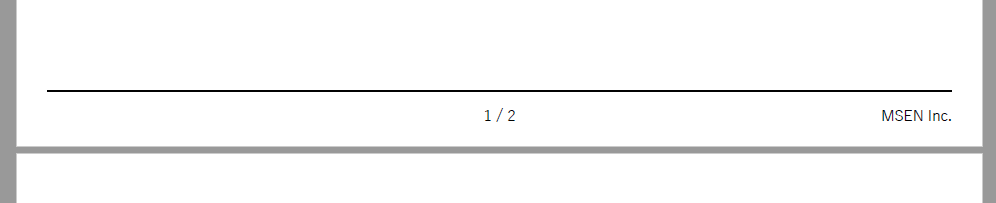

こんにちは、kenzauros です。

以前、記事でも紹介した **Markdown から PDF を生成できる Visual Studio Code の拡張機能 [markdown-pdf](https://github.com/yzane/vscode-markdown-pdf/)** 、業務でとても便利に使わせていただいています。

- [Visual Studio Code で Markdown から PDF を一発生成する拡張機能 markdown-pdf](/vscode-markdown-pdf-extension/)

今年 4 月、バージョン 1 になったときに内部で使われている PDF 変換器が変更になりました。

>Markdown PDF ver1.0.0 では PDF変換を node-html-pdf (PhantomJS) から puppeteer (Chromium) に変更しました
[README.ja.md](https://github.com/yzane/vscode-markdown-pdf/blob/master/README.ja.md)

これに伴い、オプションが変更になっただけでなく、**それまでの設定ではヘッダーとフッターがうまく描画されなくなってしまいました**。

今回は新しい markdown-pdf でのヘッダー・フッターの設定をご紹介します。

## ユーザー設定もしくはワークスペース設定で設定する

markdown-pdf の設定は ユーザー設定 (`settings.json`) か ワークスペース設定 (`.vscode/settings.json`) のいずれかで設定できます。

MSEN では PDF 生成関連の設定は、プロジェクトごとに多少異なる場合があること、チームメンバーで統一できることから、**ワークスペース設定 (`.vscode/settings`)** に設定するようにしています。

とあるプロジェクトで使用している設定が下記のものです。

```json
"markdown-pdf.margin.top": "0cm",
"markdown-pdf.margin.bottom": "2cm",
"markdown-pdf.displayHeaderFooter": true,
"markdown-pdf.headerTemplate": "<div></div>",
"markdown-pdf.footerTemplate": "<div style=\"font-family: '游ゴシック体', 'Yu Gothic', YuGothic, 'ヒラギノ角ゴ Pro', 'Hiragino Kaku Gothic Pro', 'メイリオ', 'Meiryo', sans-serif; position: relative; border-top: 1px solid black; margin: 0.5cm; font-size: 9px; width: 100%;\"><div style=\"position: absolute; width: 100%; top: 0.2cm; text-align: center;\"><span class='pageNumber'></span> / <span class='totalPages'></span></div><div style=\"position: absolute; right: 0; top: 0.2cm;\">MSEN Inc.</div></div>"
```

この設定は **「ヘッダーなし」「フッター中央にページ番号/ページ数＋右端に社名」** という設定です。

うん、長いですね。なぜこんなに長いのかと言いますと...

バージョン 1 未満で使用されていた node-html-pdf では PDF 用の CSS にヘッダーフッター用のスタイルを書いておけばよかったのですが、今のバージョンでは**ヘッダーフッターのスタイルはすべて style 属性で直接指定しなければならなくなりました**。

というわけで、現状では設定に冗長な記述をせざるを得ないようです。

特にフォントサイズはなぜか標準が非常に小さく、指定しなければゴマ粒のような文字になりますので、 `font-size: 9px;` のように指定してあげましょう。

ちなみにこの設定だとフッターは下記のように描画されます。



## ちょっと詳しく説明

フロントエンドエンジニアの方なら難しくないと思いますが、そうでない方がカスタムするときのためにフッター部分の記述を分解してご説明しておきます。

フッターの記述を取り出して、改行をつけて整形したものがこちらです。

```html
<div style="font-family: '游ゴシック体', 'Yu Gothic', YuGothic, 'ヒラギノ角ゴ Pro', 'Hiragino Kaku Gothic Pro', 'メイリオ', 'Meiryo', sans-serif; position: relative; border-top: 1px solid black; margin: 0.5cm; font-size: 9px; width: 100%;">
  <div style="position: absolute; width: 100%; top: 0.2cm; text-align: center;">
    <span class='pageNumber'></span> / <span class='totalPages'></span>
  </div>
  <div style="position: absolute; right: 0; top: 0.2cm;">MSEN Inc.</div>
</div>
```

**1 行目 (と 6 行目) がフッター全体の設定**で、フォントやフォントサイズ、フッター上の線などを指定しています。

**2～4 行目が中央揃えにしてページ番号とページ数を表示している部分**です。 `<span class='pageNumber'></span>` と書いた部分にページ番号が、 `<span class='totalPages'></span>` と書いた部分に総ページ数が挿入されます。

**5 行目が右端に表示する社名などの指定**です。 `right` を `left` に変えれば左寄せもできます。

なお、 1 行目でフォント指定 (`font-family`) がやたらと長いですが、フォントが決まっている場合は、 `font-family: 'メイリオ';` のようにそれだけ書けば OK です。

ヘッダーが必要な場合は、上記のような HTML を `markdown-pdf.headerTemplate` に書けば OK です。

お役に立てれば幸いです。
