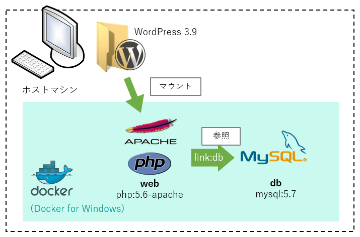

すでに動作している WordPress 3.9.9 を模擬するため、手元に **PHP 5 系 + MySQL 5 系**の環境が必要になりました。

Docker for Windows でうまく動いてくれたのでメモしておきます。

## 概要



Docker for Windows 上に PHP 5.6 のコンテナと MySQL 5.7 のコンテナを起動させ、ホストマシンの WordPress 3.9.9 を `http://localhost` でホストします。

通常であれば PHP は 7 系でいいのですが、動作環境のレンタルサーバーでは PHP 5.3 で動作が遅いという問題があったので、なるべく近い環境を再現しました。

弊社のせいではないので「WordPress も PHP も古すぎるやろ」というツッコミは勘弁してください。

### ディレクトリ構成

こんな感じのディレクトリ構成を想定します。

```
.
├ docker/
│ ├ web/
│ │ ├ Dockerfile
│ │ └ php.ini
│ ├ db.sql
│ └ docker-compose.yml
├ .htaccess
├ wp-admin/
├ wp-content/
├ wp-includes/
├ index.php
├ wp-config.php
└ wp-*.php
```

`db.sql` は本番環境からエクスポートしてきたデータベースダンプファイルで MySQL に流し込みます。元データを戻す必要がない場合は不要です。

`php.ini` はコンテナにマウントします。今回は一旦イメージを起動させ、 `/usr/local/etc/php/php.ini-development` をコピーしてきました。特に設定は変更していません。

## Docker 構成

### PHP の実行環境 + Apache

まず PHP の実行環境と Web サーバーは **`php:5.6-apache`** のイメージを利用します。

> [library/php - Docker Hub](https://hub.docker.com/_/php/)

本番環境の模擬には PHP 5.3.3 がよかったのですが、公式イメージではさすがに 5.6 しか選べなかったのでここは諦めました。

#### web/Dockerfile

いくらかイメージに追加設定が必要なので、 Dockerfile (`web/Dockerfile`) を作成して下記のように記述します。

```
FROM php:5.6-apache
RUN apt-get update && docker-php-ext-install mysql mysqli pdo_mysql mbstring && a2enmod rewrite
```

`docker-php-ext-install` は Docker の PHP 公式イメージに入っているコマンドで指定した拡張機能をいい感じに使えるようにしてくれます。 MySQL 系の拡張機能をインストールしておきます。

`a2enmod` は Apache 2 のコマンドで、 WordPress の URL 変換に `mod_rewrite` モジュールが必要なので有効にしておきます。


### MySQL

MySQL も公式イメージの **`mysql:5.7`** を利用します。

こちらは環境変数である程度の設定ができるので、 Dockerfile は省略し、 `docker-compose.yml` で設定しました。

> [library/mysql - Docker Hub](https://hub.docker.com/_/mysql/)

### docker-compose.yml

```ruby
version: "2"
services:
  web:
    build: ./web
    ports:
      - "80:80"
    volumes:
      - ../:/var/www/html
      - ./web/php.ini:/usr/local/etc/php/php.ini
    links:
      - db
  db:
    image: mysql:5.7
    ports:
      - "3306:3306"
    volumes:
      - ./db.sql:/tmp/db.sql
    environment:
      MYSQL_ROOT_PASSWORD: root
      MYSQL_DATABASE: wordpress
      MYSQL_USER: hogehoge
      MYSQL_PASSWORD: hogehoge
```

#### web

- `volumes`
    - Apache のルートディレクトリは `/var/www/html` なので、** WordPress のルートディレクトリをマウント**します。
    - `php.ini` は `/usr/local/etc/php/php.ini` に配置したものが使われるため、**ホストマシンの `web/php.ini`** をマウントします。

#### db

- `volumes`
    - データベースのデータを戻すため、ダンプファイルをマウントしていますが、戻す必要がない場合は不要です。
- `environment`
    - **`MYSQL_DATABASE`, `MYSQL_USER`, `MYSQL_PASSWORD` は `wp-config.php` の内容と合わせます**。

今回は MySQL のデータを永続化しませんので、データボリュームのマウントはしていません。

必要なら `docker volume create dbdata` 等でボリュームを作成し、 `/var/lib/mysql` にマウントしましょう。

```ruby
～略～
  db:
    image: mysql:5.7
    ports:
      - "3306:3306"
    volumes:
      - ./db.sql:/tmp/db.sql
      - dbdata:/var/lib/mysql
volumes:
  dbdata:
```

### 起動

```bash
cd docker
docker-compose up -d
```

### データベース復元

db に入って mysql コマンドでダンプファイルを流し込みます。

```bash
docker exec -it docker_db_1 bash
mysql -u hogehoge -p -D wordpress < /tmp/db.sql
```

(`docker_db_1` は名前が違うかもしれませんので `docker ps` で確認してください)

## 参考

- [DockerのPHPでMySQL拡張モジュールを使う | 人と情報](https://www.tmp1024.com/programming/docker-php-mysql-module)