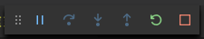
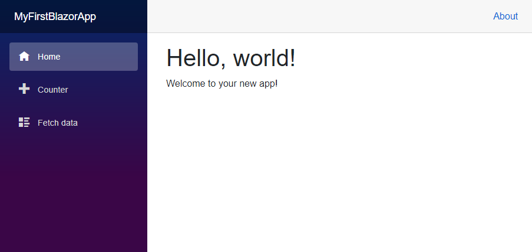

> .NET Core 3.0 の正式リリースに伴い、本記事を書き直しましたので、新記事をお読みください。
> [\[ASP.NET Core\] Blazor Server 入門 (セットアップ編)](/asp-dotnet-core-blazor-install/)


今回 ASP.NET Core で**Blazor** を利用してみたくなって調べていたところ、 Preview 9 になっていて、正式リリースまでに大きな仕様変更もないようなので、使ってみることにしました。

## 概要

まず Blazor とはなんやねんという話ですが、一言で言えば、 **Blazor とはフロントエンドもバックエンドも C# で書けちゃうという C#er にとっては夢のような Web アプリフレームワーク**です。

公式の話は [ASP.NET Core での Blazor の概要 | Microsoft Docs](https://docs.microsoft.com/ja-jp/aspnet/core/blazor/?view=aspnetcore-3.0) でも参照してください。

私の考える主な強みは下記の 3 つです。

1. .NET Core なので**クロスプラットフォーム** (Windows, Linux, macOS) で動作可能
1. **フロントエンドもサーバーサイドも C#** で記述できる (= JavaScript を書く必要がほぼない)
1. .NET Core の**多機能で整頓されたクラスライブラリ**をフル活用できる

### 1. クロスプラットフォーム

まず「クロスプラットフォームであること」は現代の Web アプリで言えば必須要件です。 Java も PHP も Node も Python もクロスプラットフォームで動作しますし、昨今では当然なのですが、これまで .NET 系で Web アプリといえば、少なくともサーバーサイドは Windows で、サーバーに IIS を使用する必要がありました。

これを払拭したのは **.NET Core (プラットフォーム)** と **.NET Standard (仕様)** です。 .NET Core は .NET のコアをオープンソースで公開し、 Windows, Linux, macOS でも完全に動作するように進化しました。 .NET Standard は .NET Framework を再定義し、Windows 依存の機能を分離することで、プラットフォームに依存しない統一した API を提供することができるようになりました。

当然ですがクライアント側も Blazor でレンダリングされて HTML になるので、どのブラウザーでも利用できます。 Internet Explorer しか対応する気のなかった [Silverlight](https://ja.wikipedia.org/wiki/Microsoft_Silverlight) までの Microsoft とは雲泥の差です。

### 2. C# だけで全部書ける

Blazor の最大の魅力はやはり**フロントエンドもサーバーサイドも C# で書ける**ことでしょう。

JavaScript にも型付けの概念が導入された TypeScript がでてきたり、 VSCode などの開発環境が進化することでずいぶん快適に開発することができるようになりましたが、 C# の言語自体がもっている機能と書きやすさは一歩抜きん出ていると思います。

**静的型付けにより開発時に型エラーを検知できる**というのは、スクリプト言語に慣れた人には窮屈かもしれませんが、実行時まで型エラーがわからないので、熟練のプログラマーでも型由来のバグを生じることはよくあることです。 JavaScript ですら TypeScript への流れがあるように、効率的な開発をしようと思うと型付け言語必然なのだと思います。

言語機能を除いても、特に**クライアントサイドとサーバーサイドでデータモデルやデータ提供サービスを重複して定義する必要がなくなります**。

Node.js をサーバーサイドに用いれば JavaScript で両側を定義することは可能ですが、この場合でも Node とクライアントサイドで実行できる ECMAScript のバージョンに差があるので、スッキリ書けるとは言い難い状態でしょう。

正直なところ C# がオリジナルで実現した機能というのはあまりないように思います。 Java をはじめとしてオブジェクト指向型言語だけでなく、関数型言語など広範な言語から便利機能だけを Cherry-picking して精錬したような言語なので、個人的には「巧妙に成長してきた」と感じています。

C# が発祥の機能としては、今では JS でも標準化されつつある **async/await**、 PHP にも取り入れられた **Null 合体演算子**などが有名なところではないでしょうか。
(正確に最初の言語かどうかは知りませんが)

### 3. .NET のクラスライブラリが利用できる

これもまた非常に強力な特長です。

他の言語では、言語の開発元が標準で提供しているライブラリが貧弱だったり、使いにくかったりします。

Node (npm) や Python (pip) などにも有用なライブラリは数多くあり、機能ごとにデファクトスタンダードはあると思いますが、ユーザーコミュニティが中心となって開発しているため、インターフェースや仕様・命名規則などはバラバラであり、その言語の経験がないと何を使っていいかわかりにくい面があります。

.NET の場合、**非常に高機能でありながら、インターフェースにも命名規則にも一貫性があります**。もともと Microsoft だけが開発元であったことも一因でしょうが、先述の通り .NET Standard として再定義されたときに淘汰され、整理されたのでさらに洗練されたものになりました。

Web 開発にも "C# を！ .NET のライブラリを！" というのは .NET 開発者の長年の夢であり、 Microsoft としても悲願だったのでしょう。

### .NET Core 3.0 は運用 Ready

下記のページによれば、執筆時点の Preview 9 を含め、 **.NET Core 3.0 Preview 7 以降は運用 Ready である** とされています。

> .NET Core プレビュー 9 は、Microsoft で運用の準備ができていると見なされており、完全にサポートされています。 Preview 7 以降、リリースでは、新機能を追加するのではなく、.NET Core 3.0 を洗練させることに焦点を当てています。
> [.NET Core 3.0 の新機能 | Microsoft Docs](https://docs.microsoft.com/ja-jp/dotnet/core/whats-new/dotnet-core-3-0#production-supported-preview)

まだバグフィックスや微調整は行われるでしょうから、運用環境に採用するのは勇気がいりますね。評価を十分に行い、開発中も柔軟にリリースに追従できそうであれば、導入を検討する価値はあるのではないかと思います。

## 前提

Visual Studio を使うのが一般的だとは思いますが、最近は Visual Studio Code (VSCode) でもいい感じで開発できるようなので、今回は VSCode で進めます。

- **Visual Studio Code 1.38.1**
    - 拡張機能 [C#](https://marketplace.visualstudio.com/items?itemName=ms-vscode.csharp) 1.21.2
    - 拡張機能 [C# XML Documentation Comments](https://marketplace.visualstudio.com/items?itemName=k--kato.docomment) 0.1.8
- .NET Core 3.0.100-preview9-014004
    - Microsoft.AspNetCore.Blazor.Templates 3.0.0-preview9.19424.4

`.cs` ファイルを開くと提案が表示されますが、 [C#](https://marketplace.visualstudio.com/items?itemName=ms-vscode.csharp) の拡張機能をインストールしておきます。

また、 Visual Studio と同じように `///` を入力してドキュメントコメントを書くため [C# XML Documentation Comments](https://marketplace.visualstudio.com/items?itemName=k--kato.docomment) もインストールしましょう。

## インストール

### .NET Core 3.0 のインストール

Blazor の Preview 9 を利用するにはまず **.NET Core 3.0** をインストールします。 (.NET Core 2.x 系の場合はテンプレートをインストールしても一覧に表示されません)

- [Download .NET Core 3.0 (Linux, macOS, and Windows)](https://dotnet.microsoft.com/download/dotnet-core/3.0)

上記のページから SDK のインストーラーをダウンロードします。執筆時点でのバージョンは `3.0.100-preview9-014004` です。 Windows の場合は **NET Core Installer: x64** をダウンロードしてインストールします。

インストールできたら、コンソールを開いてバージョンを確認しておきます。

```bash
$ dotnet --version
3.0.100-preview9-014004
```

### Blazor テンプレートのインストール

次に Blazor テンプレートをインストールします。 `dotnet new -i` に続けて `Microsoft.AspNetCore.Blazor.Templates::3.0.0` の最新バージョンを指定します。

執筆時点では `Microsoft.AspNetCore.Blazor.Templates::3.0.0-preview9.19424.4` でしたが、最新のものが不明な場合は `3.0.0` まで入力して実行すると、入力したものに一番近い最新のバージョンをサジェストしてくれますので、そのバージョンを使用します。

```bash
$ dotnet new -i Microsoft.AspNetCore.Blazor.Templates::3.0.0-preview9.19424.4
～略～
Templates                                         Short Name               Language          Tags
----------------------------------------------------------------------------------------------------------------------------------
～略～
Blazor Server App                                 blazorserver             [C#]              Web/Blazor
Blazor WebAssembly App                            blazorwasm               [C#]              Web/Blazor/WebAssembly
～略～
```

実行するとインストール後のテンプレート一覧が表示されます。上記のように `blazorserver` と `blazorwasm` が含まれていれば問題ありません。

**blazorserver** は**サーバーサイド**の Blazor アプリ、 **blazorwasm** は WebAssembly を使った**クライアントサイド**の Blazor アプリのテンプレートです。

詳細は [Blazor ホスティングモデルの ASP.NET Core | Microsoft Docs](https://docs.microsoft.com/ja-jp/aspnet/core/blazor/hosting-models?view=aspnetcore-3.0) を参照してください。

### プロジェクトの作成

`dotnet new` コマンドを実行して新しいプロジェクトを作成します。 `-o` オプションと `-n` オプションを使うことでインストールするフォルダーとプロジェクト名を別に指定できます。


```bash
$ cd C:\Repos\my-first-blazor-app
$ dotnet new blazorserver -o src -n MyFirstBlazorApp
The template "Blazor Server App" was created successfully.
This template contains technologies from parties other than Microsoft, see https://aka.ms/aspnetcore/3.0-third-party-notices for details.

Processing post-creation actions...
Running 'dotnet restore' on src\MyFirstBlazorApp.csproj...
  C:\Repos\my-first-blazor-app\src\MyFirstBlazorApp.csproj の復元が 90.61 ms で完了しました。

Restore succeeded.
```

今回は下記のようなディレクトリ構成にしました。

```
my-first-blazor-app/
└ src/
  └ MyFirstBlazorApp.csproj
```

`Restore succeeded.` と表示されれば OK です。

インストールフォルダーの直下は下記のような構成になります。

```
src/
├ bin/
├ Data/
├ obj/
├ Pages/
├ Properties/
├ Shared/
├ wwwroot/
├ _Imports.razor
├ App.razor
├ appsettings.Development.json
├ appsettings.json
├ MyFirstBlazorApp.csproj
├ Program.cs
└ Startup.cs
```

`.gitignore` が作成されないので公式の **[core/.gitignore](https://github.com/dotnet/core/blob/master/.gitignore)** を配置しましょう。

## 開発環境のセットアップ

### 開発環境アセットの生成

VSCode でプロジェクトフォルダーを開き、 **F5 (デバッグの開始)** をクリックします。初回は Asset を追加するかどうか VSCode から確認されるので、 Yes を押すと `.vscode` フォルダに `launch.json`, `tasks.json` が追加されます。

念のため、自動生成された `launch.json`, `tasks.json` の内容を確認しておきます。

#### `launch.json`

```js
{
    // Use IntelliSense to find out which attributes exist for C# debugging
    // Use hover for the description of the existing attributes
    // For further information visit https://github.com/OmniSharp/omnisharp-vscode/blob/master/debugger-launchjson.md
    "version": "0.2.0",
    "configurations": [
        {
            "name": ".NET Core Launch (web)",
            "type": "coreclr",
            "request": "launch",
            "preLaunchTask": "build",
            // If you have changed target frameworks, make sure to update the program path.
            "program": "${workspaceFolder}/src/bin/Debug/netcoreapp3.0/MyFirstBlazorApp.dll",
            "args": [],
            "cwd": "${workspaceFolder}/src",
            "stopAtEntry": false,
            // Enable launching a web browser when ASP.NET Core starts. For more information: https://aka.ms/VSCode-CS-LaunchJson-WebBrowser
            "serverReadyAction": {
                "action": "openExternally",
                "pattern": "^\\s*Now listening on:\\s+(https?://\\S+)"                
            },
            "env": {
                "ASPNETCORE_ENVIRONMENT": "Development"
            },
            "sourceFileMap": {
                "/Views": "${workspaceFolder}/Views"
            }
        },
        {
            "name": ".NET Core Attach",
            "type": "coreclr",
            "request": "attach",
            "processId": "${command:pickProcess}"
        }
    ]
}
```

#### `tasks.json`

```js
{
    "version": "2.0.0",
    "tasks": [
        {
            "label": "build",
            "command": "dotnet",
            "type": "process",
            "args": [
                "build",
                "${workspaceFolder}/src/MyFirstBlazorApp.csproj",
                "/property:GenerateFullPaths=true",
                "/consoleloggerparameters:NoSummary"
            ],
            "problemMatcher": "$msCompile"
        },
        {
            "label": "publish",
            "command": "dotnet",
            "type": "process",
            "args": [
                "publish",
                "${workspaceFolder}/src/MyFirstBlazorApp.csproj",
                "/property:GenerateFullPaths=true",
                "/consoleloggerparameters:NoSummary"
            ],
            "problemMatcher": "$msCompile"
        },
        {
            "label": "watch",
            "command": "dotnet",
            "type": "process",
            "args": [
                "watch",
                "run",
                "${workspaceFolder}/src/MyFirstBlazorApp.csproj",
                "/property:GenerateFullPaths=true",
                "/consoleloggerparameters:NoSummary"
            ],
            "problemMatcher": "$msCompile"
        }
    ]
}
```

### デバッグの開始

この状態で再度 F5 (デバッグの開始) を実行します。

デバッグを開始すると `launch.json` の `launch` で設定されたプロジェクトが起動します。起動前に `preLaunchTask` で指定された `tasks.json` の `build` タスクでプロジェクトがビルドされます。

デバッグ実行が開始されると下記のようなデバッグツールバーが表示されます。



同時にブラウザーが起動して `https://localhost:5001` が開かれます。おそらく証明書の警告が表示されるので「詳細」を押して無視して開けば OK です。

下記のようなデフォルトの Bootstrap 4 アプリが表示されればセットアップは完了です。



この状態で "Counter" や "Fetch Data" などはすでに動的に動作しますので、操作してみましょう。

## 次の記事

次回は Entity Framework Core を使って SQL Server に接続してみます。

- [[ASP.NET Core] Blazor Preview 9 入門 (EF Core + SQL Server 編)](/asp-dotnet-core-blazor-preview9-ef-core-sqlserver)

## 参考

- [ASP.NET Core Blazor を使ってみる | Microsoft Docs](https://docs.microsoft.com/ja-jp/aspnet/core/blazor/get-started?view=aspnetcore-3.0&tabs=visual-studio-code)