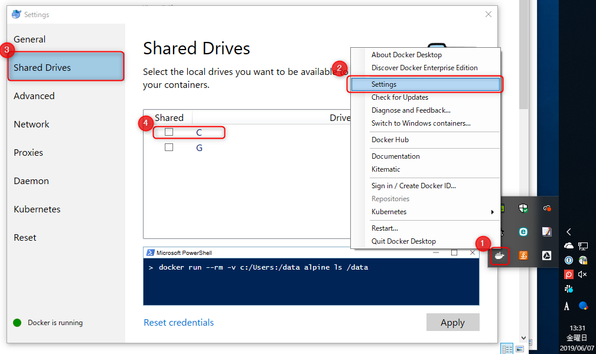
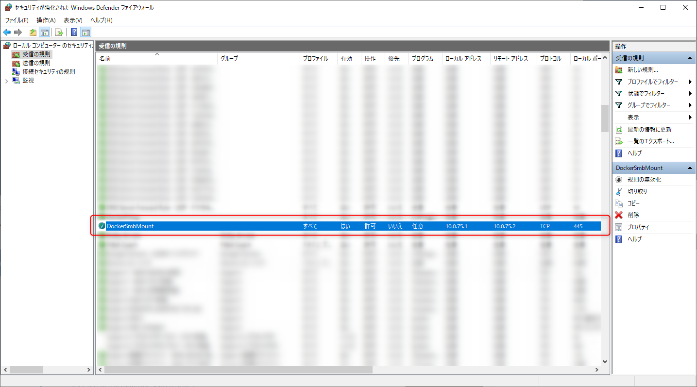
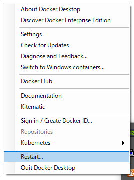
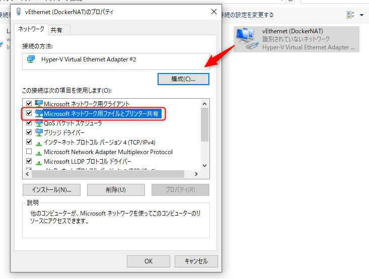
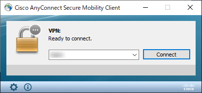
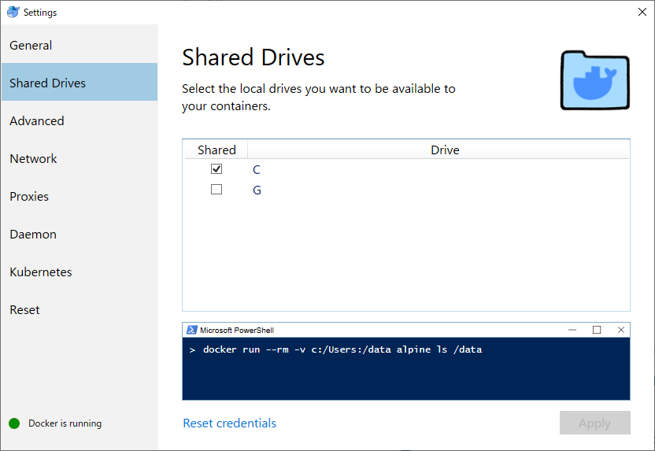

 **Docker Desktop (Docker for Windows) の共有ドライブ (Shared Drives) が設定できなくて困った**のでそのトラブルシューティングです。

## Laradock のコンテナーが起動しない

新しいプロジェクトの **Laradock** を起動しようと `docker-compose` をたたくとエラーがでました。

```
Creating laradock_mysql_1            ... error

ERROR: for laradock_mysql_1  Cannot create container for service mysql: b'Drive sharing seems blocked by a firewall'
```

"Drive sharing seems blocked by a firewall" だそうなので、 Docker Desktop の Settings から Shared Drives を確認するとたしかに C ドライブが外れている。

<a href="images/cisco-anyconnect-blocked-shared-drives-setting-in-docker-desktop-for-windows-1.png"></a>

これにチェックをつけて [Apply] を試みるも、下記のエラーではじかれてしまう。

>**Firewall detected**
>A firewall is blocking file Sharing between Windows and the containers. See documentation for more info.

上の "documentation" というのは下記のページなのだが、

>[Get started with Docker for Windows | Docker Documentation](https://docs.docker.com/docker-for-windows/#firewall-rules-for-shared-drives)

ホストの 445 へのアクセスができるようにファイアウォールを設定せよというだけだった。

<a href="images/cisco-anyconnect-blocked-shared-drives-setting-in-docker-desktop-for-windows-2.png"></a>

Windows ファイアウォールを確認したところ、 **`DockerSmbMount`** という規則がおり、どうも普通に開いているようだ。念のため Windows ファイアウォールを一時的に無効にしてみたが、改善されなかった。

## やったこと

### ウイルス対策ソフトのファイアウォール確認

いくつか日本語のサイトを確認したが、いずれも「ESET や Kaspersky やノートンなどウイルス対策ソフトのファイアウォールが影響しているので Windows ファイアウォールと同様の許可設定をしよう」という内容だった。

弊社は ESET を使っているので一応確認したが、そもそもパーソナルファイアウォールが動いていないので、関係なかった。こちらも念のため ESET を一時停止して確認したが、状況は改善しなかった。

その他、いろいろなサイトで引用されている下記の Stack Overflow のスレッドからいろいろ試してみた。

[Settings to Windows Firewall to allow Docker for Windows to share drive - Stack Overflow](https://stackoverflow.com/questions/42203488/settings-to-windows-firewall-to-allow-docker-for-windows-to-share-drive)

### Docker Desktop の再起動

タスクトレイの Docker Desktop から Restart してみた。

<a href="images/cisco-anyconnect-blocked-shared-drives-setting-in-docker-desktop-for-windows-3.png"></a>

### DockerNAT の設定変更

`vEthernet (DockerNAT)` のプロパティから「Microsoft ネットワーク用ファイルとプリンター共有」のチェックを外して反映し、チェックを戻して反映してみた。

<a href="images/cisco-anyconnect-blocked-shared-drives-setting-in-docker-desktop-for-windows-4.png"></a>

### DockerNAT のネットワークカテゴリーの変更

`vEthernet (DockerNAT)` のネットワークカテゴリーをプライベートにすれば？というのもあったので PowerShell でやってみたが、やはり効果なし。

そもそも Windows ファイアウォールの設定 (`DockerSmbMount`) はプライベートだけでなく、ドメインとパブリックに対しても有効になっていたので関係なさそう。

```
PS C:\Windows\system32> Set-NetConnectionProfile -interfacealias "vEthernet (DockerNAT)" -NetworkCategory Private
PS C:\Windows\system32> Get-NetConnectionProfile -interfacealias "vEthernet (DockerNAT)"


Name             : 識別されていないネットワーク
InterfaceAlias   : vEthernet (DockerNAT)
InterfaceIndex   : 22
NetworkCategory  : Private
IPv4Connectivity : NoTraffic
IPv6Connectivity : NoTraffic
```

### そして

ここで [神のレス](https://stackoverflow.com/a/53704808) が目に入る。

> My problem was **Cisco Anyconnect VPN** interfered with internal docker networking
> https://stackoverflow.com/a/53704808

## Cisco AnyConnect が原因でした

たしかに業務で **Cisco AnyConnect** を使っており、ここまでも VPN 接続中でした。

ただ、このレスにあった

> to fix this go to:
> Cisco Anyconnect Settings > Preferences > check Allow local (LAN) access when using VPN

をやってみましたが効かなかったため、とりあえず Disconnect してみました。

<a href="images/cisco-anyconnect-blocked-shared-drives-setting-in-docker-desktop-for-windows-5.png"></a>

すると、アラ不思議。 Shared Drives の設定がすんなりと通ってしまいました。

<a href="images/cisco-anyconnect-blocked-shared-drives-setting-in-docker-desktop-for-windows-6.png"></a>

再び、 AnyConnect で VPN にも接続し、 Shared Drives の設定を変更してみましたが、問題なく動作しました。

Laradock さんも無事に起動されました。

```bash
$ docker-compose up -d nginx mysql workspace
Creating laradock_docker-in-docker_1 ... done
Creating laradock_mysql_1            ... done
Creating laradock_workspace_1        ... done
Creating laradock_php-fpm_1          ... done
Creating laradock_nginx_1            ... done
```

今思えばそもそも **AnyConnect と Docker for Windows は前から干渉しあっていることが多く、 `vEthernet (DockerNAT)` が有効になった状態では VPN につながらない**などの不具合もありました。

もっと早く気付けばよかった。。。

いずれにしろ根本原因は不明です。とりあえず AnyConnect と Docker のネットワーク・インターフェースは相性が悪いらしいです。
