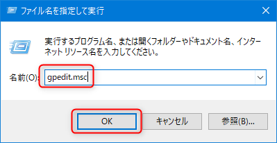
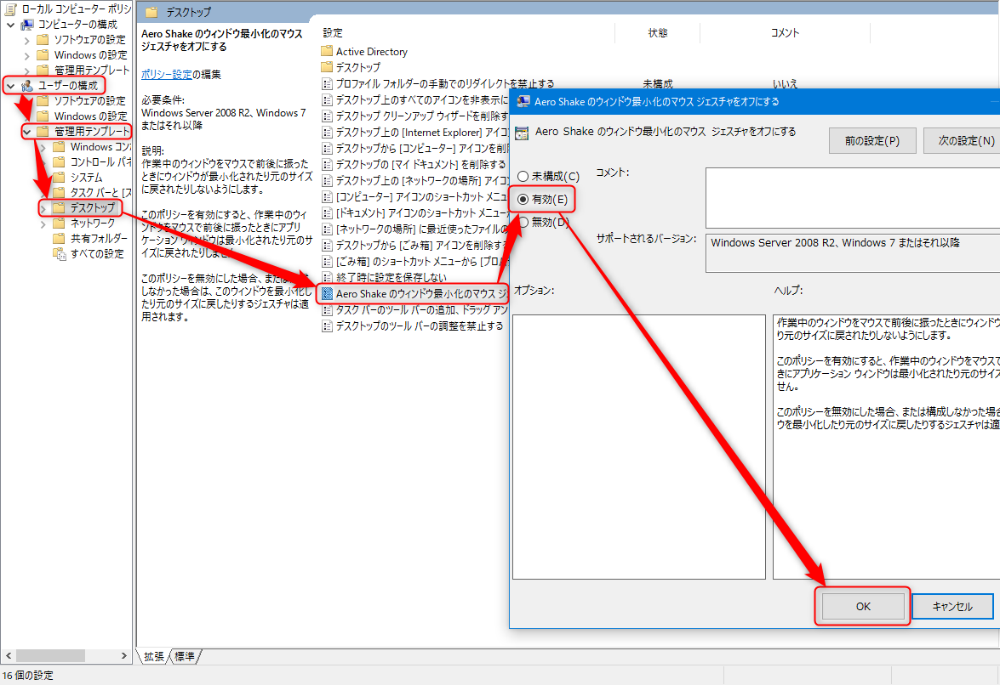

Windows 10 を使っていて、ストレスを感じることナンバー15、 **Aero Shake (エアロシェイク)** の無効化方法です。

## 概要

私は昔からやたらとウィンドウを開きまくるので、そのぶんウィンドウ操作も頻繁です。

邪魔にならない位置にウィンドウを移動しようと思ってドラッグしたまま少し位置を迷う (＝"振る") と、**デスクトップ上の他のウィンドウがすべて最小化**されてしまう。

この機能が Windows 7 から追加された **Aero Shake (エアロシェイク)** です。

運良ければ (?) もう一度"振る"と全部戻るのですが、戻らないこともあって、その時はすべてタスクバーから一つずつ復元しなくてはなりません。

余計なお世話すぎる。機能があるのはいいとして、なぜデフォルトで ON なのか...。

しかし、参考記事を見る限り好意的な方もいらっしゃるようなので、使い方次第、ですね。

## 環境

- Windows 10 Pro (1909)

## 無効化方法

ファイル名を指定して実行 ([Windows] + [R]) を開き、 `gpedit.msc` と入力して [OK] で**ローカルグループポリシーエディター**を開く

**[ユーザーの構成] → [管理用テンプレート] → [デスクトップ] → [Aero Shake のウィンドウ最小化のマウス ジェスチャをオフにする]** をダブルクリックして開き、 **[有効]** にして [OK] を押すだけです。

特に再起動は不要で即座に無効になります。

## 参考サイト

- [Windows の Aero Shake （エアロシェイク）を無効にする - Qiita](https://qiita.com/kawaidainfinity/items/17ff4527d8bf8ca4b879)
- [意外と知られざるWindows7の機能「エアロシェイク」が地味に便利な件　これみんなも使いましょう | Tipstour](https://tipstour.net/windows/7737)
