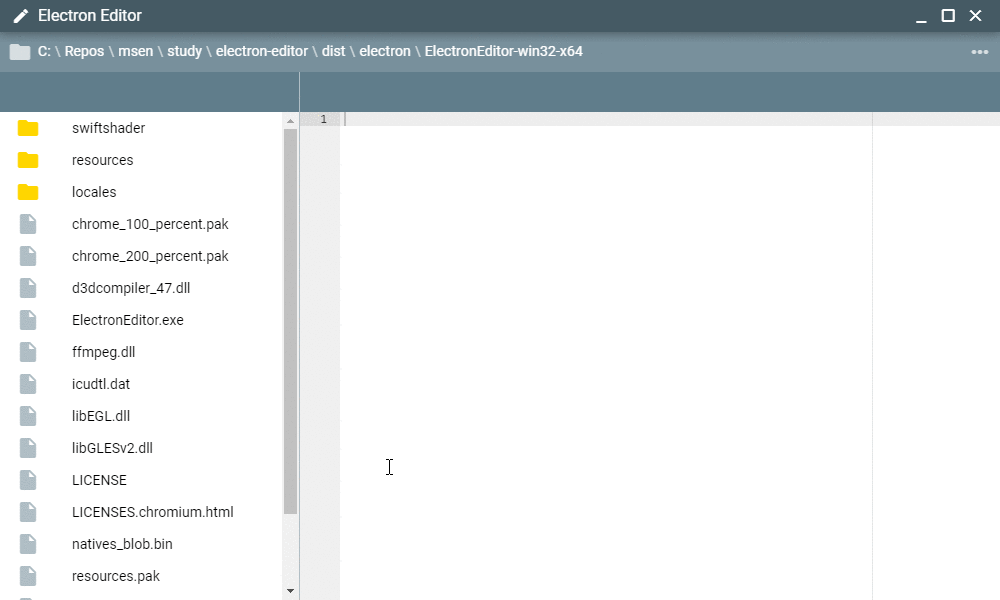

**MSEN では月に一度、社内勉強会**を行っています。

だいたい毎回 3 コマぐらい設けて、

- 1コマ目は全体アナウンスとセキュリティチェック
- 2コマ目は輪番制の発表
- 3コマ目は立候補制の発表

というような感じでやっています。今回は

- 2コマ目: 私 ([@kenzauros](https://github.com/kenzauros))
- 3コマ目: じんないさん ([@jinna-i](https://github.com/jinna-i))

ということで、じんないさんは**初心者でもわかる Docker 入門**をやってくれました。

私は前回のカトー ([@k-so16](https://github.com/k-so16)) さんに続き、 Electron の実践ということで「**Electron で作るテキストエディタ**」と題し、かんたんな（でもちょっとモダンな雰囲気の）テキストエディタをみんなで作ってみることにしました。

## 概要

今回はこんな感じのテキストエディタをつくることが目標です。

プログラムのソースコードリポジトリ、詳細な資料は下記をご覧ください。

- [mseninc/electron-editor: Simple Text Editor on electron](https://github.com/mseninc/electron-editor)
- [プレゼン資料](https://github.com/mseninc/electron-editor/blob/master/docs/presentation.md)

この記事では上記以外の話をメモしておきたいと思います。

## 参加者のスキルレベル

今回の参加者のスキルレベルとしてはプログラムを主としない人もいたため、

- Vue.js と Electron をさらに知る (前回の勉強会でやった基礎を前提にやったので)
- 高度なフレームワーク (Quasar) にふれる
- 自分でプログラムを開発できる素地をつくる

といったところを主眼におきました。

コピペでもなんでもいいので、作っていく過程を知って、最終的に動けば OK というぐらいのフワッとしたワークショップです。

## 技術スタック

今回のプログラムの技術スタックは下記の通りです。

- [Node.js](https://nodejs.org/ja/)
    - [Electron](https://electronjs.org/)
        - [Vue.js](https://jp.vuejs.org/)
        - [Quasar Framework](https://quasar.dev/)
        - [Ace](https://ace.c9.io/)

プレゼン資料でも書いているとおり、ほんとは Ace のようなエディター機能を再開発してみることがとても勉強になると思いますが、時間の都合と、ある程度の「アプリできた感」を出すため、今回は Ace を利用させてもらうことにしました。

## 今回のプレゼン資料について

昔の職場で、全体報告用アプリを作ったときに利用した **[reveal.js](https://revealjs.com/#/)** を使い、 markdown でまとめました。 4年ぶりぐらいの活用でしたが、あまり変わっていませんでした(笑)

[highlight.js](https://highlightjs.org/) によるシンタックスハイライト (色付け) も効くので、特にソースコードを含むような IT 系のプレゼンには向いています。

ただ、デフォルトのテーマは英語向けだったり、字が大きすぎたりして、使いにくいので、ある程度 CSS で調整が必要です。

今回は発表に **VSCode で reveal.js をホストできる [vscode-reveal](https://marketplace.visualstudio.com/items?itemName=evilz.vscode-reveal)** を利用しました。なぜかエクスポートがうまくいかないのが難点ですが、スライド自体はいい感じに表現できるので、楽しかったです。

## 所感

準備はしていても、なかなか筋書きどおりには進行しないものです。タイポや軽いバグなどもあり、私にとっても、とても勉強になる時間でした。

まぁわずか2時間ほどで初学者が完全に理解するのは無理ですが、「おぉ、動いた。表示された」と、少しでも感動を味わうことができたら、今回の講習は成功です。

技術面で全体を見ている立場から言えば、各メンバーが、フルスタックとはいかないまでも **「プログラムが書ける、読める」といういわゆる「リテラシー」**を身に着けてほしいと思っています。これは SRE (Site Reliability Engineering) にもつながることですが、プログラムを書いた経験がなければ、自動化や省力化のきっかけすらつかみにくいものです。

考えるよりまず動く、我々のような小さな会社は「とりあえずやってみる」ことこそが成長のカギだと思っています。

今後も、<del>布教</del>活動を継続していきます。
