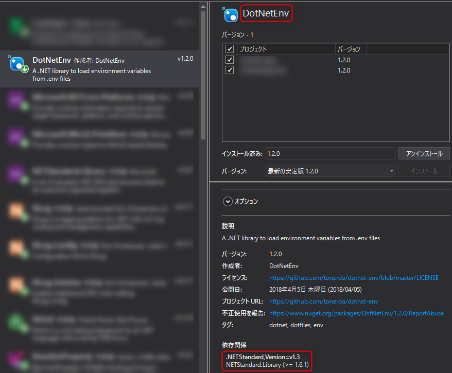
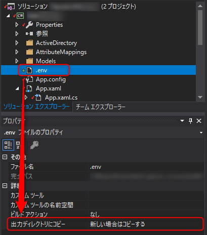

.NET アプリの設定ファイルといえば **App.config** (Settings.settings) が手軽で便利ですが、他のプロジェクトから参照できなかったりして不便な部分もあります。

そこで、読み込みだけできればよい環境変数的な設定に関しては Web 系でのお馴染みの `.env` ファイルを利用することにしました。今回は **[DotNetEnv](https://github.com/tonerdo/dotnet-env)** を使ってみました。

> [tonerdo/dotnet-env: A .NET library to load environment variables from .env files](https://github.com/tonerdo/dotnet-env)

## .env に変えることによるメリットとデメリット

主に App.config と比較したメリットとデメリットを考えてみます。

### メリット

- 設定ファイルがシンプルになる
- アセンブリ外に公開・共有しやすい

### デメリット

- 設定をプログラム側から書き出すことはできない
- Visual Studio (2017) 自体が .env に対応しておらず、エディターで開いてもシンタックスハイライトが効かないため、若干見づらい
- メンバー名でアクセスするには少し工夫が必要

上記のようなデメリットはあるものの、大きな手間がかかるわけではありませんので、 ReadOnly でよければメリットのほうが大きくなるでしょう。

逆に言えば書き込みが必要な設定ファイルを複数のプロジェクトで共有することは設計に難ありのような気もしますので、 App.config で足りそうです。

シンタックスハイライトについては **VSCode** で開くのが吉でしょう。

## 環境

- Visual Studio 2017 (v15.8.7)
- .NET Framework 4.6.1

本稿時点の DotNetEnv のバージョン 1.2.0 では **.NET Standard v1.3** が必要ですので、 **.NET Framework の場合 4.6 以上**である必要があります。 (参考: [dotnet/standard](https://github.com/dotnet/standard/blob/master/docs/versions.md))

## 基本的な使い方

### インストール

NuGet からインストール可能なので VS のパッケージ管理か、コマンドでインストールします。



- Visual Studio パッケージマネージャー:
```
PM> Install-Package DotNetEnv
```
- .NET Core CLI:
```
dotnet add package DotNetEnv
```

### .env ファイルの配置

プロジェクト配下に `.env` を配置し、設定を記述します。下記は `.env` ファイルの例です。

```
FILE_PATH = "test.csv"
EXPIRATION_PERIOD = 365
```

`.env` ファイルを出力ディレクトリにコピーするように設定しておきます。



### .env ファイルの読み込み

各変数を読む前にファイルを Load メソッドで読み込みます。

```cs
DotNetEnv.Env.Load(
    "./path/to/.env",
    trimWhitespace: true,
    isEmbeddedHashComment: true,
    unescapeQuotedValues: true,
    clobberExistingVars: true);
```

第 1 引数には `.env` ファイルのパスを渡します。省略するとカレントディレクトリーの `.env` が参照されます。

その他、名前付き引数で読み込み時の設定が可能です。すべてデフォルトで `true` なのであまり明示的に指定する必要はないかもしれません。

引数名 | 既定値 | 効果
--- | --- | ---
`trimWhitespace` | `true` | `true` にするとキーと値の前後の空白を取り除く<br>(`=` の回りにスペースを書ける)
`isEmbeddedHashComment` | `true` | `true` にすると各行の `#` 以降をコメントとして無視する
`unescapeQuotedValues` | `true` | `true` にするとダブルクオーテーションかシングルクオーテーションで区切られた値のクオートを解除して読み込む
`clobberExistingVars` | `true` | `false` にするとすでに環境変数として存在する場合、上書きしない

### 値の取得

値の取得には下記の 2 パターンがあります。

- `System.Environment.GetEnvironmentVariable("KEY")`
- `DotNetEnv.Env.GetString("KEY")` (DotNetEnv のヘルパーメソッド)

DotNetEnv のヘルパーメソッドのほうが、型指定でき (`int`, `double`, `bool`, `string` のみ)、変数が存在しない場合のフォールバック値を指定できることから便利だと思います。

```cs
DotNetEnv.Env.GetString("FILE_PATH"); // string 型で "test.csv" が取得できるはず
DotNetEnv.Env.GetInt("EXPIRATION_PERIOD"); // int 型で 365 が取得できるはず
DotNetEnv.Env.GetString("FILE_PATH2", "ほげ"); // 定義されていないので "ほげ" が取得できるはず
```

## ヘルパークラス Env.cs

DotNetEnv はここまでの使い方でも便利ですが、 Settings っぽく使うためにヘルパークラスを定義してやると便利だと思います。

Gist にあげましたので参考にしてください。

- [DotNetEnv を使った .NET アプリでの環境変数管理用ヘルパークラス - gist](https://gist.github.com/kenzauros/127be6447fb8d5a135a1d6f39f948795)

```cs:title=Env.cs
using System.Runtime.CompilerServices;

/// <summary>
/// 環境変数を管理します。
/// </summary>
public static class Env
{
    /// <summary>
    /// デフォルトの .env ファイルのファイル名
    /// </summary>
    public const string DEFAULT_ENV_FILENAME = ".env";

    /// <summary>
    /// 環境変数を .env ファイルから読み込みます。
    /// </summary>
    /// <param name="path"></param>
    public static void Load(string path = null)
    {
        DotNetEnv.Env.Load(path ?? DEFAULT_ENV_FILENAME);
    }

    #region 環境変数プロパティからの呼び出し用プロキシメソッド

    public static string GetString([CallerMemberName] string key = "") => DotNetEnv.Env.GetString(key);
    public static int GetInt([CallerMemberName] string key = "") => DotNetEnv.Env.GetInt(key);
    public static bool GetBool([CallerMemberName] string key = "") => DotNetEnv.Env.GetBool(key);
    public static double GetDouble([CallerMemberName] string key = "") => DotNetEnv.Env.GetDouble(key);

    #endregion

    #region 環境変数プロパティ

    // サンプル
    public static string FILE_PATH => GetString();
    public static int EXPIRATION_PERIOD => GetInt();

    #endregion

}
```

Settings クラスのように環境変数名でアクセスできるよう、**静的プロパティーを環境変数名で定義**しています。

これにより、下記のように簡略化できるだけでなく、 **IntelliSense の入力補完**を利用できるようになります。

```diff
- DotNetEnv.Env.GetString("FILE_PATH");
+ Env.FILE_PATH;
```

ヘルパークラスのプロパティー実装は `CallerMemberName` 属性を使って、プロパティー名と同名のキーを探しにいくので、最小限の記述で済みます。記述ミスでのバグが大幅に抑えられるでしょう。

参考になれば幸いです。
