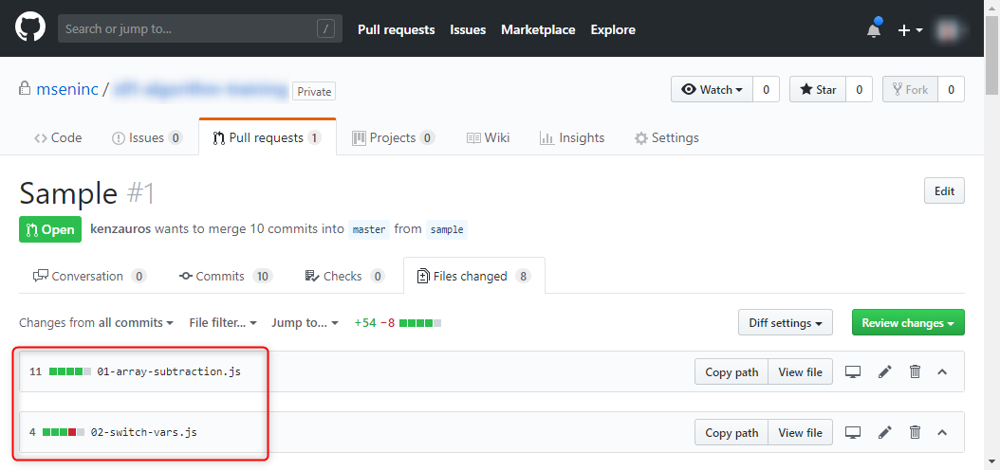
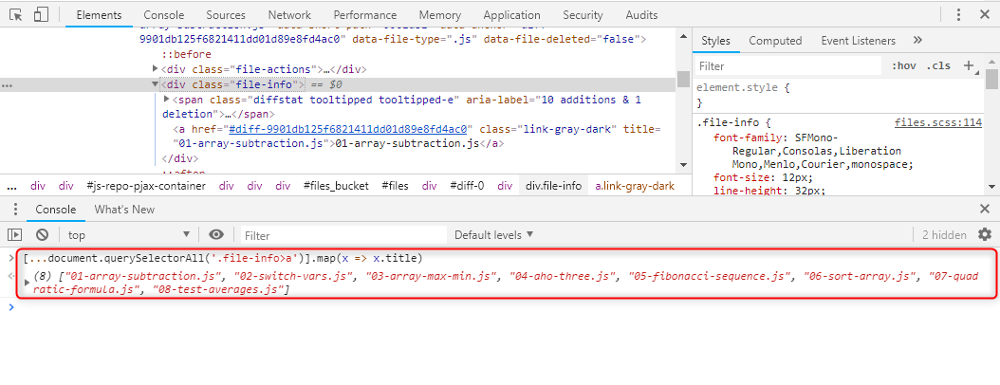

資料をまとめたりするときに使えるかもしれない、ちょっとした小ネタです。

**Git で差分のあるファイル名を抽出する**には `git diff` を使えばいいのですが、そのファイル名を使ってごにょごにょ加工したい場合、（私は）JavaScript のほうが便利なので、 **GitHub の Pull Request を利用**することにしました。

## やりたいこと

ちなみに **`git diff` コマンドでコミット間の変更ファイル名一覧を取得**するのは下記のようにします。

```
git diff --diff-filter=d --name-only origin/master HEAD
```

`diff-filter=d` オプションで「削除以外」、 `name-only` でファイル名のみ、 `origin/master` と `HEAD` の差分を抽出します。

これでずらずらーっとファイル名が得られます。

が、このあとこの一覧を加工しようと思うとシェルスクリプトや PowerShell でごにょごにょしなければなりません。

私は**ゆとり世代なので、なるべく JS のような優しい言語がいい**のです。

## Pull Request からファイル名抽出

Node.js でもいいんですが、ブラウザー上のほうが非開発者にも優しく、テキストの扱いも容易なので、 GitHub の Pull Request を利用します。

**Pull Request の Files changed** からそのブランチで変更されたファイルの一覧が見えるので、これを使いましょう。



この赤枠で囲った部分がファイル名で、この部分の HTML タグは下記のようになっています。

```html
<div class="file-info">
    <span 略>略</span>
    <a 略 title="01-array-subtraction.js">01-array-subtraction.js</a>
</div>
```

CSS クエリーでいえば **`.file-info > a`** にファイル名が格納されています。タグの中身でもいいですが、 `title` 属性のほうが簡単そうです。

というわけで、開発者ツール (Chrome なら　Ctrl+Shift+J) を起動して、 Console に下記のように打ち込み、

```js
[...document.querySelectorAll('.file-info>a')].map(x => x.title)
```

Enter を押してやると、**ファイル名の一覧を配列で取得できます**。



説明する必要もないぐらいですが、下記のような処理の流れです。

- `document.querySelectorAll` で CSS セレクターに合致した要素一覧を取得
- 配列スプレッド演算子 `[... ]` で要素一覧を配列に展開
- `map` で `title` 属性のみ抽出

`document.querySelectorAll` が返すのが配列でなく `NodeList` なので一旦配列に変換しています。

## 応用

あとはたとえば Markdown のリストにしたければちょこっと追記して、

```js
[...document.querySelectorAll('.file-info>a')].map(x => x.title)
.map(x => `- ${x}`)
.join('\n')
```

のように書いてやれば、

```md
- 01-array-subtraction.js
- 02-switch-vars.js
- 03-array-max-min.js
- 04-aho-three.js
- 05-fibonacci-sequence.js
- 06-sort-array.js
- 07-quadratic-formula.js
- 08-test-averages.js
```

のような出力が得られますね。