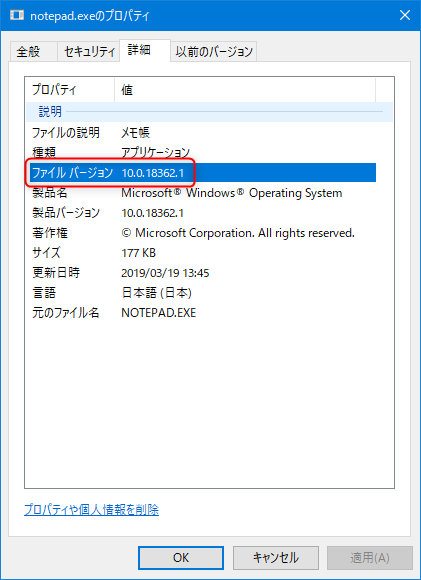

タイトルの通り **PowerShell で exe や dll のバージョン番号を v1.0.0 のような形式で取得**する方法を紹介します。



バージョン番号を使って Git のタグづけをしたり、 `Compress-Archive` で Zip に固めたりするのに便利です。

## スニペット

結論のスニペットからどうぞ。

```
$vi = (Get-ItemProperty $exePath).VersionInfo
$fileVersion = "v" + ($vi.FileMajorPart) + "." + ($vi.FileMinorPart) + "." + ($vi.FileBuildPart)
Write-Output $fileVersion
```

以上です。

## 説明

あまり説明することもないですが、さすがに手抜きすぎるので、簡単に解説します。

バージョン番号は `メジャーパート.マイナーパート.ビルドパート.プライベートパート` となっています。

まず `(Get-ItemProperty $exePath).VersionInfo` で **[`FileVersionInfo` クラス](https://docs.microsoft.com/ja-jp/dotnet/api/system.diagnostics.fileversioninfo?view=netframework-4.8)のインスタンス**が得られます。

このインスタンスの各プロパティがバージョン番号の各パートに相当します。

パート | プロパティ
--- | ---
メジャー | `FileMajorPart`
マイナー | `FileMinorPart`
ビルド | `FileBuildPart`
プライベート | `FilePrivatePart`

あとは**これを文字列結合すれば好きな形式でバージョン文字列が得られる**というわけですね。

ちなみに**実行ファイルのバージョンには「製品バージョン」と「ファイルバージョン」**があり、上記は「ファイルバージョン」の取得用です。「製品バージョン」の場合は `Product~` を使用します。


パート | プロパティ
--- | ---
メジャー | `ProductMajorPart`
マイナー | `ProductMinorPart`
ビルド | `ProductBuildPart`
プライベート | `ProductPrivatePart`

