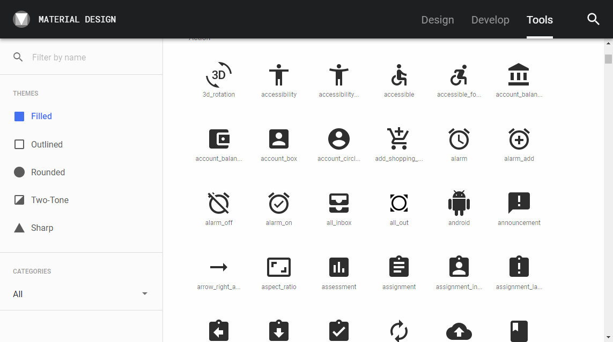

Web デザインで使えるアイコンフォントは多いのですが、統一感や種類の豊富さ、あとは継続性を考えると、個人的には Google の Material Design で使われる **Material Icons** の使い勝手がいいと思っています。

> [Icons - Material Design](https://material.io/tools/icons/?style=baseline)

アイコンの検索は ↑ のページが見やすくて便利です。

## フォントファイルのダウンロード

デザインする際は、アイコンフォントファイルをインストールして使うのが便利です。

Material Icons の場合、意外と公式ページからダウンロードできず、フォントファイルになかなかたどり着けないため、リンクをご紹介します。

アイコンフォントは GitHub で公開されているので、そちらからダウンロードするのがよいです。

> [material-design-icons/iconfont at master · google/material-design-icons](https://github.com/google/material-design-icons/tree/master/iconfont)

Windows で使うなら `MaterialIcons-Regular.ttf` をダウンロードすればいいので、リンクを開き、 [ダウンロード] ボタンをクリックするだけです。

ちなみに直リンクは [こちら](https://github.com/google/material-design-icons/raw/master/iconfont/MaterialIcons-Regular.ttf) 。

Web デザインだけでなく Word などの文書中でアイコンをちょこっと使うときにも便利です。

## ライセンス

ちなみにライセンスは [Apache Licence 2.0](http://www.apache.org/licenses/LICENSE-2.0.txt) なので、ほぼ自由に使うことができます。
