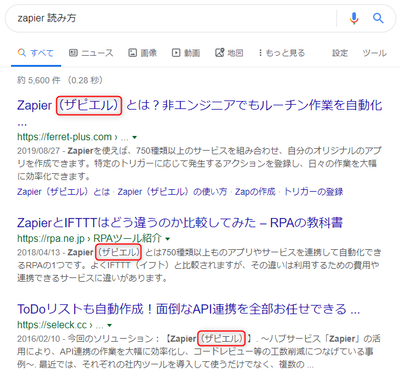
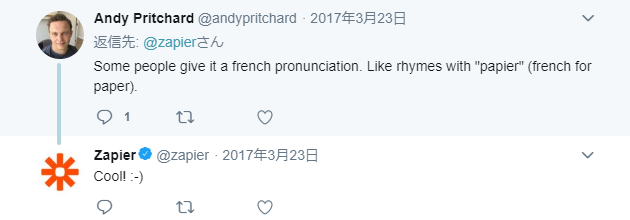

閑話休題。自動化ツールとして割と気に入っている **Zapier** 。

今日社内で読み方の話になりました。私はずっと「**ザピアー**」と読んでましたが、 Zapier をググると意外と「**ザピエル**」派がいらっしゃることが判明しました。

[ザビエル](https://ja.wikipedia.org/wiki/%E3%83%95%E3%83%A9%E3%83%B3%E3%82%B7%E3%82%B9%E3%82%B3%E3%83%BB%E3%82%B6%E3%83%93%E3%82%A8%E3%83%AB) にしか見えないんですが、困ったときは公式に聞いてみましょう。

## 公式見解

[Zapier の公式 Twitter アカウント](https://twitter.com/zapier) によると

https://twitter.com/zapier/status/507316890281467905

「**"happier" みたいに発音してね。 Zapier はみなさんをよりハッピーにする存在だから♡**」ということだそうです。

ということは**「happier＝ハピアー」とすると「zapier」は「ザピアー」**ですかね。

## しかし別の読み方も

この公式アカウントのツイートに対し、

> Some people give it a french pronunciation. Like rhymes with "papier" (french for paper).
> フランス語発音で呼んでる人もいるぜ。 "papier" みたいに発音しちゃってさ。

というコメントが。

公式アカウントも認めていますので、フランス語読みでも OK だそうです。この場合、 **"papier" が「パピエ」って感じなので「ザピエ」**ですかね。

と考えると「<del>ザビエル</del> ザピエル」はスペイン語読みっぽい？

## 結論

一応正式な英語読みは「ザピアー」でよかったようですが、 Zapier の公式アカウントの反応を見ている限り「好きに呼んで」という感じのようです(笑)

**Zapier makes you happier!**