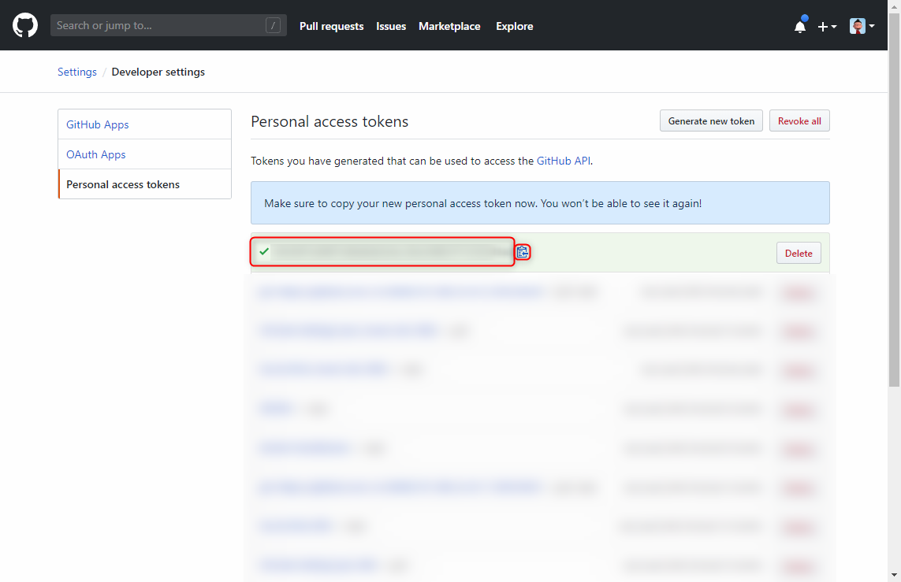

今回は Docker で立ち上げた社内 **GitLab に GitHub のリポジトリをインポート**する方法を紹介します。かなり簡単です。

## 前提条件

GitLab は立ち上がっている前提とします。

- GitLab バージョン: CE 11.11.3

この記事は 2019年6月 時点の情報を元にしています。

## モチベーション

弊社は **GitHub** をソースコード管理に使っていますが、やはりクラウドサービスであることから、一定のサービス消滅、データ消失の不安はあります。

IT システム開発会社にとってソースコードは命なので、失われてしまっては事業継続がままなりませんが、 **GitHub 上でやりとりされている Issue や Pull request といったある種のログ情報もナレッジベースとして非常に重要な資産**です。

Git の場合、ソースコードは各開発者の手元にある程度のクローンが残りますが、 Issue や PR は通知が Slack に残るぐらいなので、一本の流れとしてやりとりをさかのぼるには無理があります。

今回は GitHub とは物理的に異なる場所に、これらのソースコードと Issue や PR をバックアップできることを目標としています。

## GitHub リポジトリのインポート

### GitHub の Personal Access Token の生成

まずは **GitHub** 側での操作です。

GitHub の **[Personal setting](https://github.com/settings/profile)** ページを開き、 **[developer settings]** をクリックします。

左メニューの **[Personal access tokens]** をクリックし、 **[Generate new token]** をクリックします。

New personal access token 画面では **[Select scopes] で [repo] スコープ**を選択します。これでこのトークンでリポジトリ操作が可能になります。

[Note] には自分で何のために発行したかわかるように注釈を書いておきましょう。

**[Generate token]** をクリックするとトークンが生成されます。

トークン一覧画面でチェックマークのついたものが今生成されたトークンです。**コピーボタンを押してコピー**します。このトークンは二度と表示できませんので、必要な場合はメモっておきます。ただし、忘れた場合は古いものを失効 (Delete) させて再発行すればいいので、あまりどこかに置いておかないほうがいいでしょう。

### GitLab に GitHub リポジトリをインポート

ここからは **GitLab** での操作です。

GitLab を開き、メニューバーの + ボタンから **[New project]** を選択します。

**[Import project]** タブから **[GitHub]** を選択します。

**[Personal Access Token]** というテキストボックスに先ほど生成したトークンを貼り付け、 **[List your GitHub repositories]** をクリックします。

次の画面で自分が権限を持っている GitHub リポジトリの一覧が表示されます。

**[From GitHub]** 列が GitHub のリポジトリ名、 **[To GitLab]** 列が GitLab にどういう名前でインポートするかの設定です。所有者 (画像では root になっている) とリポジトリ名を設定し、 **[Import]** ボタンをクリックすると、そのリポジトリのインポートが開始されます。

ちなみに複数リポジトリの [Import] をクリックすると、スケジュールされて順次インポートが実行されます。

### インポート結果

しばらくするとインポートが完了し、リポジトリが表示できます。 Git としてのコミット記録やブランチだけでなく、 **Issue** や **Merge Requests** (GitHub の Pull request) も移行できていることがわかります。

Issue やマージリクエストを開いてみると、コメント内にある、**別の Issue や PR へのリンクも機能している**ことがわかります。

ただし、Issue やマージリクエスト、コメントの発言者は GitLab のシステム上はすべてインポートしたユーザーになり、 GitHub で投稿したユーザーは `Created by: ユーザー名` という形でコメントの一部として記述されます。

同じユーザーがいないので当たり前といえば当たり前ですが、 GitHub ユーザーにリンクするとかしてこのあたりだけもう少し改善されないかなと思います。

## 課題

### Git LFS

さて、無事取り込めたように思えたリポジトリですが、実は **Git LFS が有効なリポジトリで LFS 管理されているファイルが GitLab 側に存在していません**。このため、それらのファイルを開こうとすると 404 Not Found になってしまいます。

GitLab 側は LFS を有効にしてあるのですが、今のところ解決していません。これが実現できないとバックアップとしては片手落ちな感じです。

### 定期的なバックアップ

インポートはけっこういい感じにできますが、その後の同期をとることができません。

同期しなおすには、一度 GitLab のリポジトリを削除して、再度インポートしなおさなければなりません。

手動でやるのはなかなか面倒な（というか現実的でない）ので、自動化できないか検討中です。