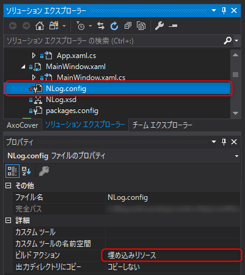

**NLog** の config ファイル (`NLog.config`) はアプリケーションと同じフォルダに配置して読み込むのが一般的で、この方法は融通が利いてよいのですが、大人の事情により「exe と dll 以外配置できない」ことがあります。

そこで設定ファイルを実行ファイルに埋め込んだ上で、初期化時に**埋め込みリソース (Embedded Resource) から設定ファイルを読み込む方法**を紹介します。

ほとんど姉妹記事 log4net と同じですが、 XmlReader を使うあたりなど少し変わっています。

> [log4net の config ファイルを 埋め込みリソース から読み込む](/load-log4net-config-from-embedded-resources)

## はじめに

本記事の想定は下記の通りです。

- .NET Framework 4.5 以降
- C# 7.0
- NLog 4
- NLog 使ってるけど大人の事情で config ファイルを表に出せない方

## 設定ファイルを埋め込みリソースに変更



まず、 `NLog.config` のビルドアクションを **埋め込みリソース** に設定します。

## Logger 生成前に Configuration を設定

ロガーを使う前ならどこでもいいわけですが、とりあえず App のコンストラクタで設定ファイルを読み込ませます。

```cs
var assembly = System.Reflection.Assembly.GetExecutingAssembly();
var resourceName = assembly.GetManifes‌​tResourceNames()
    .FirstOrDefault(x => x.EndsWith("NLog.config", StringComparison.OrdinalIgnoreCase));
if (resourceName != null)
{
    using (var stream = assembly.GetManifestResourceStream(resourceName))
    using (var reader = XmlReader.Create(stream))
    {
        NLog.LogManager.Configuration = new NLog.Config.XmlLoggingConfiguration(reader, null, true);
    }
}
Logger = NLog.LogManager.GetCurrentClassLogger();
```

おおまかな流れは下記の通りです。

1. `Assembly.GetExecutingAssembly` で実行ファイルの情報を取得
2. `assembly.GetManifes‌​tResourceNames` で実行ファイルに含まれるリソース名の一覧を取得
3. 設定ファイルのファイル名 (`NLog.config`) で終わるリソース名を抽出
4. そのリソース名のリソースを `assembly.GetManifestResourceStream` で開く
5. ストリームから XmlReader を作成
6. XML から `XmlLoggingConfiguration` を生成し、 `NLog.LogManager.Configuration` に設定

2 で得られるリソース名は、名前空間名がくっついて長ったらしいので、 `.FirstOrDefault(x => x.EndsWith(...))` で後方一致検索させています。

ちなみに `new NLog.Config.XmlLoggingConfiguration(reader, null, true);` このコンストラクタの第2引数はなぜか「ファイル名」なんですが、 `null` でも支障ありませんでした。

## あとがき

よく見たら本家にも、似たような読み込み方法がありました(笑)

>[Explicit NLog configuration loading · NLog/NLog Wiki](https://github.com/NLog/NLog/wiki/Explicit-NLog-configuration-loading)