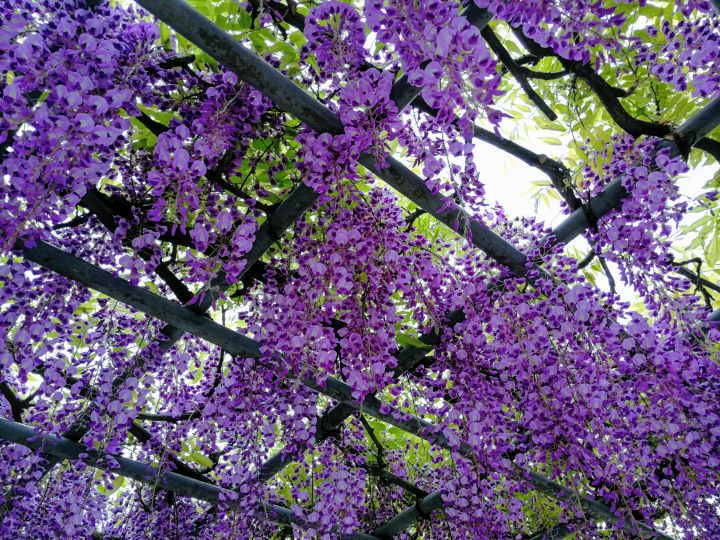
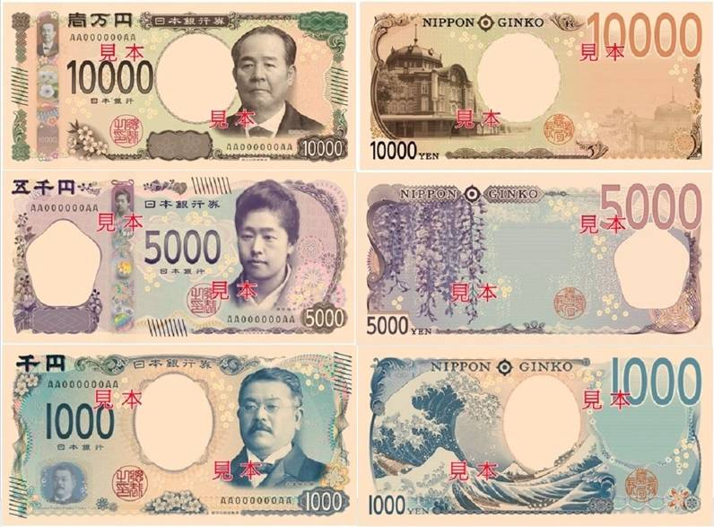
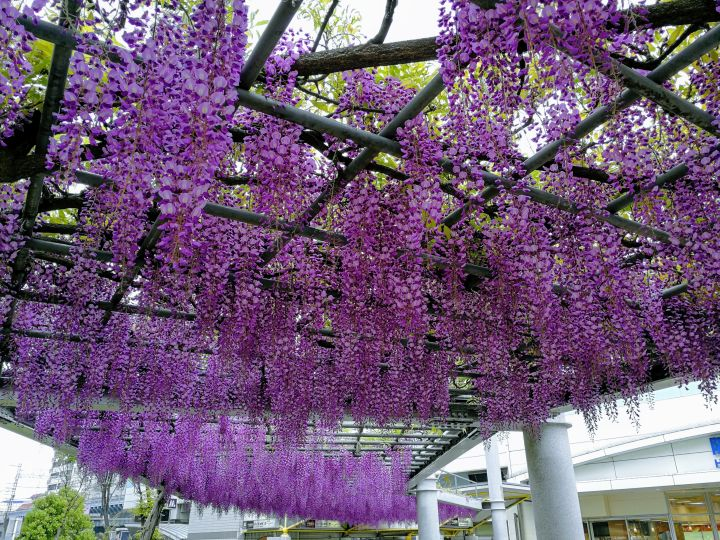
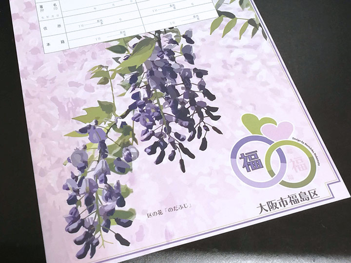

我々 MSEN が本拠を構える大阪市福島区の「**野田**」というエリアは**「のだふじ」（野田藤）**で有名です。

そんな「のだふじ」が見ごろを迎えているので、阪神電車・野田駅前で撮影してきました。毎日の通勤途中で鑑賞できるので、うれしいですね。

## 江戸時代には吉野の桜と並び称された「のだふじ」

江戸時代には「**吉野の桜　野田の藤　高尾の紅葉**」と謳われたほどだったといいます。

しかし明治以降、都市開発や戦争・台風などの影響により、ほぼ消滅してしまい、大阪人ですらその名を聞くことはほとんどなくなってしまいました。

生まれも育ちも大阪の私も、恥ずかしながら、この地で仕事をはじめるまでそこまで有名だったことは知りませんでした。すぐ近くの高校にも通っていたのに。

そんなこんなで苦難の時代を経て、地元の方々が復活に向けて努力され、今ではこの時期になると区の至るところできれいな藤棚を見ることができます。

今後もますます増えていくことを願ってやみませんし、協力していきたいと思います。

## 新五千円札の図案に採用された「のだふじ」

**福島区の花**にもなっている「のだふじ」、実は 5 年後に発行される**新五千円札**の裏面に採用されることになりました。

大阪人、特に福島区に住む人間にとって、とても誇らしいことです。

藤の独特な紫は、日本らしく、懐かしく、奥ゆかしい、なんとも言えない品がただよっています。

新元号である「**令和**」の「**美しく和やかに**」という意味合いにも、ふさわしい花ではないかと思います。

令和 6 年からは五千円札を中心に使っていくことにします(笑)

## 福島区は婚姻届も「のだふじ」

余談ですが、**福島区役所でもらえる婚姻届には「のだふじ」バージョンがあります**。

ゼクシィの付録婚姻届もいいですが、福島区で結婚される方はせっかくなので地元オリジナルのものを使ってみてはいかがでしょうか。

## 平成の終わりに

**平成 31 年 4 月 26 日は MSEN 平成最後の営業日**でした。令和元年 5 月 6 日までお休みをいただきます。

昭和生まれの私は、平成という時代に特段の思い入れがあるわけでもないですが、それでもやはり新時代を迎えるというのは身がひきしまる思いです。

平成の末にあたり、プライベートも大きな変容を見せようとしています。

**諸行無常。令和元年も公私ともにがんばります。**

## 関連リンク

- [ゴールデンウィーク休業のお知らせ | MSEN Inc.](https://msen.jp/gw-2019/)
- [のだふじの会 – 大阪市福島区「野田藤（のだふじ）」発祥の地](http://nodafuji.com/)
- [2019年のノダフジの開花レポート – のだふじの会](http://nodafuji.com/2019/04/16/2019%e5%b9%b4%e3%81%ae%e3%83%8e%e3%83%80%e3%83%95%e3%82%b8%e3%81%ae%e9%96%8b%e8%8a%b1%e3%83%ac%e3%83%9d%e3%83%bc%e3%83%88-2/)
- [新五千円札裏面の「ノダフジ」　実は大阪・福島発祥 - 産経ニュース](https://www.sankei.com/life/news/190426/lif1904260018-n1.html)
- [大阪市福島区：のだふじコーナー （…>みどころ>区の花「のだふじ」）](https://www.city.osaka.lg.jp/fukushima/page/0000194121.html)