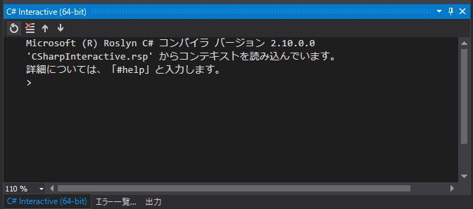

ちょこっと C# を実行して試したいとき、 Visual Studio に内蔵されている対話型の **C# Interactive** (CSI) が便利です。

Web でいえばちょうど開発者ツールの Console に相当するような機能で、 **REPL** (Read-Eval-Print Loop) なんて呼ばれたりするやつです。

今回は**ワンライナー** (1行のソースコード) で指定文字列のバイト配列表現や SHA256 ハッシュ表現を取得する方法を紹介します。

## C# Interactive の起動

**C# Interactive** は Visual Studio の **[表示] メニュー → [その他のウィンドウ(E)] → [C# インタラクティブ]** から起動します。

<a href="images/one-liner-with-csharp-interactive-1.png"></a>

こんなペインが起動します。

<a href="images/one-liner-with-csharp-interactive-2.png"></a>

## 指定文字列のバイト配列を取得する

指定した文字列の**バイト表現**を得てみます。文字コードは UTF8 にしましたが、 Shift-JIS なら `Encoding.GetEncoding(932)` を使いましょう。 (`932` は SJIS の Microsoft [コードページ](https://ja.wikipedia.org/wiki/%E3%82%B3%E3%83%BC%E3%83%89%E3%83%9A%E3%83%BC%E3%82%B8))

```cs
Console.WriteLine(string.Join("", Encoding.UTF8.GetBytes("hogehoge").Select(x => $"0x{x:x2}, ")));
```

上記コードで下記のような出力が得られます。

```
0x68, 0x6f, 0x67, 0x65, 0x68, 0x6f, 0x67, 0x65, 
```

## 指定文字列の SHA256 ハッシュを取得する

同様に指定文字列の **SHA 256 ハッシュ文字列**を 16 進数で取得してみます。

```cs
Console.WriteLine(string.Join("", new System.Security.Cryptography.SHA256CryptoServiceProvider().ComputeHash(Encoding.UTF8.GetBytes("hogehoge")).Select(x => $"{x:x2}")));
```

上記コードで下記のような出力が得られます。

```
4c716d4cf211c7b7d2f3233c941771ad0507ea5bacf93b492766aa41ae9f720d
```

> [[C# 6] SHA256 や MD5 の 16 進ハッシュ文字列を得る](https://mseeeen.msen.jp/compute-hash-with-csharp-6-or-later)