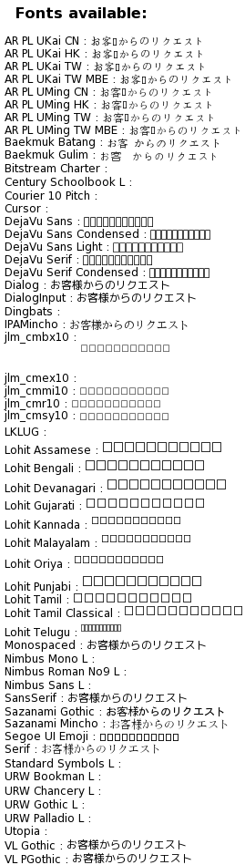
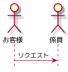
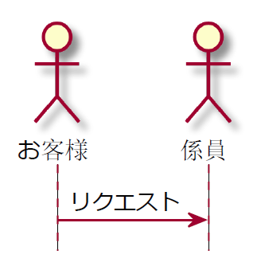
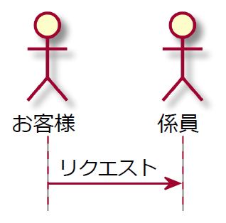

**テキストで UML が記述できる [PlantUML](http://plantuml.com/ja)** は同じくテキストでドキュメントが作成できる Markdown と非常に相性がいいです。

Markdown の文中に PlantUML の記述を埋め込んでおけば、画像として管理が別になることもないですし、 Git での差分管理も容易です。

ただし PlantUML はテキストなので当然、画像に変換してやる必要があります。 VSCode では PlantUML 拡張機能を入れるだけで自動的に変換してプレビューに表示してくれます。

PlantUML で UML 図を生成する方法はいろいろありますが、拡張機能などで生成される場合、公式の [PlantUML Server](http://www.plantuml.com/plantuml) を使って動的生成する例が多いです。

今回は **SVG (Scalable Vector Graphics) 形式で画像を取得するときに日本語フォントが中華フォントになってしまうことがある**ので、それの回避方法を紹介します。

## PlantUML Server について

公式の **PlantUML Server** は `http://www.plantuml.com/plantuml` という URL で利用できるようになっています。

```
@startuml

hide footbox

actor お客様 as student
actor 係員 as teacher

student -> teacher : リクエスト

@enduml
```

たとえば上記のような PlantUML は 

```
https://www.plantuml.com/plantuml/svg/SoWkIImgAStDuNA0ip8oKr8LqlBpIvBoAxYu4fDByeiK7ZTsFLstwDdo6Gg9nGh59QKfgNabKAad-vkUJbu84Yz9JKpEI2tYue8gKD2rWuafM2ayRbxrk6dzuwOLZvjsFcxkuE9oICrB0TiCeG40
```

のような URL で下記のような UML 画像に変換できます。


この**パラメーターには PlantUML の記述が圧縮・エンコードされている**ので、復元も可能です。

URL に `svg` と含まれていることからもわかるように、この URL は **SVG (ベクター) 形式の画像**を返します。ちなみに `svg` を png に変えると PNG 画像が取得できます。

## PlantUML Server で生成した SVG での日本語フォント指定

### 仕組み

[前掲の URL](https://www.plantuml.com/plantuml/svg/SoWkIImgAStDuNA0ip8oKr8LqlBpIvBoAxYu4fDByeiK7ZTsFLstwDdo6Gg9nGh59QKfgNabKAad-vkUJbu84Yz9JKpEI2tYue8gKD2rWuafM2ayRbxrk6dzuwOLZvjsFcxkuE9oICrB0TiCeG40) をブラウザで開き、中身の SVG タグを見てみると下記のような構造になっていることがわかります。

```html
<svg xmlns="http://www.w3.org/2000/svg" xmlns:xlink="http://www.w3.org/1999/xlink" contentScriptType="application/ecmascript" contentStyleType="text/css" height="147px" preserveAspectRatio="none" style="width:146px;height:147px;" version="1.1" viewBox="0 0 146 147" width="146px" zoomAndPan="magnify">
  <defs>～省略～</defs>
  <g>
    <line style="stroke: #A80036; stroke-width: 1.0; stroke-dasharray: 5.0,5.0;" x1="32" x2="32" y1="86.2969" y2="135.4297"/>
    <line style="stroke: #A80036; stroke-width: 1.0; stroke-dasharray: 5.0,5.0;" x1="121" x2="121" y1="86.2969" y2="135.4297"/>
    <text fill="#000000" font-family="sans-serif" font-size="14" lengthAdjust="spacingAndGlyphs" textLength="42" x="8" y="82.9951">お客様  </text>
    ～省略～
  </g>
</svg>
```

文字列の部分は `<text>` タグで、フォントは `font-family` 属性で指定されています。

この **`font-family` を変更するには `skinparam defaultFontName フォント名`** を指定します。

使用できるフォントは `listfonts` という PlantUML の関数 (?) で取得できます。

```
@startuml
listfonts お客様からのリクエスト
@enduml
```

実際に PlantUML Server で `listfonts` を表示したものが下記です (リアルタイムです)



前述の例では下記のようになります。 `VL PGothic` が利用できるようなので指定してみましょう。

```
@startuml

skinparam defaultFontName VL PGothic
hide footbox

actor お客様 as student
actor 係員 as teacher

student -> teacher : リクエスト

@enduml
```

下記のようになります。



たしかに VL PGothic が適用されています。

### 問題点

**ただし、上記のように指定したフォントがきれいに適用されるのは画像フォーマットが PNG などのラスター画像の場合のみ**です。

SVG では前掲のとおり、 `<text>` タグの `font-family` に `VL PGothic` という指定がハマるだけなので、下記のようになります。

```html
<text fill="#000000" font-family="VL PGothic" font-size="14" lengthAdjust="spacingAndGlyphs" textLength="42" x="8" y="82.9951">お客様  </text>
```

この指定は当然ながら環境依存になので、 PC に [VL ゴシック](https://ja.wikipedia.org/wiki/VL%E3%82%B4%E3%82%B7%E3%83%83%E3%82%AF) がインストールされていなければ代替のフォントが使われます。おそらく一般的なユーザーではインストールされていないでしょう。

おそらく Windows の Chrome や Edge で開くとメイリオが代替フォントに使われるはずです。ただ**環境によってはよくわからない中華フォントが優先されてしまい**下記のようになってしまうことがあります。



これはさすがにドキュメントに使えないので、さてどうするか思案しました。結局のところ **`defaultFontName` に「だいたいどの PC でも入ってそうなフォント」を指定するしかない**という結論にいたりました。

**SVG の場合、サーバー側でフォントを使用しないので、 `listfonts` にあるフォントを使う必要がない**のです。

ということでたとえば下記のように明示的にメイリオを指定します。

```
@startuml

skinparam defaultFontName メイリオ
hide footbox

actor お客様 as student
actor 係員 as teacher

student -> teacher : リクエスト

@enduml
```

ダサいですね。しかし、結果はきれいに描画されます。



ダサいですが、これで我慢しましょう。

## 結論

**PlantUML Server を使って、 SVG 形式の画像で日本語フォントを指定するときは、ローカルの環境にあるフォントを指定**しましょう。