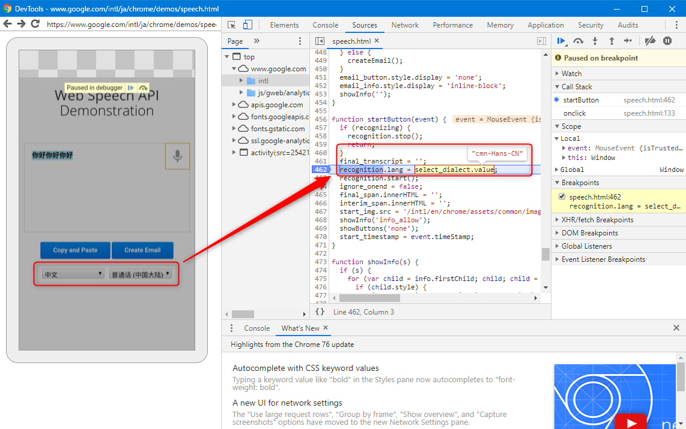

音声認識対応の Web サイトを構築しようとしたとき、現代ではブラウザ標準で **SpeechRecognition API** があるため、 JavaScript で容易に構築できます。

ただ、まだまだ機種依存が強く、クロスプラットフォームでうまく動作させるためには苦労が伴います。そもそも **iOS の Safari は未対応**ですので、 iOS のキーボードの音声認識機能を使わせるか、クラウド API を利用するなどの対策が必要です。

今回はその一つ、「**Android Chrome の音声認識で中国語が認識しない**」という問題について解決法をご紹介します。

## SpeechRecognition API

このページをご覧の方に説明する必要はないかもしれませんが、 SpeechRecognition は JavaScript から下記のように使用します。 (一部 ES2015 記法ですのでご注意ください)

```js
function getSpeechRecognition() {
  return window.webkitSpeechRecognition
    || window.SpeechRecognition
    || throw new Error('Failed to initialize speech recognition function.');
}

const SpeechRecognition = getSpeechRecognition();
const recognizer = new SpeechRecognition();
recognizer.lang = 'en-US';
recognizer.onresult = ((e) => {
  // 音声認識に成功したとき
  // e.results[0][0].transcript に結果文字列が格納される
  console.log(e.results[0][0].transcript);
});
recognizer.onend = ((e) => {
  // 中断したとき
  console.error(e);
});
recognizer.onerror = ((e) => {
  // エラーが発生したとき (許可されていない場合など)
  console.error(e);
});

// 音声認識を開始させる
recognizer.start();

// 音声認識を中断させる
recognizer.abort();
```

比較的わかりやすいインターフェースです。

できればコールバックでなく Promise にしてほしいですが、今のところ自前で Promise にラップして使っています。

## 言語指定

### 概要

ここで**認識言語を指定するのが `lang` プロパティ**です。 MDN のリファレンスによれば

> 現在の SpeechRecognition の言語を返して設定します。指定されない場合、これはデフォルトで HTML lang 属性の値になります。どちらも設定されていない場合、ユーザーエージェントの言語設定が使用されます。
> - [SpeechRecognition - Web API | MDN](https://developer.mozilla.org/ja/docs/Web/API/SpeechRecognition)

とのことです。デフォルトでは User Agent もしくは `<html lang='ho-ge'>` のどちらかの設定が使われるようです。

任意の言語を指定するには [`lang` プロパティのリファレンス](https://developer.mozilla.org/ja/docs/Web/API/SpeechRecognition/lang) にあるように「**BCP 47言語タグ**」を指定するとあります。

「BCP 47言語タグ」 は **[IETF言語タグ](https://ja.wikipedia.org/wiki/IETF%E8%A8%80%E8%AA%9E%E3%82%BF%E3%82%B0)** とも呼ばれるものです。

もっとも一般的には `ja` のように言語だけか、 `ja-JP` のように言語と地域を指定します。

日本語のように日本でしか話されていない言語は重複して面倒な気もしますが、スペイン語や英語、中国語といった広い地域で話されている言語の場合は、アメリカ英語なら `en-US` イギリス英語なら `en-GB` といった地域指定がないと音声合成も音声認識も有効に機能しないからです。

### 音声合成の言語タグ一覧

「音声認識」ではなく、**「音声合成 (Speech Synthesis)」で利用できる言語タグの一覧は過去記事でも紹介したとおり、 `window.speechSynthesis.getVoices()` を使うことで簡単に取得できます**。

> - [Web Speech Synthesis API (音声合成) で利用可能な音声の一覧を手軽に取得する](https://mseeeen.msen.jp/list-voices-with-web-speech-synthesis-api/)

ただし、これで得られた `lang` の値が音声認識でそのまま使えないことがあります。

### 中国語の場合

ほとんどのプラットフォームや言語はそのまま流用可能なようですが、少なくとも **Android ✕ 中国語(中国本土) の場合、`lang` は `zh_CN_#Hans` のようになっているため、このまま利用できません**。

さらに厄介なことに**一般的に「中国語(中国本土)」を表す `zh-CN` を指定しても音声認識ができません。** 対応していない場合、デフォルトの日本語等の認識になるので、まったく中国語として入力されません。

PC 版 Chrome では `zh-CN` で動作したため、ハマりました。

ではなんと指定すればよいのか。とりあえず**「中国語(中国本土)」は `zh` だけ**で動作させることができます。 (2019年8月現在)

ということで少々泥臭いですが、最初は **Android の場合のみ `zh-CN` を `zh` に変換する**という方法をとりました。

```js
function fixRecognitionLang(lang) {
  if (!Platform.is.android) return lang;
  // "普通话（中国大陆）" to just "zh"
  if (lang === 'zh-CN') return 'zh';
  return lang;
}
recognizer.lang = fixRecognitionLang(lang);
```

注) `Platform.is.android` は Quasar Framework が用意するユーティリティのため、一般の環境ではプラットフォーム識別を別途実装してください。

### 文献と Chrome の場合の最善策

本当に音声認識で使える言語タグはどこを調べればわかるのでしょうか。これは公式に出ている資料にはないようです。

下記の StackOverflow で最も盛んに議論されています。

> - [What are language codes in Chrome's implementation of the HTML5 speech recognition API? - Stack Overflow](https://stackoverflow.com/questions/14257598/what-are-language-codes-in-chromes-implementation-of-the-html5-speech-recogniti)

上記スレッドにもあるように Chrome の場合 (?) は **Google Cloud の Speech-To-Text API の対応言語**を参照するのがよいようです。

> - [言語対応  |  Cloud Speech-to-Text  |  Google Cloud](https://cloud.google.com/speech-to-text/docs/languages)

たしかに**「普通话（中国大陆）」が `zh`** だけになっており、 台湾 (`zh-TW`) や 香港 (`zh-HK`) は普通の形式でいけるようです。

> - [Chrome Browser](https://www.google.com/intl/ja/chrome/demos/speech.html)

ちなみに Google が提供している [Web Speech API のデモページのソースコード](https://www.google.com/intl/ja/chrome/demos/speech.html) では中国語は下記のように定義されています。

```js
['中文',             ['cmn-Hans-CN', '普通话 (中国大陆)'],
                     ['cmn-Hans-HK', '普通话 (香港)'],
                     ['cmn-Hant-TW', '中文 (台灣)'],
                     ['yue-Hant-HK', '粵語 (香港)']],
```

試しに Chrome の開発者ツール (DevTools) を使って Android をデバッグしてみたところ、**「普通话 (中国大陆)」を選択したときは `lang` プロパティに `cmn-Hans-CN` が設定されており、これで無事に中国が認識できました**。



ということは、 **Chrome の場合は PC でも Android でも [Web Speech API のデモページのソースコード](https://www.google.com/intl/ja/chrome/demos/speech.html) にある一覧が正しい**ということでよさそうです。

```js
langs.map(r => r.length === 2 ? [[r[0], r[1][0]]] : r.slice(1).map(x => [`${r[0]} ${x[1]}`, x[0]])).flat()
```

上記コードで一覧化してみました。

言語 | 言語タグ
--- | ---
Afrikaans | af-ZA
አማርኛ | am-ET
Azərbaycanca | az-AZ
বাংলা বাংলাদেশ | bn-BD
বাংলা ভারত | bn-IN
Bahasa Indonesia | id-ID
Bahasa Melayu | ms-MY
Català | ca-ES
Čeština | cs-CZ
Dansk | da-DK
Deutsch | de-DE
English Australia | en-AU
English Canada | en-CA
English India | en-IN
English Kenya | en-KE
English Tanzania | en-TZ
English Ghana | en-GH
English New Zealand | en-NZ
English Nigeria | en-NG
English South Africa | en-ZA
English Philippines | en-PH
English United Kingdom | en-GB
English United States | en-US
Español Argentina | es-AR
Español Bolivia | es-BO
Español Chile | es-CL
Español Colombia | es-CO
Español Costa Rica | es-CR
Español Ecuador | es-EC
Español El Salvador | es-SV
Español España | es-ES
Español Estados Unidos | es-US
Español Guatemala | es-GT
Español Honduras | es-HN
Español México | es-MX
Español Nicaragua | es-NI
Español Panamá | es-PA
Español Paraguay | es-PY
Español Perú | es-PE
Español Puerto Rico | es-PR
Español República Dominicana | es-DO
Español Uruguay | es-UY
Español Venezuela | es-VE
Euskara | eu-ES
Filipino | fil-PH
Français | fr-FR
Basa Jawa | jv-ID
Galego | gl-ES
ગુજરાતી | gu-IN
Hrvatski | hr-HR
IsiZulu | zu-ZA
Íslenska | is-IS
Italiano Italia | it-IT
Italiano Svizzera | it-CH
ಕನ್ನಡ | kn-IN
ភាសាខ្មែរ | km-KH
Latviešu | lv-LV
Lietuvių | lt-LT
മലയാളം | ml-IN
मराठी | mr-IN
Magyar | hu-HU
ລາວ | lo-LA
Nederlands | nl-NL
नेपाली भाषा | ne-NP
Norsk bokmål | nb-NO
Polski | pl-PL
Português Brasil | pt-BR
Português Portugal | pt-PT
Română | ro-RO
සිංහල | si-LK
Slovenščina | sl-SI
Basa Sunda | su-ID
Slovenčina | sk-SK
Suomi | fi-FI
Svenska | sv-SE
Kiswahili Tanzania | sw-TZ
Kiswahili Kenya | sw-KE
ქართული | ka-GE
Հայերեն | hy-AM
தமிழ் இந்தியா | ta-IN
தமிழ் சிங்கப்பூர் | ta-SG
தமிழ் இலங்கை | ta-LK
தமிழ் மலேசியா | ta-MY
తెలుగు | te-IN
Tiếng Việt | vi-VN
Türkçe | tr-TR
اُردُو پاکستان | ur-PK
اُردُو بھارت | ur-IN
Ελληνικά | el-GR
български | bg-BG
Pусский | ru-RU
Српски | sr-RS
Українська | uk-UA
한국어 | ko-KR
中文 普通话 (中国大陆) | cmn-Hans-CN
中文 普通话 (香港) | cmn-Hans-HK
中文 中文 (台灣) | cmn-Hant-TW
中文 粵語 (香港) | yue-Hant-HK
日本語 | ja-JP
हिन्दी | hi-IN
ภาษาไทย | th-TH
