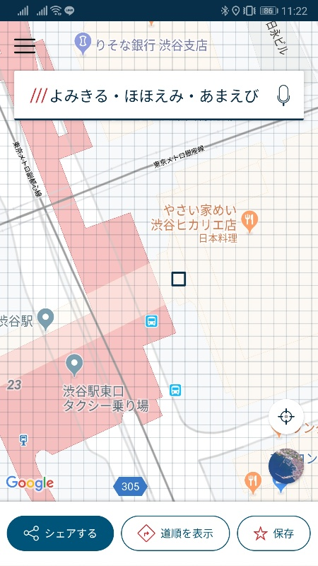

こんにちは、kenzauros です。

[1日目](/techcrunch-tokyo-2019-day-1/) に引き続き、 **TechCrunch Tokyo 2019** の参加レポートです。

2日目もとてもエキサイティングな発表が続きました。

## Fireside Chat

### 「住宅シェアリング「OYO LIFE」が目指す未来」 - 山本竜馬氏（OYO LIFEグロース統括責任者）

**[OYO LIFE](https://www.oyolife.co.jp/) は2019年3月28日にサービスインしたスタートアップの賃貸プラットフォーム**である。

スマホ完結・入退去負担ゼロ（毎月フラット）・日々の生活を総合的にプロデュースしていくことを売りとしている。本体の OYO はインドのグローバルホテルブランドであり、客室数ではマリオットに次ぐ世界第2位につけている。

OYO LIFE は東京から開始し、大阪は10月、名古屋は11月からサービスインとなる。

家具付きが基本でウィークリー・マンスリーマンションと似ているが、借りたあと借り主まかせではなく、すべてをマネージしていることが特徴だという。公共料金の契約も OYO LIFE で代行しており、従量課金でもないため、ユーザーは定額制の家賃を支払うだけでよい。

信用情報は提出された身分証明書とクレジットカード情報などを人力で確認しているという。不動産オーナーとしては OYO に貸しているという形態であるため、又貸しに抵抗がない場合は、スムースである。

現在の主なターゲットは単身者であるらしいが、当然この層が中心的になろうと思う。社宅としての利用も考えられる。安定的に物件が供給されるようになれば、会社がずっと契約をしておく必要がなく、退職したり入社したりしたときに都度契約すればよい。

### 「正確な位置情報を3単語で表現する「住所革命」でできること」 - Chris Sheldrick氏（what3words CEO）

冒頭に Sheldrick CEO によるプレゼンが行われた。

**what3words** は**地球上を57兆個の3m×3mの四角形に分割**し、それぞれに3単語のキーワードを付与することでその地球上の位置を表そうというものだ。

モチベーションは下記のような現在の「住所」についてのジレンマを解決することにある。

- 公園、山の中など地球上には住所がないところがいっぱいある
- 今の住所ではビルの中心はわかっても入り口がわからない
- 当然ながら緯度経度で表される座標は現実的ではない

37ヶ国語に対応しており、日本語ならたとえば**渋谷ヒカリエの入り口は「よみきる・ほほえみ・あまえび」** である。 (下図)

アプリ上では 3mx3m がグリッドで表され、それぞれに別の3単語が振られていることがわかる。

日本語ではわかりやすさの観点から、ひらがなだけにすることになり、50人の言語学者・翻訳者で辞書をすべて見ていき、ネガティブ・攻撃的でないかを判断して基本的な25000語を選別したという。

なお、この3単語はもし気に入らなくても二度と変えることはできないので、3m横に行ってみてほしいとのことだった。

ただし同じ単語の並びや似た言葉はなるべく離れた座標にマッピングして、誤った場所を示すことがないよう（人間が違う場所だと判断できるよう）にしているという。

もっとも採用が進んでいるのイギリスのようだ。身近な例では Airbnb やドミノ・ピザが導入しているほか、やはりモビリティー業界が注目しているらしく、 DB (ドイツ鉄道), ベンツ, ALPINE, SONY が出資しているほか、まさに今日 SUBARU が出資することを発表したという。

マネタイズとしては、コード → 座標の変換により課金が発生する仕組みである。将来的にはグローバルスタンダードになること目指すという。

実際に使ってみたが、使い勝手には改良が必要だと思うものの、3m おきに場所を示すことができるので、非常に画期的だと思った。ここまでくるとどちらかというと地図の詳細さのほうがネックになりそうだ。

### 「5Gがもたらすロボティクス新時代」 - 沢登哲也氏（コネクテッドロボティクス代表取締役/CEO）

"調理をロボットで革新する"「**コネクテッドロボティクス**」はたこ焼きロボのオクトシェフで有名である。

- 重労働からの開放
- 日本食を世界へ
- 作りたてのおいしさ

の3つをモチベーションとしている。

**Robotics-as-a-Service** をうたい、クラウドを活用したロボットサービスを目指している。

労働人口の減少で人件費が増加する中、ロボットは10年で40%価格が落ちているらしい。このことは RPA の発展にも寄与しそうだ。

ビジネスモデルとして、汎用のロボットアームを使い、ソフトウェアとパッケージングのみを行うことで開発費を最小限にできていることがうかがえた。内部的にはハイレベルなモーションコントロールとディープラーニングの組み合わせだという。

沢登氏自信は祖父母が飲食店を経営していたため、もともと飲食店に親近感があり、大学院を卒業したあとに「かっこいい飲食店やりたい」というモチベーションで飲食業にも従事し、その労働負荷からロボットを飲食店にもちこむことを考えたようだ。

同社では調理ロボットだけでなく、食器洗いロボットにも取り組んでいる。飲食店で共通的にでてくる問題意識としては、調理というより皿洗いなどの片付けにあるという。残飯、皿の傾きなど多様なノイズを学習しながら正確に皿を認識して掴むことが肝となる。

大変おもしろい取り組みでそのうちロボットだけの店がでてきてもそれはそれで楽しい。バック・トゥ・ザ・フューチャー Part 2 で 2015 年として描かれた世界が今やっとそこまできているようだ。

### 「女性起業家が語るリテールテックのいま」 - Selene Cruz氏（Re:store創業者/CEO）

今回、いくつかでたリテール店舗のお話し。「実際にさわりたい」「インターネットはいやだ」「体験したい」という欲求にこたえる。彼女が最初は自分の家を店にしたのがきっかけだという。

英語がわかりにくかったので同時通訳機を着用したが、それでも話が早すぎて追いづらく、結局あまりわからなかった。

### 「為替・送金の手数料無料、英国発フィンテックスタートアップRevolut」 - Hannes Graah氏（Revolut Growth担当バイスプレジデント）

**Revolut は 34カ国でサービスを提供している送金の形を変えるフィンテック**である。グローバルではすでに 800 万ユーザー以上で、App Store の評価は 4.9 と顧客満足度が非常に高いという。日本でのローンチも予定している。

単なる送金アプリではなく、**両替、コミッションのない証券取引、カード発行・制御、寄付、チャリティーなど金融商品を一括に扱えるフルスイート**となっている。

両替もリアルタイムレートで換算し、不透明な手数料なしがないことも魅力だという。収益はサブスクリプションでフリーミアムに近い形態のようだ。

デモを見る限り、アプリの UI は洗練されていてわかりやすく、 Graah 氏の主張する「資金管理を非常に簡潔に」「人とやりとりせずに完了」「利用のしきいが低い」というのが実現できていると感じた。

### 「電動キックボードのLimeが規制大国・日本に上陸する理由」 - David Richter氏（Lime CBO）

CBO の Richter 氏は**電動スクーター LIME** に乗ってさっそうと登場した。

2060 年には世界の 68% が都会に住むようになり、自動車の移動の一部を置き換える必要がある。それの一つの解が LIME というわけだ。

今年は日本上陸を目指して福岡で実証実験が行われたらしい。

先日ドイツに行ったとき、都市部には LIME をはじめ、いくつかのブランドの電動スクーター（キックボード）が当然のように使われていた。観光客も地元の人も**さっとロックを解除し、さっと乗り、さっと乗り捨てていく**。そんな光景が当たり前だった。

日本でも規制が緩和されて導入されれば流行ることは間違いないと思うが、運転免許とヘルメットに方向指示器、ナンバープレート、バックミラーが必要な現行制度ではなかなか「気軽な利用」とはいかない。しかし政府でもセグウェイの二の舞を避けようときちんとした (?) 検討会が立ち上がっているようなので、規制緩和に期待したい。

ただし、 Richter 氏も述べていたように安全性の確保はもっとも重要だ。欧州の都市部とよりずっと人が混み合っている東京や大阪では、安全性の確保はなかなかハードルが高そうだ。

### Product Update

Product Update については興味をもった会社のみまとめた。

#### 内山智晴氏（Yper代表取締役社長）

**袋型宅配ボックス「Okippa」を運営する Yper**。

去年3千件だったのが、郵便局の10万件配布もあって、13万世帯に急増した。Okippa 以外の宅配ボックスの販売数が8万件ぐらいだそうなので、業界を倍以上にかさ上げしていることになる。

オートロックマンションでの対応に腐心しているようだった。

#### 小川 嶺氏（タイミー代表取締役）

**単発バイトをマッチングする「タイミー」** 、一年間の伸びは目覚ましいもので、20億円以上の資金調達を果たし、従業員数も120名を超えて、100年続く企業を目指しているという。

ちなみに小川氏は今年大学4年生だが、40単位足らず、卒業はできないらしい。

## まとめ

今年のベンチャーキャピタルによるスタートアップへの投資は下記の4分野に固まっているという。

- SaaS (Software as a Service)
- ヘルス・医療系分野
- Robotics/IoT
- AI

驚くところはないが、インターネット関連事業がもはや挙がってこないというのは時代の変化のようだ。

また投資総額は年々増加しており、総額では 2018年の4200億円と同程度が少し上ぐらいになりそうだ。1社あたりの調達額も、1社平均で3億円、中央値でも1億円と、まだまだ米国水準の半分以下ながら、着実に増加しているらしい。

