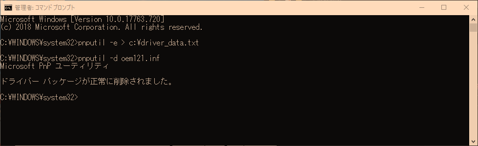

PC をリストアして **AnyConnect (Cisco AnyConnect Secure Mobility Client)** をインストールしようとしたところ、下記のエラーに見舞われ、一向にインストールできないトラブルに遭遇しました。

> There is a problem with this Windows Installer package. A program run as part of the setup did not finish as expected. Contact your support personnel or package vendor.

今回解決した方法をメモっておきます。

## 環境

- Windows 10 Pro 1809
- Cisco AnyConnect Secure Mobility Client 3.1.05152

## 事象

AnyConnect のインストーラー `anyconnect-win-3.1.05152-pre-deploy-k9.msi` を利用して、インストールしようとすると終盤で進まなくなり、しばらくすると下記のエラーが表示され、インストールが失敗する。

<a href="images/unable-to-install-cisco-anyconnect-1.png"></a>

公式ページにあるまさにこのエラーなのですが、ここにある方法を試してみても、いずれもうまくいきませんでした。

> [AnyConnect(Windows) インストール時のエラー (There ... - Cisco Community](https://community.cisco.com/t5/%E3%82%BB%E3%82%AD%E3%83%A5%E3%83%AA%E3%83%86%E3%82%A3-%E3%83%89%E3%82%AD%E3%83%A5%E3%83%A1%E3%83%B3%E3%83%88/anyconnect-windows-%E3%82%A4%E3%83%B3%E3%82%B9%E3%83%88%E3%83%BC%E3%83%AB%E6%99%82%E3%81%AE%E3%82%A8%E3%83%A9%E3%83%BC-there-is-a-problem-with-this/ta-p/3155919)

調べながら試行錯誤した結果、最終的に下記のスレッドに従って作業し、インストールすることができました。

> [Anyconnect re-install on Windows 10 Han... - Cisco Community](https://community.cisco.com/t5/vpn-and-anyconnect/anyconnect-re-install-on-windows-10-hanging/td-p/2703272)

ただ、最終的には AnyConnect のバージョンが 3.x 系と古くて接続先とマッチしなかったので、直ったあと 4.x 系をインストールしなおしました。ひょっとすると 4.x 系では役に立たないかもしれません。

## 対策

まず、 **`C:\Windows\System32\DriverStore\FileRepository`** を開き **`vpnva-6.inf_amd64_`** から始まるフォルダがあるかを確認します。存在する場合、 AnyConnect のインストーラーによってドライバーファイルのゴミが残っているようです。

<a href="images/unable-to-install-cisco-anyconnect-2.png"></a>

次に **`C:\Windows\inf\setupapi.dev.log`** を開き、 `AnyConnect` と書かれている箇所を検索します。その直下で `{Plug and Play Service: Device Install for ROOT\NET\0000}` と書かれている部分を見つけます。

<a href="images/unable-to-install-cisco-anyconnect-3.png"></a>

たとえば下記のようになっています。

```
{Plug and Play Service: Device Install for ROOT\NET\0000}
     ndv:           Driver INF Path: C:\WINDOWS\INF\oem121.inf
     ndv:           Driver Node Name: vpnva-6.inf:573bd3b1d858e0ac:Cisco.ndi.NTamd64:3.1.6019.0:vpnva
     ndv:           Driver Store Path: C:\WINDOWS\System32\DriverStore\FileRepository\vpnva-6.inf_amd64_f4ee011be27e2804\vpnva-6.inf
```

ここで `oem121.inf` のようなインストールファイルの名前を見つけます。

コマンドプロンプトを開き、下記のコマンドを実行します。 **[PnPUtil](https://docs.microsoft.com/ja-jp/windows-hardware/drivers/devtest/pnputil)** は Windows のドライバーパッケージをメンテするためのツールです。 (Plug and Play Utility の略と思われる)

```
pnputil -e > c:\driver_data.txt
```

**`c:\driver_data.txt`** にドライバーの情報が出力されるので、開いて確認します。

<a href="images/unable-to-install-cisco-anyconnect-4.png"></a>

`Cisco` で検索し、先ほど見た `oem121.inf` があることを確認します。ほかに `Cisco Systems` のついたものがあれば、その `inf` ファイル名も対象にします。 (1 つ消しただけではうまくいきませんでした)

<a href="images/unable-to-install-cisco-anyconnect-5.png"></a>

控えた **`inf` を `pnputil -d` で削除**します。複数ある場合はファイル数分だけ実行しましょう。

```
pnputil -d oem121.inf
```

「ドライバーパッケージが正常に削除されました」と表示されれば OK です。

これで AnyConnect のインストーラーを起動し、インストールできれば成功です。特に再起動はいりませんでした。