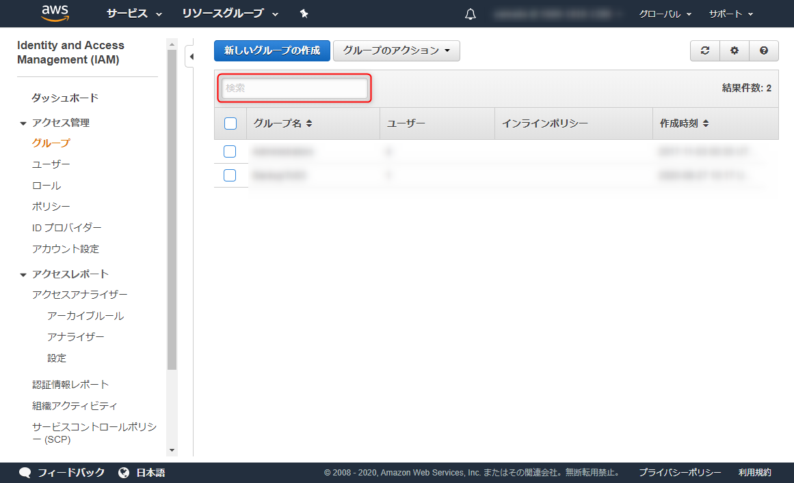

Amazon EC2 インスタンスで **InfluxDB** をテスト運用しています。

テスト運用とはいえ、蓄積されたデータが消えると困るため、データベースのバックアップを行うことにしました。 InfluxDB のバックアップはコマンド一発で簡単なんですが、「どこに」という問題が残ります。

今回は同じ AWS 上の **S3** に保存することにしました。

## 前提条件

- Amazon EC2 で下記の仮想マシンが動作している
    - Amazon Linux 2
    - InfluxDB 1.8.0 がインストール済み (`influxd` コマンドが使用可能)
    - 設定ユーザー・バックアップ実行ユーザーは `ec2-user`
- Amazon S3 が使える
- Amazon IAM の設定ができる

## S3 の設定

先に **Amazon S3 の設定**をしておきます。

1. IAM グループの作成
2. IAM ユーザーの作成
3. S3 バケットの作成

ここでは S3 にバックアップデータを保存する**専用のユーザーとグループ**を用意することにします。既存の適したユーザーがある場合はそれを利用してもかまいません。

### IAM グループの作成

まず、 S3 への権限だけを設定したグループを作成します。

**IAM (Identity and Access Management) の [グループ設定](https://console.aws.amazon.com/iam/home#/groups)** から [新しいグループの作成] を選択します。

<a href="images/backup-influxdb-on-ec2-to-amazon-s3-1.png"></a>

グループ名を入力します。ここでは `S3Backup` としました。

<a href="images/backup-influxdb-on-ec2-to-amazon-s3-2.png"></a>

フィルターに `S3` を入力して `AmazonS3FullAccess` にチェックをいれます。

<a href="images/backup-influxdb-on-ec2-to-amazon-s3-3.png"></a>

確認画面で問題なければ、 [グループの作成] をクリックしてグループを作成します。

<a href="images/backup-influxdb-on-ec2-to-amazon-s3-4.png"></a>

### IAM ユーザーの作成

**IAM の [ユーザー設定](https://console.aws.amazon.com/iam/home#/users)** から [ユーザーを追加] を選択します。

<a href="images/backup-influxdb-on-ec2-to-amazon-s3-5.png"></a>

ユーザー名を入力します。ここでは `s3backup` としました。アクセスの種類は「プログラムによるアクセス」だけを選択します。

<a href="images/backup-influxdb-on-ec2-to-amazon-s3-6.png"></a>

アクセス許可の設定ではユーザーをグループに追加します。先に作成した `S3Backup` グループにチェックをいれます。

<a href="images/backup-influxdb-on-ec2-to-amazon-s3-7.png"></a>

タグの追加画面では特になにもせず、進みます。

<a href="images/backup-influxdb-on-ec2-to-amazon-s3-8.png"></a>

設定内容を確認して [ユーザーの作成] をクリックするとユーザーが作成されます。

<a href="images/backup-influxdb-on-ec2-to-amazon-s3-9.png"></a>

ユーザーの追加が成功したら、**「アクセスキー ID」と「シークレットアクセスキー」**をメモしておきます。このアクセスキーの流出にはくれぐれもご注意ください。

<a href="images/backup-influxdb-on-ec2-to-amazon-s3-10.png"></a>

### S3 バケットの作成

[S3 の管理コンソール](https://s3.console.aws.amazon.com/s3/home) を開き、 [バケットを作成する」を押下します。

<a href="images/backup-influxdb-on-ec2-to-amazon-s3-11.png"></a>

バケット名を設定します。ここでは `influxdb-backup-tmp` とします (すみません、画像は `influxdb-backup` になっています)。リージョンはお好きなところを選択してください。

なお、バケット名は全ユーザーでユニークなもののため、 `influxdb-backup-tmp` はもう使用できないと思います ([参考](https://aws.amazon.com/jp/premiumsupport/knowledge-center/s3-error-bucket-already-exists/))。お好きなバケット名をつけてください。

<a href="images/backup-influxdb-on-ec2-to-amazon-s3-12.png"></a>

オプションとアクセス権限はとりあえずデフォルトのままでよいと思います。

<a href="images/backup-influxdb-on-ec2-to-amazon-s3-13.png"></a>

設定内容を確認して [バケットを作成] をクリックするとバケットが作成されます。

<a href="images/backup-influxdb-on-ec2-to-amazon-s3-14.png"></a>

新しいバケットが確認できれば S3 側の準備は完了です。

<a href="images/backup-influxdb-on-ec2-to-amazon-s3-15.png"></a>

## EC2 側でバックアップを設定する

### AWS 認証情報の設定

Amazon Linux であれば **AWS CLI** がインストールされているはずですが、念のため確認しておきます。

```sh
$ aws --version
aws-cli/1.16.300 Python/2.7.18 Linux/4.14.181-140.257.amzn2.x86_64 botocore/1.13.36
```

**AWS の認証情報を設定**します。ユーザーを作成するときに取得した「アクセスキー ID」と「シークレットアクセスキー」を指定します。リージョンや出力フォーマットは適当に設定してください。

```sh
$ aws configure
AWS Access Key ID [None]: ************************
AWS Secret Access Key [None]: **********************************************
Default region name [None]: us-east-2
Default output format [None]: json
```

### EC2 でバケットの確認

さきほど作成した S3 バケットが存在することを確認します。

```sh
$ aws s3 ls | grep influxdb
2020-08-27 05:00:11 influxdb-backup-tmp
```

### InfluxDB のバックアップ

InfluxDB のバックアップはインストールされている環境であれば `influxd` コマンドが利用でき、バックアップ・リストアもコマンド一発で可能です。

バックアップする場合は下記のようにバックアップ先のみ指定して叩きます。

```sh
$ influxd backup -portable influxdb_backup/
```

ちなみに現在では `-portable` を指定しておくことが重要です。

※ `-portable` がない場合、旧形式になり、メタデータしかバックアップされません。データベースをバックアップするには別途 `-database` をつけてデータベース名を指定する必要があります。

[Back up and restore InfluxDB OSS | InfluxData Documentation](https://docs.influxdata.com/influxdb/v1.8/administration/backup_and_restore/)

実行すると下記のように指定したフォルダ以下にバックアップファイルが生成されます。

```
$ influxd backup -portable influxdb_backup/
2020/08/27 05:14:03 backing up metastore to influxdb_backup/meta.00
2020/08/27 05:14:03 No database, retention policy or shard ID given. Full meta store backed up.
2020/08/27 05:14:03 Backing up all databases in portable format
2020/08/27 05:14:03 backing up db=
2020/08/27 05:14:03 backing up db=_internal rp=monitor shard=45 to influxdb_backup/_internal.monitor.00045.00 since 0001-01-01T00:00:00Z
～中略～
2020/08/27 05:14:03 backup complete:
2020/08/27 05:14:03     influxdb_backup/20200827T051403Z.meta
～中略～
2020/08/27 05:14:03     influxdb_backup/20200827T051403Z.s52.tar.gz
2020/08/27 05:14:03     influxdb_backup/20200827T051403Z.manifest
```

このまま S3 にもっていくのも忍びないので tar.gz で固めておきます。

```sh
$ tar -zcvf influxdb_backup.tar.gz influxdb_backup/
```

### S3 バケットへコピー

ファイルにまとまったら S3 にコピーします。こちらもコマンド一発です。

```sh
$ aws s3 cp influxdb_backup.tar.gz s3://influxdb-backup-tmp/
upload: ./influxdb_backup.tar.gz to s3://influxdb-backup-tmp/influxdb_backup.tar.gz
```

これでバックアップができるようになりました。

### シェルスクリプト

ここまでをシェルスクリプトにしてみます。別になんということもないですが、一応ソースを載せておきます。

```sh
#!/bin/bash -e

DIR=influxdb_backup/
BACKUP_FILE=influxdb_backup_`date "+%Y%m%d_%H%M%S"`.tar.gz
LOG_FILE=${0%.*}.log
BUCKET=s3://influxdb-backup-tmp/

rm -rf ${DIR}
influxd backup -portable ${DIR} 1>${LOG_FILE}
tar -zcvf ${BACKUP_FILE} ${DIR} 1>/dev/null
rm -rf ${DIR}

if [ ! -e ${BACKUP_FILE} ]; then
  echo "InfluxDB Backup [ERROR]: Backup file has not been generated" >&2
  exit 1
fi

echo "InfluxDB Backup [COMPLETED]: ${BACKUP_FILE}"

aws s3 cp ${BACKUP_FILE} ${BUCKET} 1>/dev/null
rm ${BACKUP_FILE}

echo "InfluxDB Backup [UPLOADED]: ${BACKUP_FILE}"

exit 0
```

あとはこれを cron で実行するか Jenkins などからスケジュール実行すれば OK でしょう。