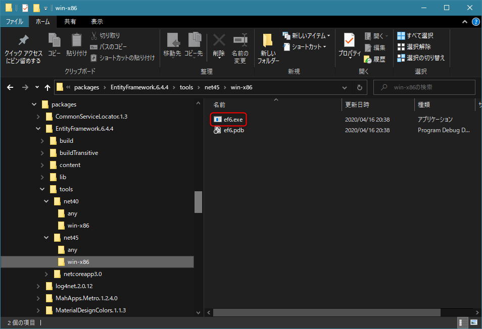

最近では **Entity Framework 6** を使って新しく開発することはないと思いますが、既存アプリの改修ではまだ利用せざるを得ないこともあり、データベースを変更するときにはマイグレーションが必要になります。

ただ Entity Framework のマイグレーションは昔からわかりにくく、特に開発環境 **以外** から適用するときは毎回けっこう調べ直す必要があります。

今回は 2020年12月時点で **Entity Framework 6.4 のデータベースマイグレーションを行う方法**を紹介します。なお、この記事にはマイグレーションファイル自体を作る手順はありません。

## 概要

前述のとおり、開発環境 (Visual Studio) であれば **パッケージマネージャーコンソール**から PowerShell コマンドの `Update-Database` を叩けば、マイグレーションを実行させることができます。

ただ、当然ながら**運用環境には `Update-Database` などというコマンドは存在しません**ので、別の手段で運用中のデータベースにマイグレーションを適用する必要があります。

**運用環境でマイグレーションを実行するには EF6 のパッケージに同梱されている ef6.exe を使用**します。

ちなみに昔は **migrate.exe** でした。驚くことに MS Docs には未だに migrate.exe の記述しかありません。にもかかわらず EF 6.4.4 には migrate.exe はもう同梱されていないので全く使えない手順になっています。

- [migrate.exe-EF6 の使用 | Microsoft Docs](https://docs.microsoft.com/ja-jp/ef/ef6/modeling/code-first/migrations/migrate-exe)

## ef6.exe のありか

まず **ef6.exe** がどこにあるか、ですが、おそらく下記のフォルダにあります。

`<ソリューションかプロジェクトのパス>\packages\EntityFramework.<バージョン>\tools\net45\win-x86`

tools フォルダ配下は下記のような構成になっており、 .NET Framework 4.0 向けと .NET Framework 4.5 向け、さらに `any` ビルドと `x86` ビルドがあります。環境に応じたものを使用します。

<a href="images/entity-framework-6-apply-migrations-to-database-with-ef6exe-1.png"></a>

## ef6.exe の使い方

### 配置

マイグレーションを含むプロジェクトでビルドした**バイナリー (*.dll か *.exe) と同じフォルダに ef6.exe を配置**します。

*.dll や *.exe の**アプリケーション構成ファイル (*.config) も同じフォルダー**にあることを確認します。たとえば `HogeHoge` プロジェクトの場合は下記のような構成になります。

- `ef6.exe`
- `HogeHoge.dll`
- `HogeHoge.dll.config`
- その他必要なファイル群

構成ファイル (*.config) には Entity Framework の接続情報が定義されていることを確認しましょう。

#### 構成ファイル内の接続文字列の例 (SQLite の場合)

```xml
<connectionStrings>
  <add name="hogehoge" connectionString="Data Source=C:\hogehoge\db.sqlite;" providerName="System.Data.SQLite.EF6"/>
</connectionStrings>
```

### コマンドラインでの使い方

前述のとおり正式な Microsoft Docs は存在しないため、下記の Issue コメントが一番の情報源という心もとない話です。

- [Document ef6.exe and remove doc for migrate.exe](https://github.com/dotnet/EntityFramework.Docs/issues/1740#issuecomment-557204757)

とはいえコマンド内のヘルプが割と充実しているので、ドキュメントがなくても使うことはできます。順番に見ていきましょう。

**ef6.exe を配置したフォルダーで PowerShell を開いて実行**していきます（コマンドプロンプトでも bash でも OK ですが PowerShell が一番無難と思います) 。

まずは **`--help`** を叩くと第一段階のヘルプが表示されます。

```
> .\ef6.exe --help
Entity Framework Command-line Tools 6.4.4

Usage: ef6 [options] [command]

Options:
  --version        Show version information
  -h|--help        Show help information
  -v|--verbose     Show verbose output.
  --no-color       Don't colorize output.
  --prefix-output  Prefix output with level.

Commands:
  database    Commands to manage the database.
  migrations  Commands to manage migrations.

Use "ef6 [command] --help" for more information about a command.
```

コマンドに `database` と `migrations` があることがわかります。

### migrations コマンド

先に **`migrations` コマンド**の方から見ていきましょう。 `migrations` に `--help` をつけて実行するともう1段下のヘルプが参照できます。

```
> .\ef6.exe migrations --help

Usage: ef6 migrations [options] [command]

Options:
  -h|--help        Show help information
  -v|--verbose     Show verbose output.
  --no-color       Don't colorize output.
  --prefix-output  Prefix output with level.

Commands:
  add     Scaffolds a migration script for any pending model changes.
  enable  Enables Code First Migrations in a project.
  list    Displays the migrations that have been applied to the target database.
```

**`add`, `enable`, `list` の3つのサブコマンド**が存在します。それぞれそれぞれ Visual Studio (パッケージマネージャーコンソール)における `Add-Migration` と `Enable-Migrations`, `Get-Migrations` に相当します。

`add` や `enable` は通常開発環境上で実行するほうが便利でしょうから割愛します。

`list` を叩いてみると**すでに適用されているマイグレーションの一覧**が得られます。 `--assembly` オプションと `--config` オプションを指定して呼び出します。

```
> .\ef6.exe migrations list --assembly ".\HogeHoge.dll" --config ".\HogeHoge.dll.config"
Retrieving migrations that have been applied to the target database.
202001230938422_Initial
```

**未適用のマイグレーション一覧**を見る方法はないようです。

### database コマンド

**`database` コマンドはその名のとおりデータベースに対して実行するコマンド**です。

こちらの**サブコマンドは `update` しかありません**。これが **`Update-Database` と同じようにデータベースにマイグレーションを実行するためのコマンド**です。

`update` の詳細なヘルプを見てみます。

```
> .\ef6.exe database update --help

Usage: ef6 database update [options]

Options:
  --source <MIGRATION>             Only valid with --script. Specifies the name of a particular migration to use as the update's starting point. If omitted, the last applied migration in the database will be used.
  --target <MIGRATION>             Specifies the name of a particular migration to update the database to. If omitted, the current model will be used.
  --script                         Generate a SQL script rather than executing the pending changes directly.
  -f|--force                       Specifies that data loss is acceptable during automatic migration of the database.
  --migrations-config <TYPE>       Specifies the migrations configuration to use. If omitted, migrations will attempt to locate a single migrations configuration type in the target project.
  -a|--assembly <PATH>             The assembly to use.
  --project-dir <PATH>             The project directory. Defaults to the current directory.
  --language <LANGUAGE>            The language. Defaults to 'C#'.
  --root-namespace <NAMESPACE>     The root namespace. Defaults to the target assembly name.
  --data-dir <PATH>                The data directory.
  --config <PATH>                  Specifies the configuration file to use for named connection strings.
  --connection-string-name <NAME>  Specifies the name of a connection string to use from the application's configuration file.
  --connection-string <STRING>     Specifies the connection string to use. If omitted, the context's default connection will be used.
  --connection-provider <NAME>     Specifies the provider invariant name of the connection string.
  -h|--help                        Show help information
  -v|--verbose                     Show verbose output.
  --no-color                       Don't colorize output.
  --prefix-output                  Prefix output with level.
```

オプションはほぼ `migrations list` と同様です。

### データベースへのマイグレーションの適用

ということでデータベースに対してマイグレーションを適用するには下記のように `--assembly` オプションと `--config` オプションをつけて実行します。

```
> .\ef6.exe database update -v --assembly ".\HogeHoge.dll" --config ".\HogeHoge.dll.config"

Specify the '-Verbose' flag to view the SQL statements being applied to the target database.
Target database is: 'main' (DataSource: , Provider: System.Data.SQLite, Origin: Configuration).
Applying explicit migrations: [202011240318455_AddAdditionalTables].
Applying explicit migration: 202011240318455_AddAdditionalTables.
CREATE TABLE "AdditionalTable" (
～中略～
;

Running Seed method.
```

なお **`-v` (`--verbose`) オプションをつけておくと実際に実行される SQL まで確認できます**ので安心 (?) ですね。

### マイグレーションのロールバック (Revert migrations)

せっかくのマイグレーション機能なので、巻き戻したいこともあるでしょう。**ロールバックしたいときは `--target` オプションを指定**します。

`--target` オプション | 機能
-- | --
`0` | マイグレーションが何も適用されていない状態に戻す
`<数値>` | 指定したインデックスのマイグレーションまで適用されている状態に戻す
`"<マイグレーション名>"` | 指定したマイグレーション名のマイグレーションまで適用されている状態に戻す

※基本的には `Update-Database` の `-TargetMigration` オプションと同じです。

つまり、 A, B, C, D, E のマイグレーションがあり、 E まで適用済みとして、 C に戻したい場合は、 `--target` に `"C"` もしくは `3` を指定します。

```
.\ef6.exe database update -v --assembly ".\HogeHoge.dll" --config ".\HogeHoge.dll.config" --target "C"
```

また、 A も適用されていない状態に戻す場合は `0` を指定します。

```
.\ef6.exe database update -v --assembly ".\HogeHoge.dll" --config ".\HogeHoge.dll.config" --target 0
```

ただ、私の環境では SQLite のライブラリにバグがあるのか、生成された SQL (`DROP INDEX`) が syntax error になって戻せませんでした(笑)

SQL Server などではきっとうまくいくでしょう！

## まとめ

長くなりましたが、結論として **Entity Framework 6.4 で ef6.exe を使ってマイグレーションを適用するには下記のように `ef6.exe database update` を実行**します。

```
.\ef6.exe database update -v --assembly ".\HogeHoge.dll" --config ".\HogeHoge.dll.config"
```

データベースのバックアップをとっておくことをお忘れなく。