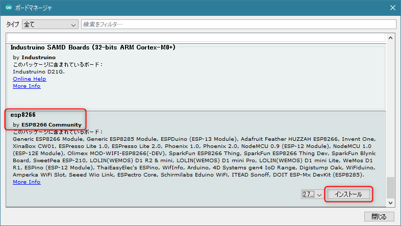
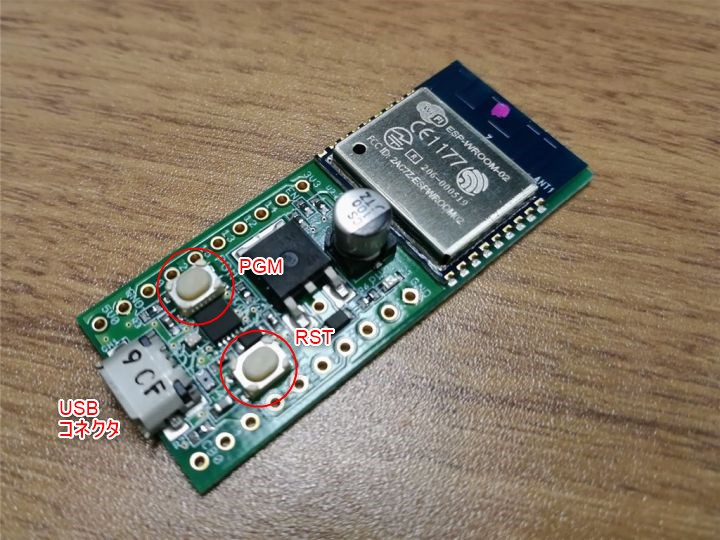

切手サイズのモジュールなのに Wi-Fi に接続できてマイコンとしても使えてしまう **ESP-WROOM-02** を使ってみました。

今回は Hello, world までの手順を紹介します。

## 概要

前述の通り、 ESP-WROOM-02 は Espressif Systems の SoC である **ESP8266EX を搭載した Wi-Fi モジュール**です。

**WPA2 でも接続でき、いわゆる「技適」取得済み**のため、日本国内でも安心して (?) 使えます。

にもかかわらず、モジュールあたり 250円～600円程度と非常に安価で入手できるため、遊ぶのには最適です。

スイッチサイエンスや Amazon でも入手可能ですが、単体の価格に関しては我らが**秋月電子通商では税込み250円と大変財布に優しい価格設定**となっております。

- [ESP-WROOM-02 Wi-Fiモジュール（フラッシュ2MB） - スイッチサイエンス](https://www.switch-science.com/catalog/2346/)
- [Ｗｉ－Ｆｉモジュール　ＥＳＰ－ＷＲＯＯＭ－０２ - 秋月電子通商](https://akizukidenshi.com/catalog/g/gM-09607/)

ただ、写真を見ればわかりますが、このモジュールは面実装タイプのため、ブレッドボードで遊ぶには変換基板が必要ですし、書き込みには FTDI の USB 変換アダプター (3.3V) が必要です。

ということで、今回は面倒なことをスキップするために、**全部入りの[秋月製開発ボード](https://akizukidenshi.com/catalog/g/gK-12236/)** を利用します。これなら Micro-USB ケーブルを用意するだけで、すぐに開発がはじめられます。ちなみに開発ボードはスイッチサイエンスなどにもありますが、おそらく秋月のこれがもっとも手頃 (1,280円) です。

## 必要なもの

前述の開発ボードと Micro-USB ケーブルのみです。

- [ＥＳＰ－ＷＲＯＯＭ－０２開発ボード - 秋月電子通商](https://akizukidenshi.com/catalog/g/gK-12236/)

<a href="images/esp-wroom-02-first-step-1.jpg"></a>

## 開発環境のセットアップ

**ESP-WROOM-02 は Arduino の IDE でそのまま開発可能**です。便利ですね。

### Arduino IDE のインストール

ということで Arduino IDE をダウンロードし、インストールします。特に迷うところはないため、割愛します。

- [Arduino - Software](https://www.arduino.cc/en/main/software)

なお、本稿執筆時点のバージョンは 1.8.13 でした。

<a href="images/esp-wroom-02-first-step-2.png"></a>

### ESP8266 ボードの追加

ESP-WROOM-02 の SoC である ESP8266 を扱うため、ボード情報を読み込みます。

まず **[ファイル] メニュー → [環境設定] の [設定] タブで「追加のボードマネージャのURL」に下記の URL を設定**します。すでになにか設定されている場合は半角カンマで区切ればいいそうです。

```
http://arduino.esp8266.com/stable/package_esp8266com_index.json
```

設定したら [OK] をクリックして設定を保存します。

**[ツール] メニュー → [ボード:] → [ボードマネージャ]** から **esp8266** (by ESP8266 Community) を検索し、最新バージョンをインストールします。執筆時点では 2.7.4 が最新でした。

<a href="images/esp-wroom-02-first-step-3.png"></a>

ダウンロード、パッケージの検証などが走るので、しばらくかかります。インストールが終わると、 **[ツール] メニュー → [ボード:]** で **[ESP8266 Boards] → [Generic ESP8266 Module]** が選べるようになるので、これを選択します。

<a href="images/esp-wroom-02-first-step-4.png"></a>

ついでに書き込み設定をそれぞれメニューから選び、下記の内容に設定しておきます。

<a href="images/esp-wroom-02-first-step-5.png"></a>

## プログラムの書き込み

では実際にプログラムを書き込んでいきます。

### シリアルポートの確認とボードの接続

まずボードを接続する前に **[ツール] メニュー → [シリアルポート] で元の COM ポートの状況 (COM3 とか COM4 とか) を確認**しておきます。

ボードを接続した後、**ここに増えた COM ポートが ESP-WROOM-02 開発ボード**、というわけです。

確認したら、**開発ボードを接続して、 [ツール] メニュー → [シリアルポート]** に表示されるまでしばらく待ちます。初回接続時は少しかかるかもしれません。

<a href="images/esp-wroom-02-first-step-6.png"></a>

今回は上図のように COM6 ポートでした。この増えた COM ポートを選択します。

### 動作確認

ためしにシリアルポートのデータを読み取ってみます。

**[ツール] メニュー → [シリアルモニタ]** を起動し、改行コード設定を **CRおよびLF**、 **ボーレートを 74880 bps** にし、開発ボードのリセットボタンを押してみます。**下記のようなアウトプットが表示されれば OK** です。

```
 ets Jan  8 2013,rst cause:2, boot mode:(3,6)
load 0x4010f000, len 3584, room 16 
tail 0
chksum 0xb0
csum 0xb0
v2843a5ac
```

### Hello, world プログラムの書き込み

早速 Hello, world なプログラムを書き込みましょう。 **IDE のエディタに下記のソースコードをコピペして、適当なファイル名で保存**します。

```c
void setup() {
  Serial.begin(74880);
}

void loop() {
  Serial.println("Hello, world");
  delay(5000);
}
```

下記の手順で**開発ボードを書き込みモード**にします。

<a href="images/esp-wroom-02-first-step-7.jpg"></a>

1. 開発ボードの RST スイッチと PGM スイッチを同時に押す
2. RST スイッチを離す
3. PGM スイッチを離す

できたら、 Arduino IDE から **[スケッチ] メニュー → [マイコンボードに書き込む]** を選択します。ソースコード、設定や COM ポートの選択に間違いがなければ、コンパイルされたプログラムが ESP-WROOM-02 に書き込まれます。

書き込みが無事完了したら、再度シリアルモニタを開いて RST スイッチを押します。

下記のように初期化のあと **Hello, world** が表示されれば OK です。

<a href="images/esp-wroom-02-first-step-8.png"></a>

お疲れ様でした。次回は Wi-Fi に接続して Web サーバーとして動かしてみます。