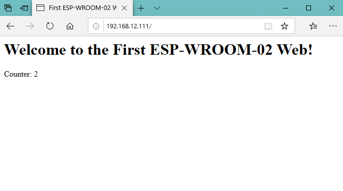
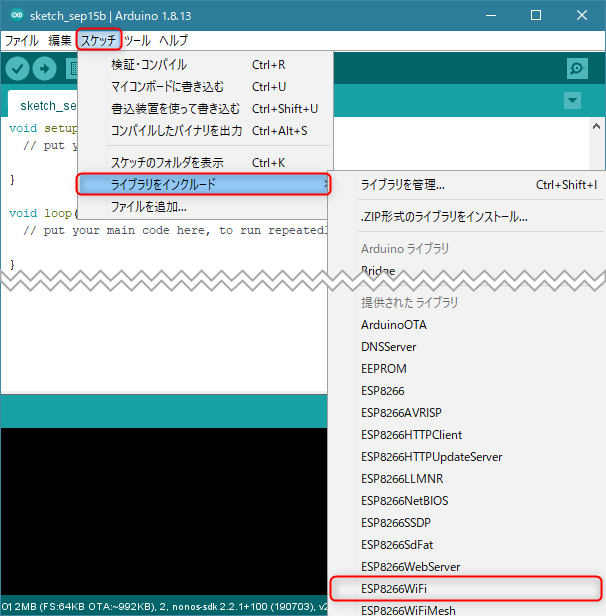
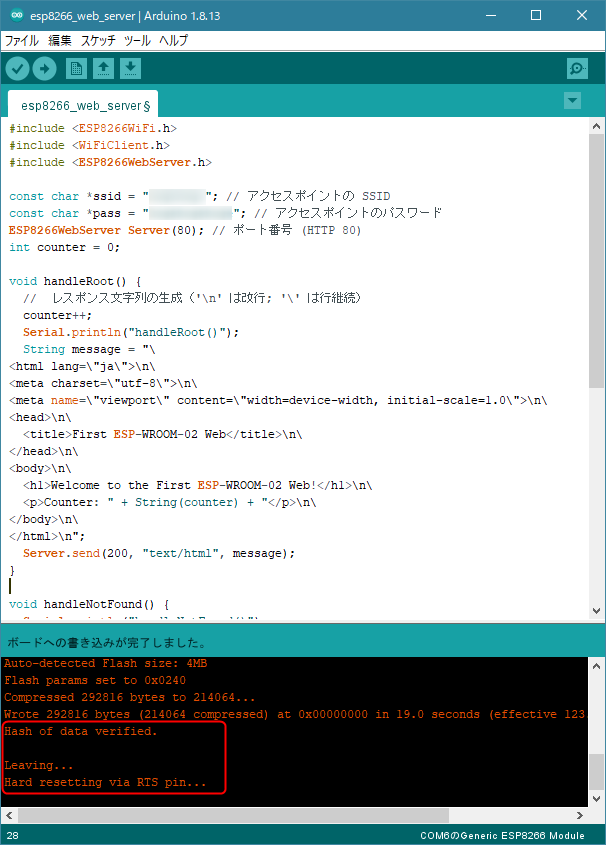
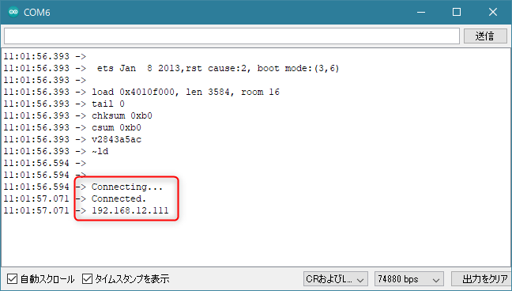
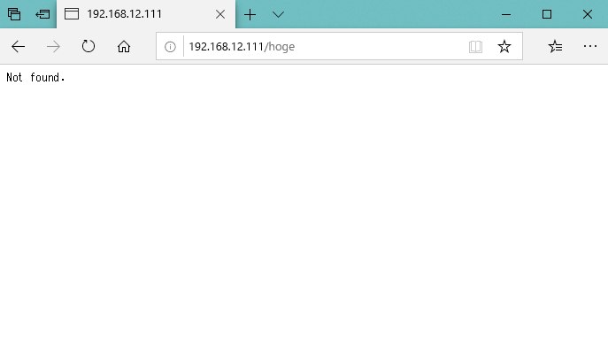

前記事で **WSP-WROOM-02** の Hello, world をやりましたので、次は **Wi-Fi に接続し、 Web サーバーとして待機してレスポンスを返せるように**してみます。

開発環境のセットアップや Hello, world については前記事をご参照ください。

- [Arduino IDE で開発できる Wi-Fi モジュール ESP-WROOM-02 ことはじめ](https://mseeeen.msen.jp/esp-wroom-02-first-step)

## 概要

**ブラウザーからアクセスして下記のように簡易的な HTTP レスポンスを返す**ところまでをやります。

<a href="images/esp-wroom-02-first-web-server-1.png"></a>

実装にあたって下記の参考サイトを参考にさせていただきました。ソースはほぼそのままです。誠にありがとうございます。

- [こじ研（ESP WiFi 接続編）](https://www.ei.tohoku.ac.jp/xkozima/lab/espTutorial0wifi.html)

## 必要なもの

前回からの続きのため秋月の開発ボードを前提にしますが、 WSP-WROOM-02 に Arduino IDE から書き込める状態であればなんでもかまいません。

- [ESP-WROOM-02 開発ボード - 秋月電子通商](https://akizukidenshi.com/catalog/g/gK-12236/)
- Micro-USB ケーブル (ESP-WROOM-02 ボードと PC の接続用)
- Arduino IDE (前記事のボードセットアップも完了している状態)
- SSID とパスワードでアクセスできる Wi-Fi アクセスポイント (DHCP)

## プログラム

### ライブラリの確認

ESP8266 ボードのセットアップが完了している場合、 **ESP8266 関連のライブラリもすでに利用可能**になっているはずなので、 `#include` で読み込むだけで使えます。

Arduino IDE の **[スケッチ] メニュー → [ライブラリをインクルード] に ESP8266* が表示されていれば OK** です。

<a href="images/esp-wroom-02-first-web-server-2.png"></a>

### なにはともあれ試してみる

とりあえず Arduino IDE で新しいスケッチを開き、下記のソースコードをコピペしましょう。

```c
#include <ESP8266WiFi.h>
#include <ESP8266WebServer.h>

const char *ssid = "YOUR_SSID"; // アクセスポイントの SSID
const char *pass = "YOUR_WIFI_PASSWORD"; // アクセスポイントのパスワード
ESP8266WebServer Server(80); // ポート番号 (HTTP 80)
int counter = 0;

void handleRoot() {
  counter++;
  Serial.println("handleRoot()");
  String message = "\
<html lang=\"ja\">\n\
<meta charset=\"utf-8\">\n\
<meta name=\"viewport\" content=\"width=device-width, initial-scale=1.0\">\n\
<head>\n\
  <title>First ESP-WROOM-02 Web</title>\n\
</head>\n\
<body>\n\
  <h1>Welcome to the First ESP-WROOM-02 Web!</h1>\n\
  <p>Counter: " + String(counter) + "</p>\n\
</body>\n\
</html>\n";
  Server.send(200, "text/html", message);  
}

void handleNotFound() {
  Serial.println("handleNotFound()");
  Server.send(404, "text/plain", "Not found.");
}

void setup() {
  Serial.begin(74880); // ボーレート 74880 bps
  delay(100);
  WiFi.mode(WIFI_STA);
  WiFi.begin(ssid, pass);
  Serial.println("Connecting...");
  while (WiFi.status() != WL_CONNECTED) {
    delay(500);
  }
  Serial.println("Connected.");
  Serial.println(WiFi.localIP());
  Server.on("/", handleRoot);
  Server.onNotFound(handleNotFound);
  Server.begin();
}

void loop() {
  Server.handleClient();
}
```

**`YOUR_SSID` と `YOUR_WIFI_PASSWORD` の部分を自分の環境に合わせて書き換え**ます。

適当な名前をつけてスケッチを保存します。私は `esp8266_web_server` としておきました。

※シリアルのボーレートは ESP-WROOM-02 起動ログとデバッグログ両方を表示させるため、起動ログのボーレート (74880 bps) に合わせています。

### 書き込み

前回と同様に下記の手順で**ボードを書き込みモードにします**。

1. 開発ボードの RST スイッチと PGM スイッチを同時に押す
2. RST スイッチを離す
3. PGM スイッチを離す

Arduino IDE から **[スケッチ] メニュー → [マイコンボードに書き込む]** を選択します。

これでコンパイルされて ESP-WROOM-02 に書き込まれるはずです。

<a href="images/esp-wroom-02-first-web-server-3.png"></a>

ステータスが上記のようになったら完了です。

### 動作確認

書き込みが完了したら、 **[ツール] メニュー → [シリアルモニタ] を起動した状態 (CR および LF, 74880 bps) で RST スイッチ**を押します。

<a href="images/esp-wroom-02-first-web-server-4.png"></a>

Connecting... から Connected に変わって IP アドレスが表示されれば OK です。

ではブラウザーからこの表示された IP アドレスにアクセスし、こんな感じで表示されれば OK です。**アクセスするたびに Counter がインクリメント**されていきます。

<a href="images/esp-wroom-02-first-web-server-1.png"></a>

ちなみに存在しないページにアクセスするとちゃんと Not found になります。

<a href="images/esp-wroom-02-first-web-server-5.png"></a>

## ソースコード確認

では、細かく、というほどもないですが、ソースコードを確認していきます。

デバッグ用のシリアル通信が混ざっているので少々ややこしいですが、機能ごとに分解すればシンプルです。

### Wi-Fi 接続部分

Wi-Fi 接続部分は下記だけです。とてもシンプルですね。

```c
#include <ESP8266WiFi.h>

const char *ssid = "YOUR_SSID"; // アクセスポイントの SSID
const char *pass = "YOUR_WIFI_PASSWORD"; // アクセスポイントのパスワード

void setup() {
  WiFi.mode(WIFI_STA);
  WiFi.begin(ssid, pass);
  while (WiFi.status() != WL_CONNECTED) {
    delay(500);
  }
}
```

**`WIFI_STA` はステーション (子機) モード**を表します。 ※親機は AP モード

下記のページにもあるようにアクセスポイントとして動作させることも簡単にできます。

- [ESP8266をAP+STAモードで使う - Androidのメモとか](https://relativelayout.hatenablog.com/entry/2017/07/22/211649)
- [ESP8266 でアクセスポイント機能を無効にする: コンピュータと足湯と園芸のブログ](http://ashiyu.cocolog-nifty.com/blog/2015/07/esp8266-4fb8.html)

### Web サーバー部分

こちらも Wi-Fi 接続やシリアル通信部分を除くと非常にシンプルになります。 HTML の内容もハショりました。

```c
#include <ESP8266WebServer.h>

ESP8266WebServer Server(80); // ポート番号 (HTTP 80)
int counter = 0;

void handleRoot() {
  counter++;
  String message = "HTML";
  Server.send(200, "text/html", message);  
}

void handleNotFound() {
  Server.send(404, "text/plain", "Not found.");
}

void setup() {
  Server.on("/", handleRoot);
  Server.onNotFound(handleNotFound);
  Server.begin();
}

void loop() {
  Server.handleClient();
}
```

URL に対する待ち受けが `Server.on("/", handleRoot);` で、リクエストがきたら `handleRoot` が呼び出されます。 `handleRoot` は HTML を 200 (OK) ステータスで返しているだけですね。

`Server.onNotFound(handleNotFound);` でハンドルされていないページに対する処理を `handleNotFound 関数で受けています。こちらもレスポンスとして 404 を返すだけです。

## まとめ

Arduino IDE に ESP8266 ライブラリをインストールした状態であれば、 **WSP-WROOM-02 を使って非常に簡単に HTTP レスポンスを返す Web サーバー**が実装できました。

本格的な Web サーバーとして動作させるにはハードルが高いですが、センサーの値を表示させたり、 REST API っぽくして L チカさせてみるのもおもしろいかもしれません。

みなさんもいろいろと試してみてください。