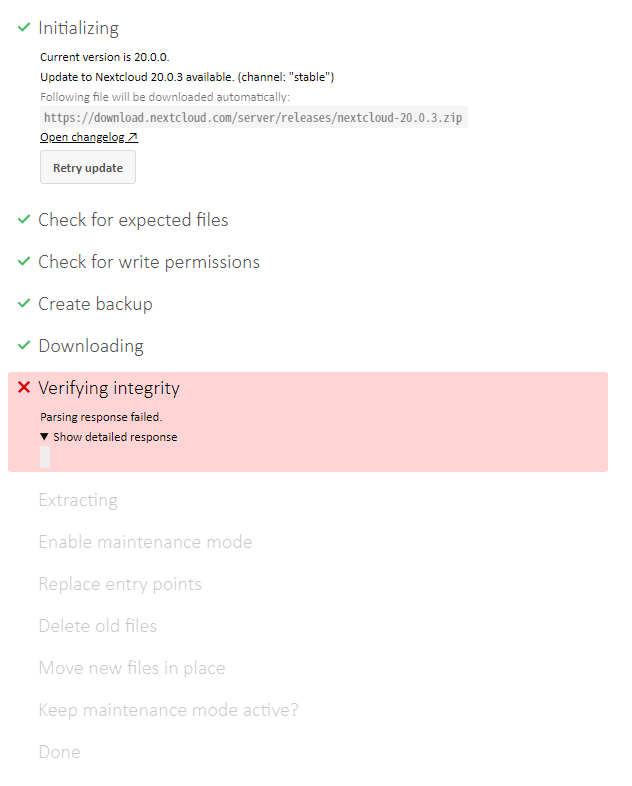
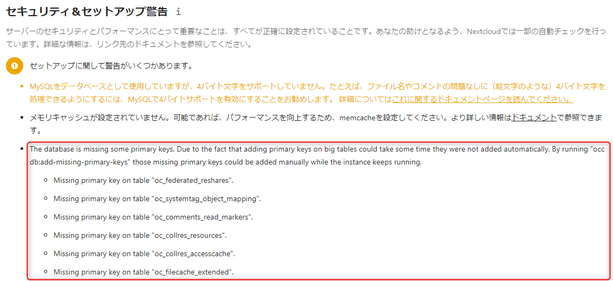

Nextcloud は GUI からも自身のアップデートができますが、比較的新しく構築した **Nextcloud でアップデートが途中で失敗し、更新がリトラできない状態**になりました。

今回は更新ができなくなったときの解消方法をご紹介します。

## アップデートできなくなるまで

Nextcloud の設定ページからアップデーターを使って更新しようとしたところ、下記のようにダウンロード後の処理で失敗しました。今回のバージョンは 20.0.0 → 20.0.3 でした。



**途中で失敗すると `Step 5 is currently in process. Please reload this page later.` といったメッセージが表示され、アップデートを再開することができません。**

CLI からやってみろという情報があるので、試しに CLI からも実行してみます。
※ `/path/to/nextcloud` は Nextcloud のインストールパスです。

```
$ sudo su -
# cd /path/to/nextcloud 
# sudo -u apache php updater/updater.phar
Nextcloud Updater - version: v20.0.0beta4-11-g68fa0d4

Step 5 is currently in process. Please call this command later.
```

チーン。同じことを言われます。 Apache を再起動しても変わりません。これでは一生アップデートできません。

## Nextcloud でアップデートできなくなったときの対処

`Step 5 is currently in process. Please call this command later.` のようなメッセージが表示されるのはアップデートが失敗したときに「どこまでアップデートが進んでいるのか」を記録したファイルが残っているからです。

- 参考: [\[UPGRADE\] Step 5 is currently in process. Please reload this page later. · Issue #411 · nextcloud/nextcloudpi](https://github.com/nextcloud/nextcloudpi/issues/411)

**アップデートの間の作業ファイルは Nextcloud のデータディレクトリ (デフォルトではインストールパス下の `data` ディレクトリ) の下に `updater-<ハッシュ>` のような名前のディレクトリができ、その中に展開されます。**

今回の環境では下記のような構成になっていました。

```
/var/www/nextcloud/
  data/
    updater-ocftioc663t7/
      backups/
      downloads/
      .step
```

この .step を消せばアップデートが再開できるようになりますが、ややこしいので `updater-<ハッシュ>` ディレクトリごと削除しました。

```
# rm -rf data/updater-ocftioc663t7/
```

この状態で再度アップデートコマンドを叩けば、アップデートが再度開始されるはずです。

```
# sudo -u apache php updater/updater.phar
```

## やはりアップデートに失敗

しかしながら今回の環境ではやはり失敗しました。

```sh
# sudo -u apache php updater/updater.phar
Nextcloud Updater - version: v20.0.0beta4-11-g68fa0d4

Current version is 20.0.0.

Update to Nextcloud 20.0.3 available. (channel: "stable")
Following file will be downloaded automatically: https://download.nextcloud.com/server/releases/nextcloud-20.0.3.zip
Open changelog ↗

Steps that will be executed:
[ ] Check for expected files
[ ] Check for write permissions
[ ] Create backup
[ ] Downloading
[ ] Verify integrity
[ ] Extracting
[ ] Enable maintenance mode
[ ] Replace entry points
[ ] Delete old files
[ ] Move new files in place
[ ] Done

Start update? [y/N] y

Info: Pressing Ctrl-C will finish the currently running step and then stops the updater.

[✔] Check for expected files
[✔] Check for write permissions
[✔] Create backup
[✔] Downloading
[ ] Verify integrity ...PHP Fatal error:  Allowed memory size of 134217728 bytes exhausted (tried to allocate 142280560 bytes) in phar:///var/www/html/nextcloud/updater/updater.phar/lib/Updater.php on line 637
```

ただ GUI から実行した場合と異なり、 CLI だとエラー内容が画面に表示されるので、すぐに原因がわかりました。

単なるメモリ不足...そういえばインストールしてから PHP の設定は後回しでほったらかしでした。

ということで php.ini で memory_limit を増やすため、 php.ini の場所を調べて、編集します。

```sh
# php -r "echo phpinfo();" | grep "php.ini"
Configuration File (php.ini) Path => /etc/opt/remi/php74
Loaded Configuration File => /etc/opt/remi/php74/php.ini
# vi /etc/opt/remi/php74/php.ini
```

```diff
; Maximum amount of memory a script may consume
; http://php.net/memory-limit
-memory_limit = 128M
+memory_limit = 1024M
```

Web サーバー (Apache) を再起動して、リトライ。

```
# systemctl restart httpd
# sudo -u apache php updater/updater.phar
Nextcloud Updater - version: v20.0.0beta4-11-g68fa0d4

Current version is 20.0.0.

Update to Nextcloud 20.0.3 available. (channel: "stable")
Following file will be downloaded automatically: https://download.nextcloud.com/server/releases/nextcloud-20.0.3.zip
Open changelog ↗

Steps that will be executed:
[ ] Check for expected files
[ ] Check for write permissions
[ ] Create backup
[ ] Downloading
[ ] Verify integrity
[ ] Extracting
[ ] Enable maintenance mode
[ ] Replace entry points
[ ] Delete old files
[ ] Move new files in place
[ ] Done

Start update? [y/N] y

Info: Pressing Ctrl-C will finish the currently running step and then stops the updater.

[✔] Check for expected files
[✔] Check for write permissions
[✔] Create backup
[✔] Downloading
[✔] Verify integrity
[✔] Extracting
[✔] Enable maintenance mode
[✔] Replace entry points
[✔] Delete old files
[✔] Move new files in place
[✔] Done

Update of code successful.

Should the "occ upgrade" command be executed? [Y/n] Y
Nextcloud or one of the apps require upgrade - only a limited number of commands are available
You may use your browser or the occ upgrade command to do the upgrade
2020-12-14T23:51:42+00:00 Setting log level to debug
2020-12-14T23:51:42+00:00 Repair step: Repair MySQL collation
2020-12-14T23:51:42+00:00 Repair info: All tables already have the correct collation -> nothing to do
～中略～
2020-12-14T23:52:12+00:00 Starting code integrity check...
2020-12-14T23:52:20+00:00 Finished code integrity check
2020-12-14T23:52:20+00:00 Update successful
2020-12-14T23:52:20+00:00 Maintenance mode is kept active
2020-12-14T23:52:20+00:00 Resetting log level

Keep maintenance mode active? [y/N] y
Maintenance mode kept active
```

今度は成功しました！めでたしめでたし。

## アップデート後

### メンテナンスモードの無効化

アップデーターの最後の質問 `Keep maintenance mode active?` で y を選ぶと、メンテナンスモードのままになります。この状態だと Nextcloud の GUI は「メンテナンスモード」ですと表示されたまま、ユーザーは利用できません。

**手動でメンテナンスモードをオフにするには `occ maintenance:mode --off` コマンドを実行**します。

```
# sudo -u apache php occ maintenance:mode --off
Maintenance mode disabled
```

### プライマリキーの追加

アップデートによって下記のように `The database is missign some primary keys` というメッセージが表示されました。



コマンドをたたけということなので、愚直に実行しました。

```
# sudo -u apache php occ db:add-missing-primary-keys
Check primary keys.
Adding primary key to the federated_reshares table, this can take some time...
federated_reshares table updated successfully.
Adding primary key to the systemtag_object_mapping table, this can take some time...
systemtag_object_mapping table updated successfully.
Adding primary key to the comments_read_markers table, this can take some time...
comments_read_markers table updated successfully.
Adding primary key to the collres_resources table, this can take some time...
collres_resources table updated successfully.
Adding primary key to the collres_accesscache table, this can take some time...
collres_accesscache table updated successfully.
Adding primary key to the filecache_extended table, this can take some time...
filecache_extended table updated successfully.
```

アップデートのついでに勝手にやってくれよという気がしますが...

### アップデーターファイルの削除

アップデート時に生成される前述の `updater-<ハッシュ>` という一時ディレクトリは、アップデート完了後も残っており、前バージョンのバックアップやが残っています。（ダウンロードしたファイルは削除されているようでした）

そのままでも支障ありませんが、ストレージ容量に制限がある場合は削除すればよいでしょう。

## まとめ

今回は Nextcloud のアップデートに失敗したあとのリカバリー方法を紹介しました。一時ファイルを消すだけなので簡単ではありますが、誰かのお役に立てれば幸いです。